# CyberSpaceCTF 2024 - Memory - Forensics Challenge
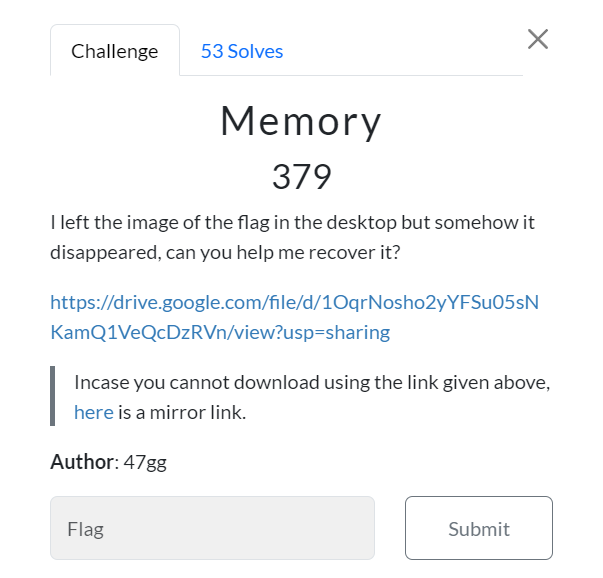
I left the image of the flag in the desktop but somehow it disappeared, can you help me recover it?

https://drive.google.com/file/d/1OqrNosho2yYFSu05sNKamQ1VeQcDzRVn/view?usp=sharing

> Incase you cannot download using the link given above, [here](https://drive.google.com/file/d/1hGiy8z73YPDV5E0OnZYA-MJZ5WcBzskT/view?usp=sharing) is a mirror link.

**Author**: 47gg
* * *
This challenge is quite unique, We were provided with Windows Memory dump and tasked to restore a file from "Desktop" < which is a big hint right here so we wanted to use `mftparser` and `filescan` and attempt to restore that file from provided memory dump (if its still there).

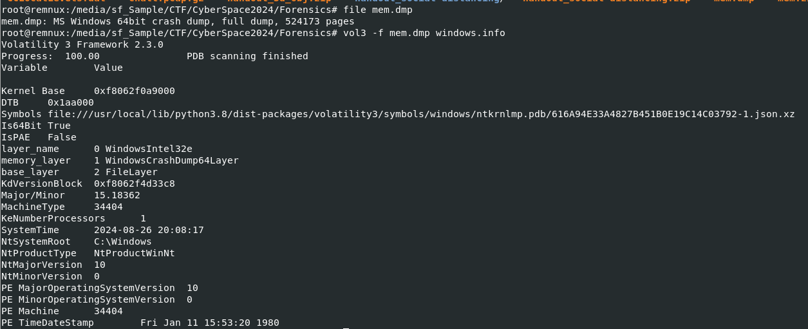

First, lets get to know about system of this memory dump first with `file` and it telling us that this memory dump is MS Windows 64bit crash dump so I used Volatility 3 with `windows.info` plugin next to find OS version which helped me determine suitable profile for Volatility 2.

From this result, I finally decided which profile to use which is `--profile=Win10x64_18362`

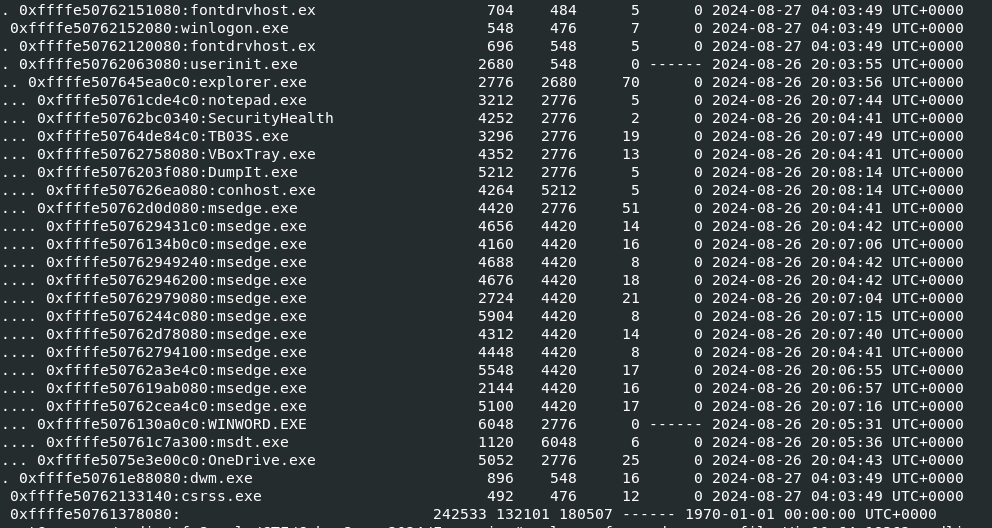

I always started with `pstree` to show any suspicious processes that I might want to look deep into and from this result, I wanted to dig into is `notepad.exe` and `WINWORD.EXE` despite knowing that they probably not associated directly with flag image. 

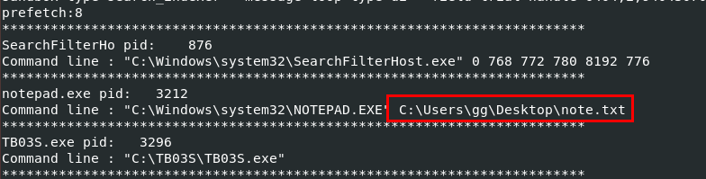

I used `cmdline` plugin next to show command-line arguments of each process and from this result, it telling me that there is one more file on "Desktop" that I might want to look into.

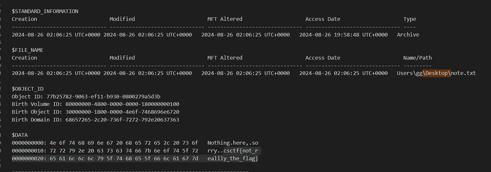

I used `mftparser` plugin to dump master file table record to a text file and find for any files reside in "Desktop" folder. and look like `note.txt` is not containing any hint nor an actual flag for us.

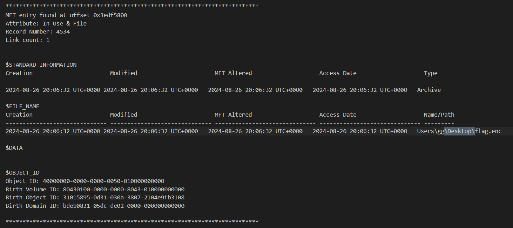

But there is one particular file that made me think, I was on the right track which is `flag.enc` but I could not dump this file using `dumpfiles` plugin since `filescan` plugin could not find this file from this memory dump.

There is a hint from the file extension indicates that this file could be an image file I was looking for but it was encrypted with some algorithms. 

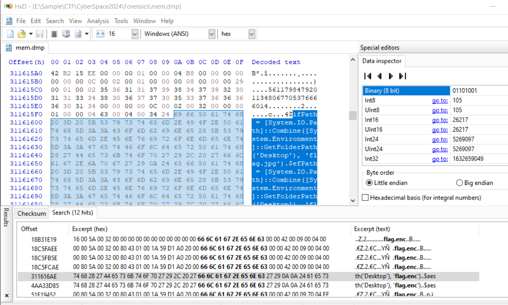

So I used `flag.enc` to search for anything from this memory dump which landed me with a powershell script responsible for encryption.

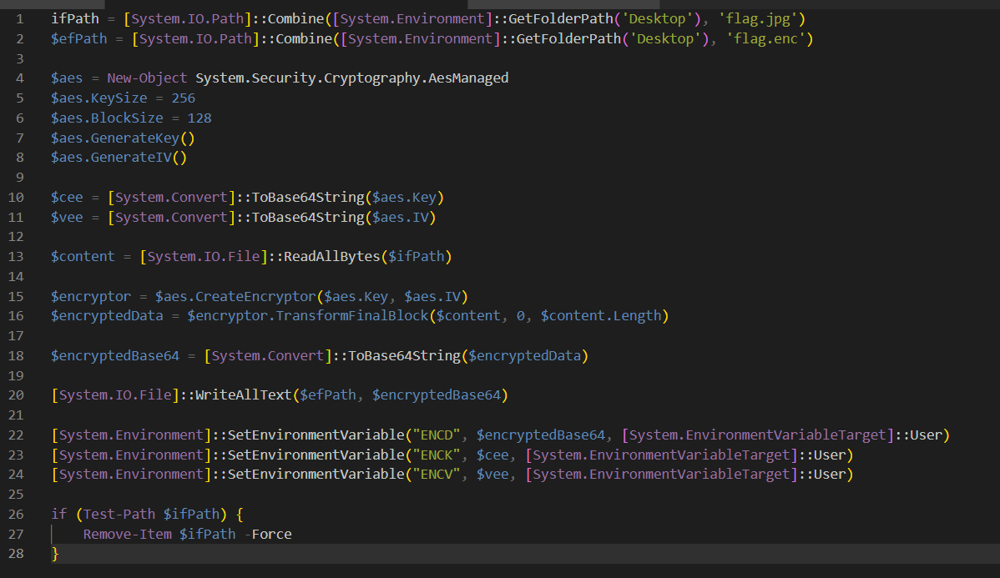

After reviewing this script, We can see that this script used AES CBC Mode to encrypt `flag.jpg` and stores ciphertext, encryption key and IV on environment variables and eventually deleted `flag.jpg`

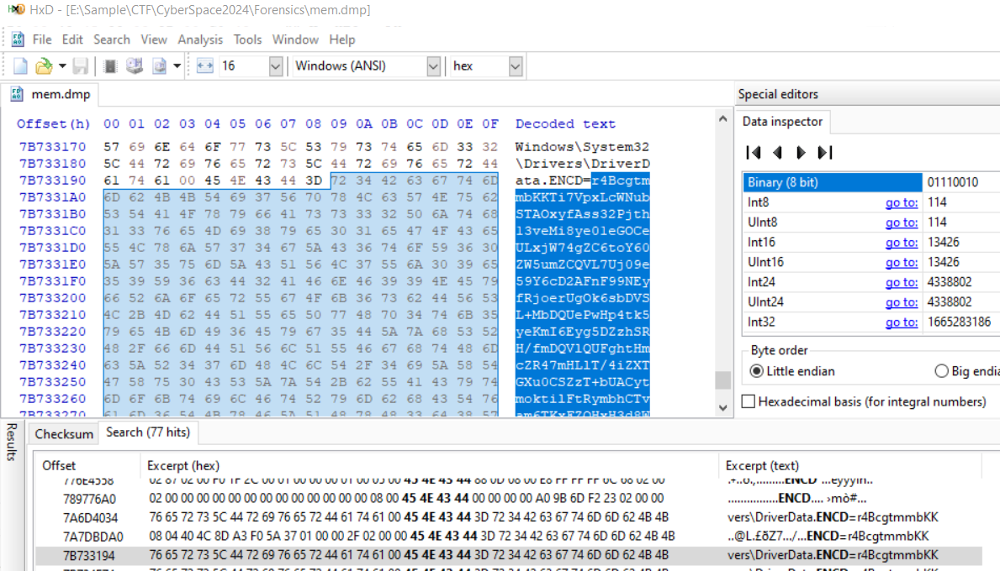

I used `envars` plugin (of volatility 2) to get these variables but It did not print out full content of `ENCD` and it could not retrieve other 2 variables.

So I had to get these variable directly from memory dump. 

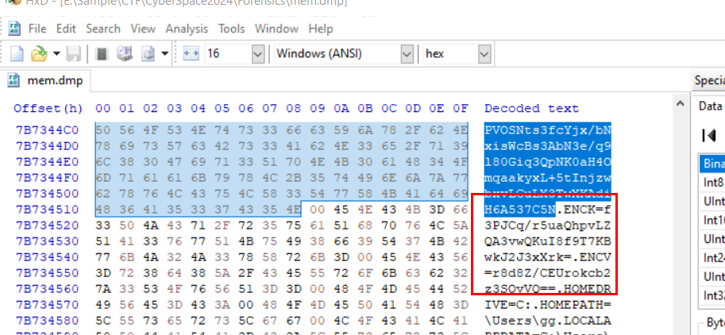

These 3 variables were declared together so I expected that at the end of `ENCD` should follow by `ENCK` and `ENCV`.

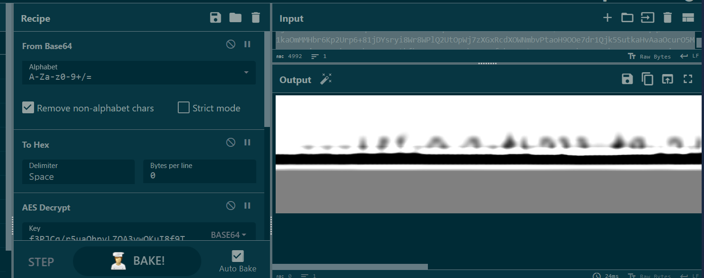

But when I tried to restore this image, it was corrupted and I had no way to solve so I went to sleep and forgot that this CTF was about to end.

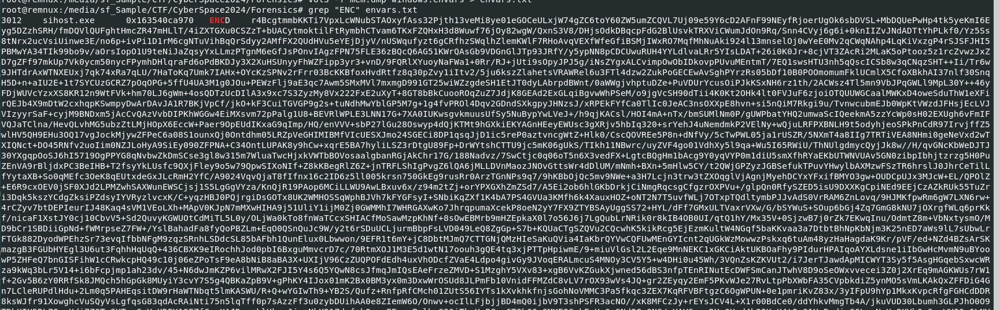

A thought came in my mind after I woke up (CTF has ended already) that maybe DATA craving via HxD and volatility 2 are not work then how about volatility 3?

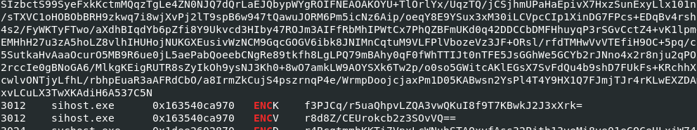

After I tried `vol3 -f mem.dmp windows.envars > envars.txt` with `grep "ENC" envars.txt` then I finally realized that sometimes I just need to calm down and explore which options I have before give up on anything.

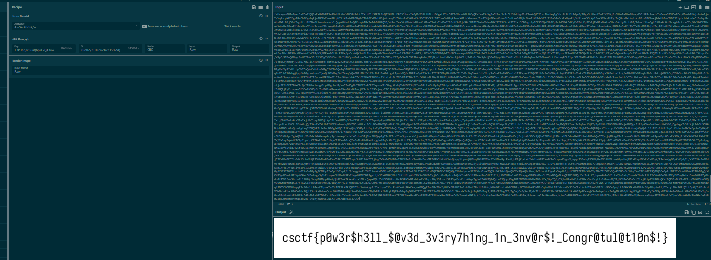

So finally I got 3 variables from the same process (different process might have different ciphertext, key and IV) then came back to CyberChef to retrieve a flag. (too late, CTF already ended LOL)

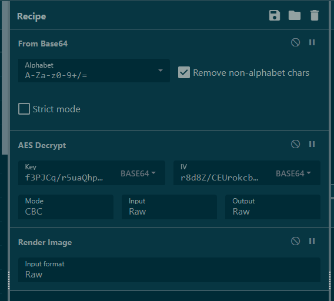

Here is All Recipes I used on CyberChef.

I also read write-up wrote by other team after this and realized, every team used Volatility 3 to solve this challenge.

Which made me realized that I really need to know tools and their capabilities so I will not have to waste my time and hit the wall again.
***