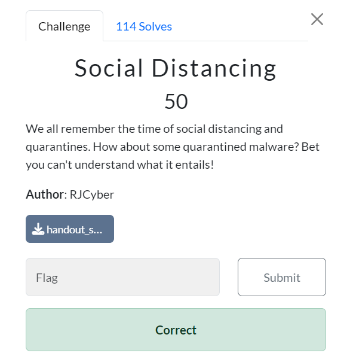

# CyberSpaceCTF 2024 - Social Distancing (50 points) - Forensics Challenge
## Social Distancing (50)

Provided File: https://drive.google.com/file/d/1sxIG6bX6--pY3fRbiO1QAOPLlv0rh6AM/view?usp=drive_link
***

On this challenge, we were given quarantine folder which stores a malware quarantined by Windows Defender

Then I remembered that John Hammond uploaded 1 video dedicated to recover quarantined malwares, which can be found here https://www.youtube.com/watch?v=K60kriw4o44


So to make it short, there is a tool called `dexray` preinstalled on REMNUX that can decrypt/recover Quarantine files from various AV / security products and we do not need a fancy command for this tool, just use `dexray .` from `Quarantine` and it will recursively go through every directories and attempt to restore all files it could for us which you can see that all output from this command will be saved as security product follow by `.out`.


Now we can see the original name of this malware (absolute path) from a file inside `Entries` directory which we will see that restored malware is a powershell script so we could expect to see encoded flag from this script.


Then we have to go to `ResourceData` directory for an actual script that was restored which we can see that a flag of this challenge is base64 encoded.

```
CSCTF{y0u_un-qu4rant1n3d_my_scr1Pt!_0x91a3edff6}
```
***