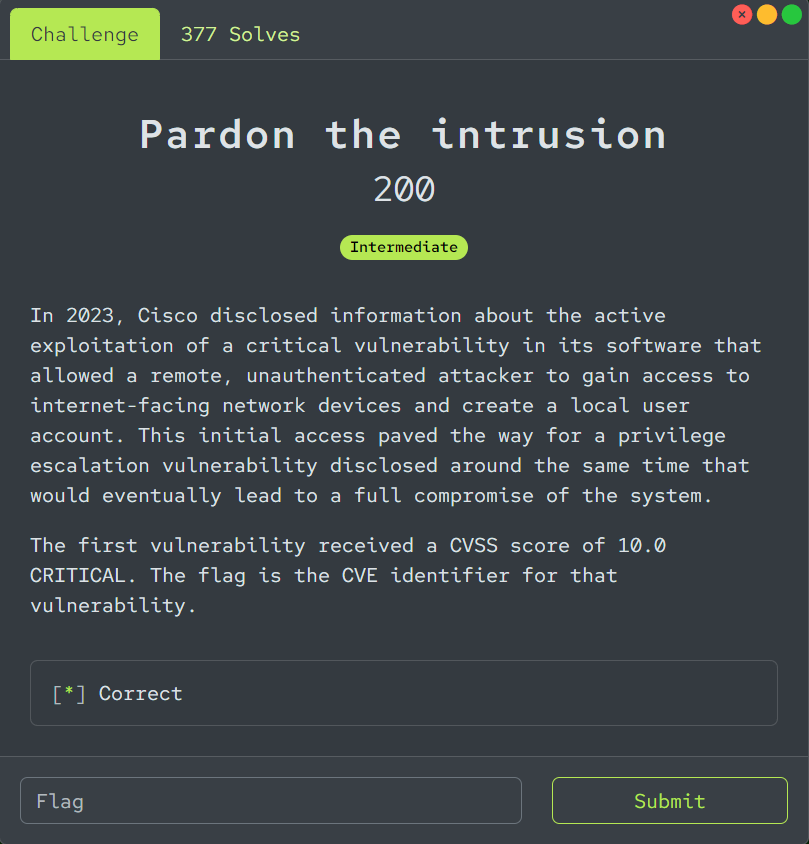

# Level Effect Cyber Defense CTF Write-up - CTI Challenges (5/5 completeness)
[toc]
***
## Pardon the intrusion (200 points)

In 2023, Cisco disclosed information about the active exploitation of a critical vulnerability in its software that allowed a remote, unauthenticated attacker to gain access to internet-facing network devices and create a local user account. This initial access paved the way for a privilege escalation vulnerability disclosed around the same time that would eventually lead to a full compromise of the system.

The first vulnerability received a CVSS score of 10.0 CRITICAL. The flag is the CVE identifier for that vulnerability.
***


This is an easy, we just need to search for specific keyword like "2023", "cisco", "rce", "cvss 10" then we will have this [CVE-2023-20198](https://nvd.nist.gov/vuln/detail/CVE-2023-20198) which is an answer of this challenge

```
CVE-2023-20198
```
***
## Got my tail! (200 points)

A certain long-cultivated cyber espionage tool deployed by Center 16 of the FSB used to be developed under a different name at its onset. What was it?
***


This one is a little bit tricky here, first we need to search for "Center 16 of the FSB" which will lead us to this [article](https://www.rferl.org/a/russia-fsb-malware-snake-takedown/32407612.html)


Even though malware deployed by Center 16 is called "Snake" but there are other names too and this article already telling us that in early versions, this malware was called an Uroboros which is an answer of this challenge

```
Uroburos
```
***
## APT jeopardy 1 (250 points)

This state-sponsored APT has been known for its cyber-espionage and disruptive operations that target defense, telecom and critical infrastructure primarily in the US. The group is believed to have surfaced in 2021.

One of the APT's hallmark TTPs is living off the land to blend into target environments. One of its most unique TTPs is proxying operational traffic through compromised VPSs and SOHO network devices so as to obscure the true origin of the activity.

Name the APT!
***


There are so many APT groups that targeted US in 2021 so we will have to find for any activities that remotely closed to their unique TTPs and according to MITRE ATT&CK, [Volt Typhoon](https://attack.mitre.org/groups/G1017/) is the most fitting one is this scenario hence the answer of this challenge

```
Volt Typhoon
```
***
## APT jeopardy 2 (250 points)

Goodcorp recently suffered a data breach. The nature of the breach and the sophisticated tactics observed suggest the threat actor is likely an APT. The Incident Response team collected the following from its investigation:

- The initial point of compromise was a spearphishing email.
- The email was designed to mimic an MFA alert and contained a malicious QR code.
- The link in the QR code led to the site thepiratecinemaclub[.]org **NOTE: Do not attempt to visit this site.**
- Once on the system, a persistence mechanism in the form of a modified version of CpuTrace was dropped.
- We found artifacts of a C2 proxy known as XTunnel on compromised systems.
There are more pressing matters than attribution here, but for the purposes of the challenge, name the APT!
***


Ok. it seems like we have a lot to unpack here but the most interesting one of them is C2 proxy known as XTunnel so I searched for this software on [MITRE](https://attack.mitre.org/software/S0117/) which landed me with only 1 APT group 


even through we found a name of an APT ([APT28](https://attack.mitre.org/groups/G0007/)) but it has many associated group under this name so we have find out other sources to land us with just 1 name


And that name is Fancy Bear, [securityweek](https://www.securityweek.com/xtunnel-malware-specifically-built-dnc-hack-report/) got me covered here

```
Fancy Bear
```
***
## APT jeopardy 3 (300 points)

Aerocorp, a subsidiary of Goodcorp, recently suffered a massive data breach by a sophisticated actor. Can you identify the group responsible?

- We believe employee credentials were initially compromised via spearphishing campaign.
- A handful of employees were social engineered into clicking on malicious attachments.
- The use of Cobalt Strike was observed in post-compromise network traffic.
- Operations found post-compromise PowerShell activity consistent with the PowerSploit framework.
- The attackers scheduled remote AT jobs via commandline.
- Forensics recovered a binary created around the time of compromise with the hash 40528e368d323db0ac5c3f5e1efe4889 .
- Logged network traffic reveals that images with unusually large file sizes were uploaded to various GitHub accounts.

Name the APT!
***


We did not need to find anything, just search hash of a binary that forensics recovered on VirusTotal and go to Community to get an answer

```
TEMP.Periscope
```
***

***