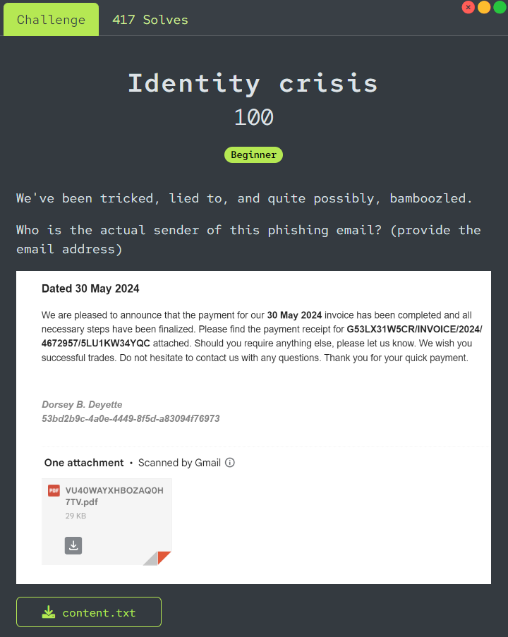
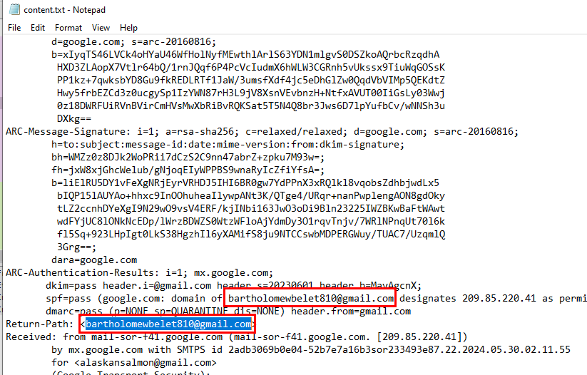
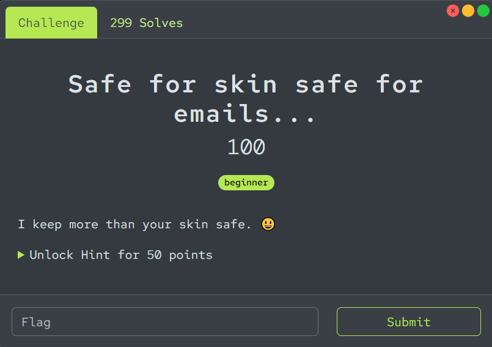
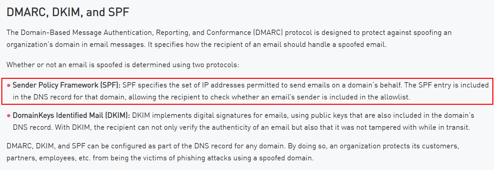
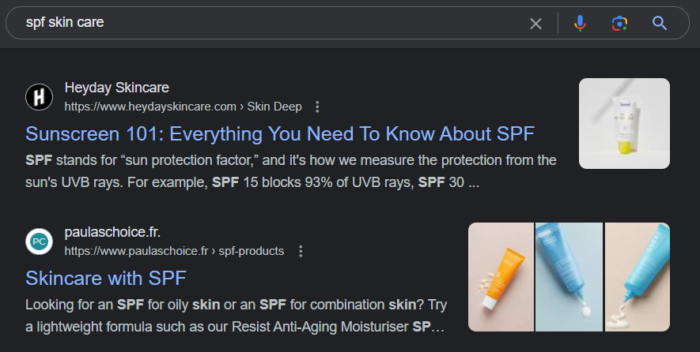
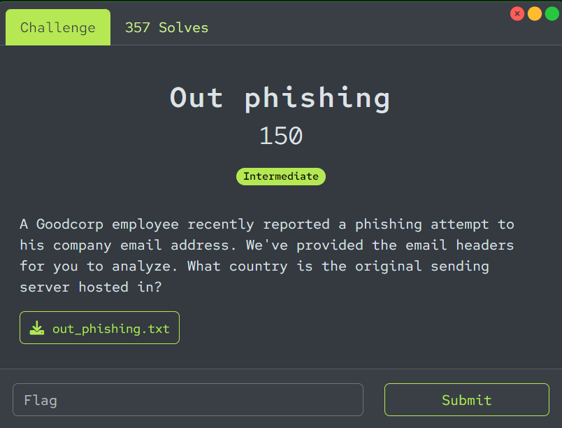
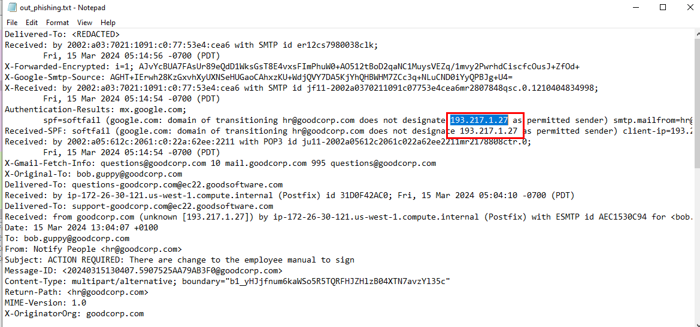
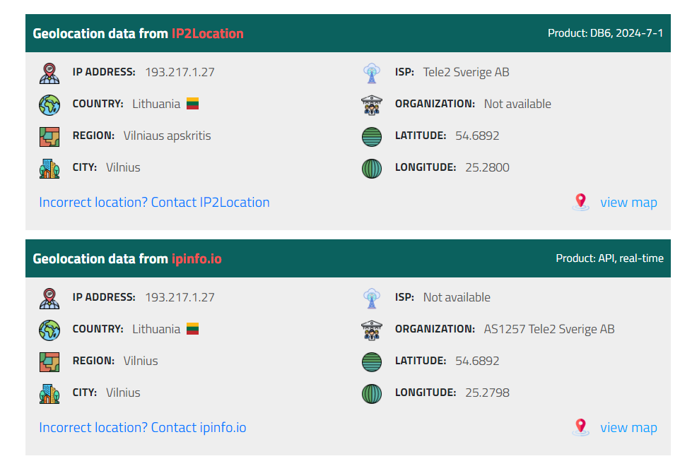
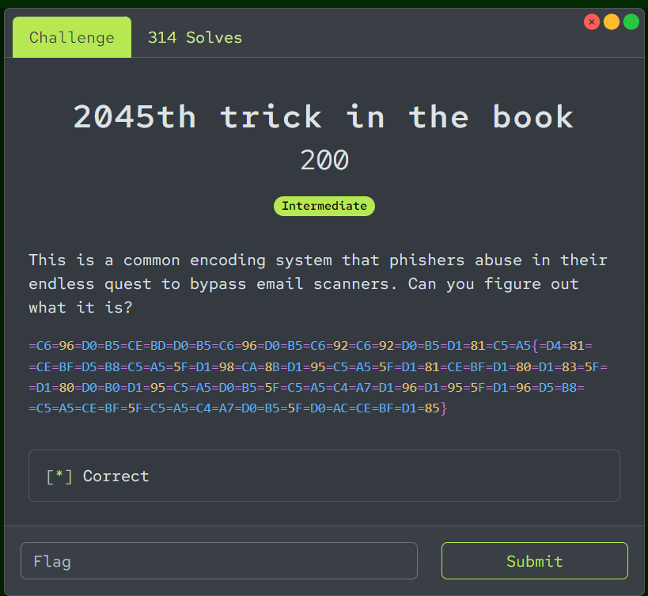
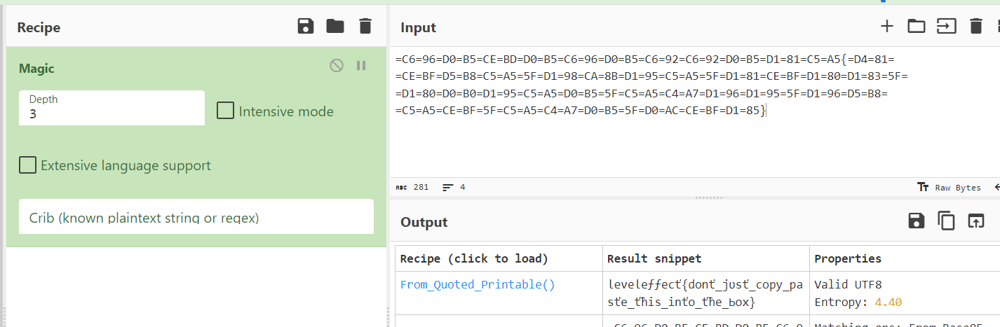

# Level Effect Cyber Defense CTF Write-up - Email Security Challenges (4/4 completeness)
[toc]
***
## Identity crisis (100 points)

We've been tricked, lied to, and quite possibly, bamboozled.

Who is the actual sender of this phishing email? (provide the email address)

[content.txt](https://leveleffectcda.ctfd.io/files/b31006ba550c1e7c062f0db293c8f89d/content.txt?token=eyJ1c2VyX2lkIjoxNTE0LCJ0ZWFtX2lkIjpudWxsLCJmaWxlX2lkIjozNH0.ZpPxaQ.L7KN26W5T-Bb27m1n5qOEjAdsbw)
***


provided text file is actually eml file in disguised which mean it contains email header which should contain actual email sender in "Return-Path" as you can see right there 

```
bartholomewbelet810@gmail.com
```
***
## Safe for skin safe for emails... (100 points)

I keep more than your skin safe. 😀
***

Well... This one is a well known protocol for [email security](https://www.checkpoint.com/cyber-hub/threat-prevention/what-is-email-security/email-security-protocols-every-business-should-have/) 



which has the same abbreviation as Sun Protection Skin which make challenge details made sense somehow

```
SPF
```
***
## Out phishing (150 points)

A Goodcorp employee recently reported a phishing attempt to his company email address. We've provided the email headers for you to analyze. What country is the original sending server hosted in?

[out_phishing.txt](https://leveleffectcda.ctfd.io/files/b995a5cc801a23830ec8a82881ebdfd0/out_phishing.txt?token=eyJ1c2VyX2lkIjoxNTE0LCJ0ZWFtX2lkIjpudWxsLCJmaWxlX2lkIjo3Mn0.ZpPxLQ.uFiNk6R2nEacZywRhS2pSz2rbQM)
***


We got an eml file in disguised again, now we can acquire an SMTP address of an email sender right there



By using IPLocation or IP2Location API, we can see that this IP address is from Lithuania

```
Lithuania
```
***
## 2045th trick in the book (200 points)

This is a common encoding system that phishers abuse in their endless quest to bypass email scanners. Can you figure out what it is?

=C6=96=D0=B5=CE=BD=D0=B5=C6=96=D0=B5=C6=92=C6=92=D0=B5=D1=81=C5=A5{=D4=81=
=CE=BF=D5=B8=C5=A5=5F=D1=98=CA=8B=D1=95=C5=A5=5F=D1=81=CE=BF=D1=80=D1=83=5F=
=D1=80=D0=B0=D1=95=C5=A5=D0=B5=5F=C5=A5=C4=A7=D1=96=D1=95=5F=D1=96=D5=B8=
=C5=A5=CE=BF=5F=C5=A5=C4=A7=D0=B5=5F=D0=AC=CE=BF=D1=85}
***


After let "Magic" on CyberChef recognized this format, we can see that its "Quoted printable" which can be used to [bypass scanners](https://www.avanan.com/blog/using-quoted-printable-encoding-to-bypass-scanners) and deliver phishing email to unfortunate users

Do not just copy an output from CyberChef to submit directly, we need to write it down again in plain english (UTF-8)

```
leveleffect{dont_just_copy_paste_this_into_the_box}
```
***