# Level Effect Cyber Defense CTF Write-up - Log Analysis Challenges (6/6 completeness)
[toc]
***
*NOTE*: This challenge I heavily relied on [Ultimate IT Security Windows Security Log Events Encyclopedia](https://www.ultimatewindowssecurity.com/securitylog/encyclopedia/) so I would love to share this wonderful resource to my readers here!
***
## Name that event 1 (100 points)

I failed to log on. What event ID am I?
***
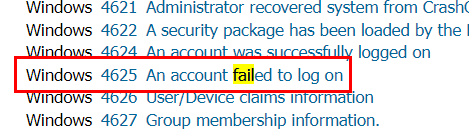

Easy one. we can just search for "failed" on encyclopedia then we will see that when an account failed to log on, Windows will log this as EventID 4625

```
4625
```
***
## Name that event 2 (100 points)
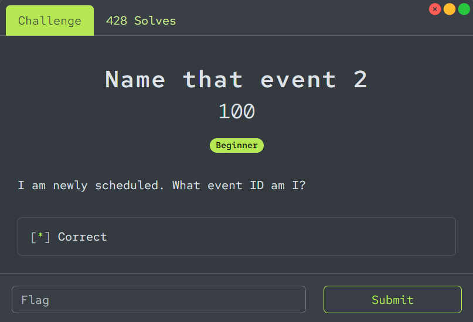
I am newly scheduled. What event ID am I?
***
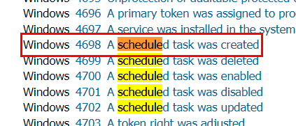

From this clue, we know that its related to Schedule task and "newly" mean that it just created so Windows will log this as EventID 4698

```
4698
```
***
## Name that event 3 (100 points)
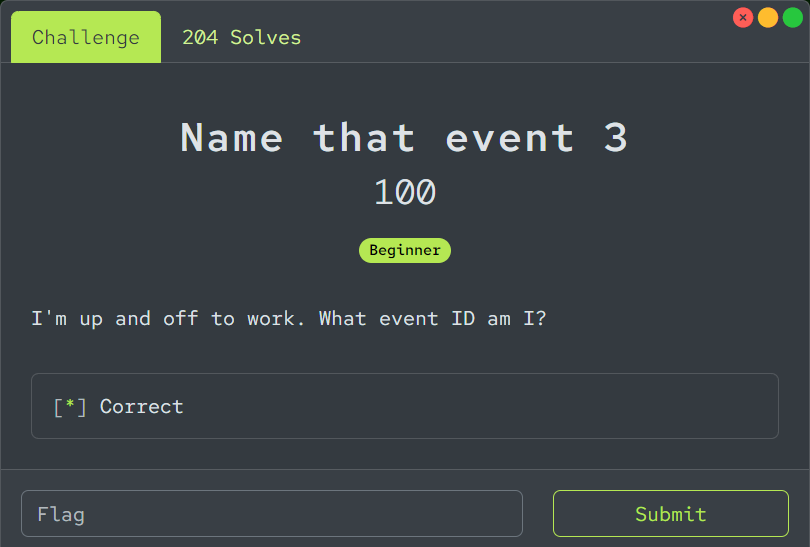
I'm up and off to work. What event ID am I?
***
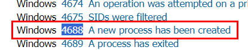

I was a little bit struggle on this one, at first I thought it might be Event ID 4608 (Windows is starting up) but there is another EventID that came across my mind which is new process started / created and turns out, it was the right answer

```
4688
```
***
## Name that event 4 (100 points)
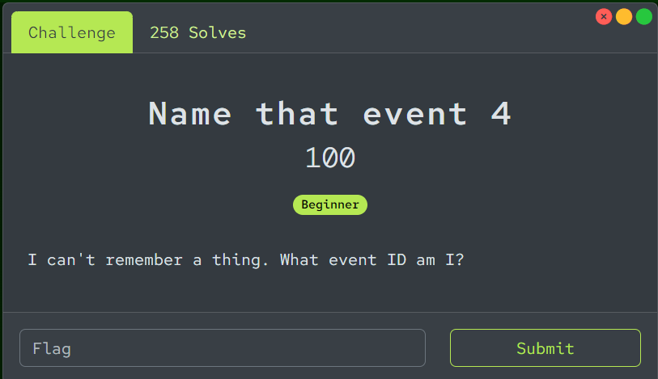
I can't remember a thing. What event ID am I?
***
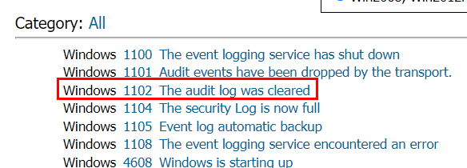

Can not remember a thing? possible something was cleared

```
1102
```
***
## whoami (100 points)
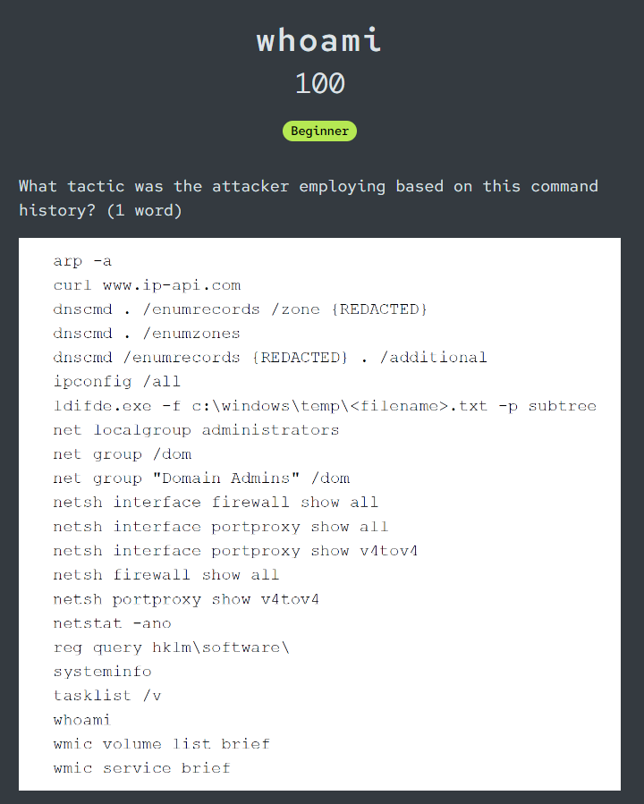
What tactic was the attacker employing based on this command history? (1 word)
***
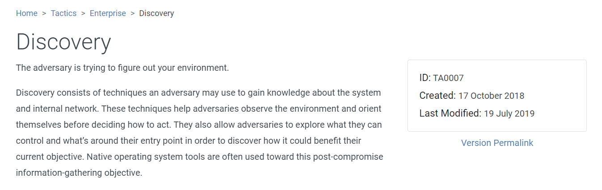

After reviewing these commands, we can see that an attacker tried to gain information as much as possible on targeted system and this tactic called Discovery according to MITRE ATT&CK

```
Discovery
```
***
## In the system (150 points)
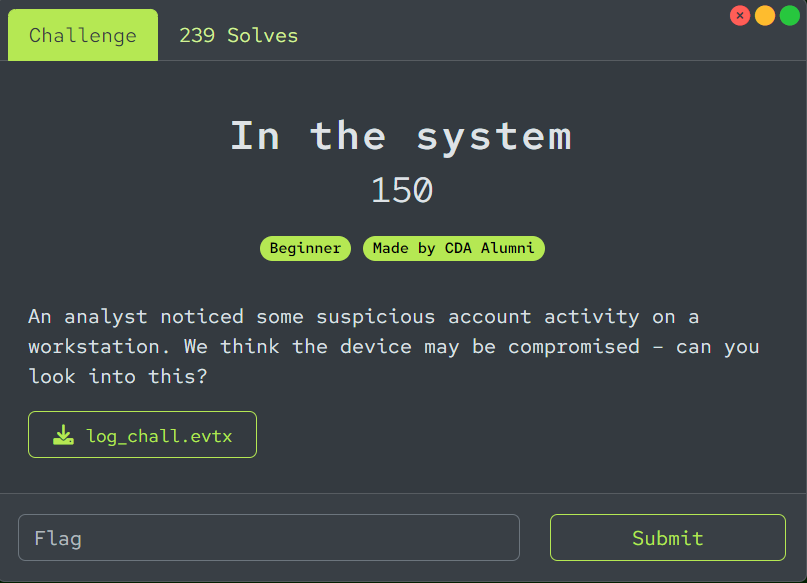
An analyst noticed some suspicious account activity on a workstation. We think the device may be compromised – can you look into this?

[log_chall.evtx](https://leveleffectcda.ctfd.io/files/1c5f28a4c20c7d14afa7a4a95b85746f/log_chall.evtx?token=eyJ1c2VyX2lkIjoxNTE0LCJ0ZWFtX2lkIjpudWxsLCJmaWxlX2lkIjozNX0.ZpP19w.y5J7aZCyHVNtSBfms9uM63IrqTM)
***
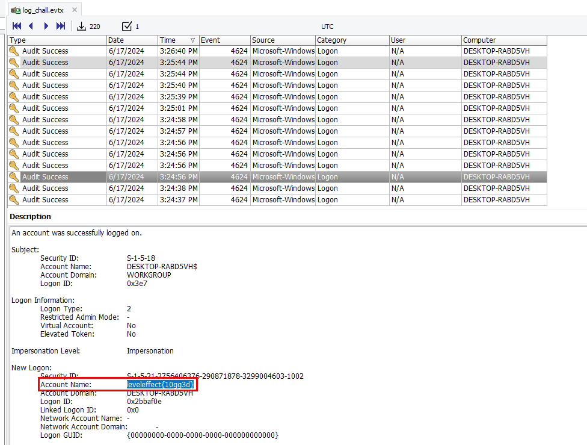

After opened this event log, we can see that there are a lot of EventID 4624 (	An account was successfully logged on)

We will have to find any suspicious Account Name on this event log to get a flag, because... well, a flag is in an Account Name as you can see

```
leveleffect{10gg3d}
```
***

***