# [MemLabs Lab 1 - Beginner's Luck](https://github.com/stuxnet999/MemLabs/tree/master/Lab%201)
Created: 14/07/2024 15:48
Last Updated: 24/08/2024 13:17
***
## Challenge Description
My sister's computer crashed. We were very fortunate to recover this memory dump. Your job is get all her important files from the system. From what we remember, we suddenly saw a black window pop up with some thing being executed. When the crash happened, she was trying to draw something. Thats all we remember from the time of crash.

**Note**: This challenge is composed of 3 flags.

**Challenge file**: [MemLabs_Lab1](https://mega.nz/#!6l4BhKIb!l8ATZoliB_ULlvlkESwkPiXAETJEF7p91Gf9CWuQI70)
***
Lately, I've been struggled with memory forensic challenges so I want to practice more and MemLabs just happened to have these awesome challenges for me to practice so I hope you can accompany me on this journey!

Since volatility 2 have more plugins that are not yet to import to volatility 3 so we will have no choice but to use volatility 2 

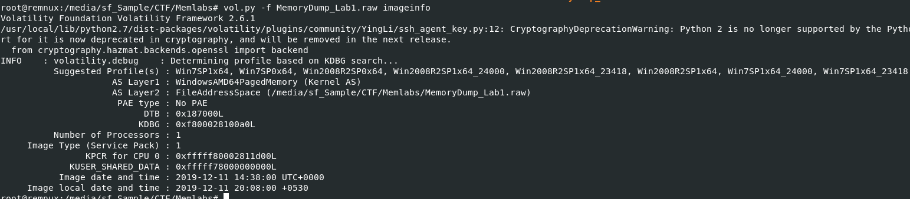

And when it comes to volatility 2, we have to determine a profile of each memory dump we investigate and we can do this by using `vol.py -f MemoryDump_Lab1.raw imageinfo` and after got the suitable profile for this memory dump then its time to capture some flags!

*note that I didnot get all flags in order so I wrote this write-up based on order I found

## Get third flag
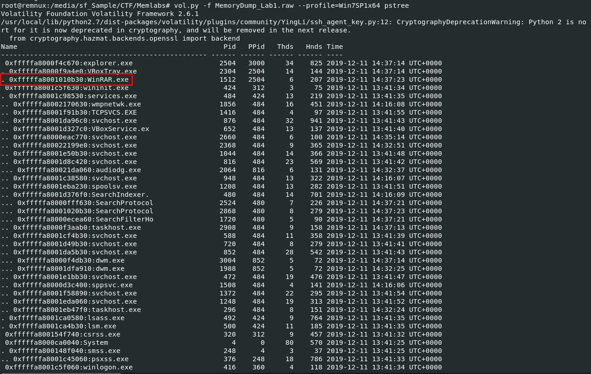

When it comes to memory dump, I always follow with `vol.py -f MemoryDump_Lab1.raw --profile=Win7SP1x64 pstree` after determined suitable profile since it will let me guess whats going on when this memory dump was taken and from this result, we can see that `WinRAR.exe` was running which mean there is some kind of compressed file that we could look into. 

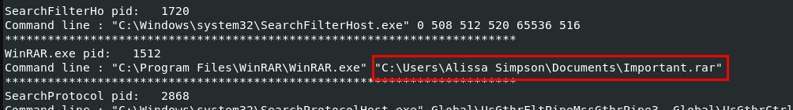

We can use `vol.py -f MemoryDump_Lab1.raw --profile=Win7SP1x64 cmdline` to show command-line argument for each process which we can see that `WinRAR.exe` took this path as an argument so we might want to dump it and take a look

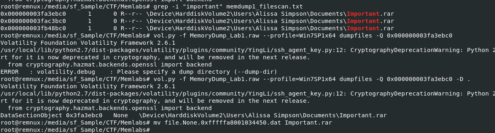

Before dumping any files, we need to know physical address (PHYOFFSETS) of that particular file on this memory dump first and for that we need to use `vol.py -f MemoryDump_Lab1.raw --profile=Win7SP1x64 filescan > memdump1_filescan.txt` to get physical address of all files available on this memory dump (Pipe output to a file so we do not have to scan through this memory dump again in case we need to find and dump another file) then after determine physical address of `Importent.rar` file then we will use `vol.py -f MemoryDump_Lab1.raw --profile=Win7SP1x64 dumpfiles -Q 0x000000003fa3ebc0 -D .` to dump it out and after dumped it, we need to change file name to it original name since volatility 2 will dump it as data file

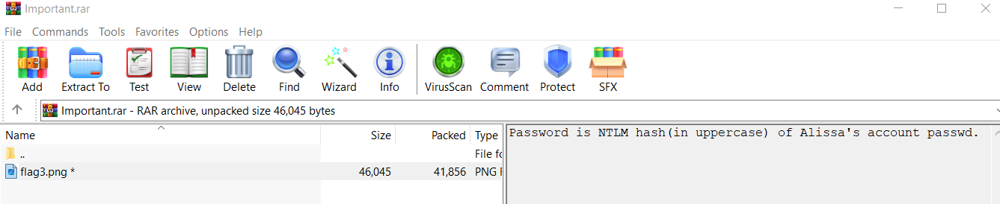

By then, we should have compressed file ready to open and after opened it we can see it is password-protected with NTLM hash of Alissa's account password

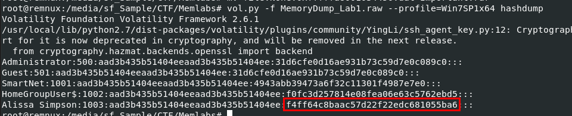

Go back to our memory dump file then we can use `vol.py -f MemoryDump_Lab1.raw --profile=Win7SP1x64 hashdump` to dump all NTLM hash then we should use this hash to view an image file by now.

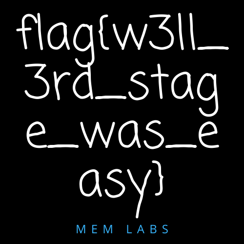

After used NTLM hash to view a file, this is an image which store third flag of this lab.

```
flag{w3ll_3rd_stage_was_easy}
```

## Get first flag
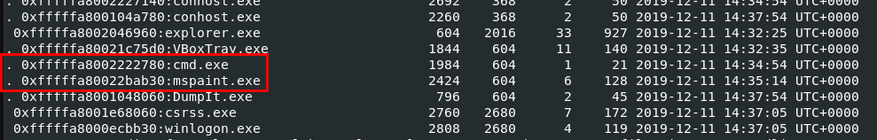

While examines an output from `pstree` plugin, we might notice `cmd.exe` and `mspaint.exe` were running on this system and what we know from description is user was drawing something (`mspaint.exe`) and black windows pop up could happened because of `cmd.exe`

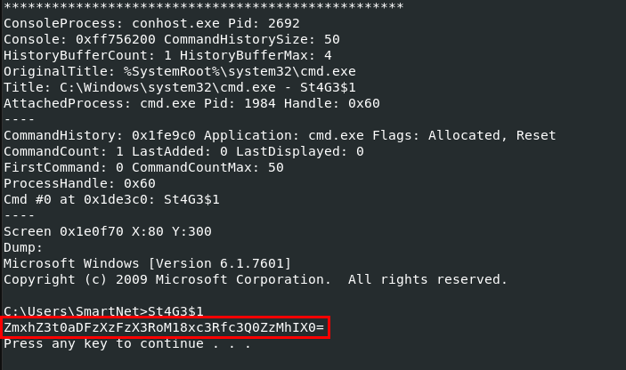

We can run `vol.py -f MemoryDump_Lab1.raw --profile=Win7SP1x64 consoles` to display command history for each processes on this system which we can see that there is 1 binary file being executed which output base64 string

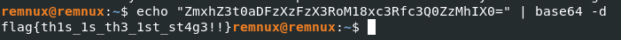

Decode it to get our first flag!

```
flag{th1s_1s_th3_1st_st4g3!!}
```

## Get second flag
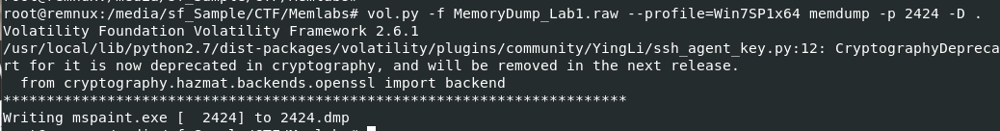

We know that we have to dig into `mspaint.exe` since user's draw was not saved because of the crash so lets dump this process out with `vol.py -f MemoryDump_Lab1.raw --profile=Win7SP1x64 memdump -p 2424 -D .`

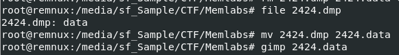

Then lets rename it to data file and use GIMP to open it.

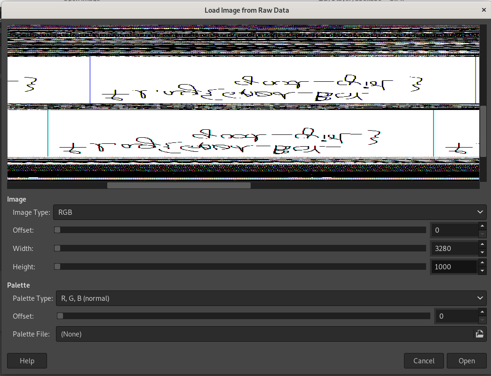

After open this file, we have to adjust width and height until we can see what user has drawn on mspaint and I think we need to rotate or flip it to make it look like alphabets

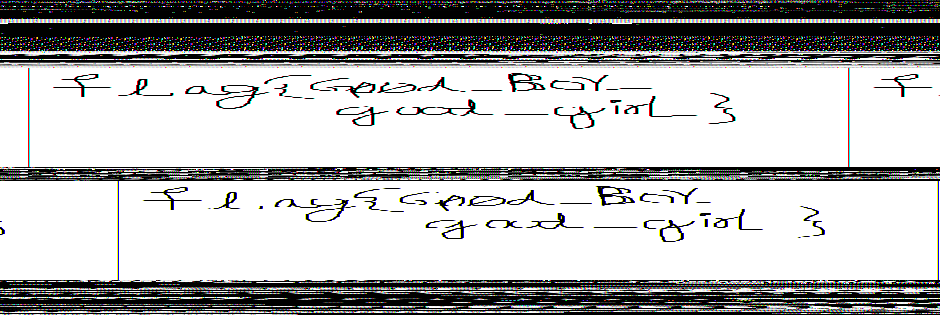

Carefully reviewing this drawing then we will have second flag of this lab

```
flag{G00d_BoY_good_girL}
```

## Lab 1 : Flags
```
flag{th1s_1s_th3_1st_st4g3!!}
flag{G00d_BoY_good_girL}
flag{w3ll_3rd_stage_was_easy}
```
***


