# [MemLabs Lab 2 - A New World](https://github.com/stuxnet999/MemLabs/tree/master/Lab%202)
Created: 14/07/2024 16:01
Last Updated: 
***
## Challenge Description
One of the clients of our company, lost the access to his system due to an unknown error. He is supposedly a very popular "environmental" activist. As a part of the investigation, he told us that his go to applications are browsers, his password managers etc. We hope that you can dig into this memory dump and find his important stuff and give it back to us.

**Note**: This challenge is composed of 3 flags.

**Challenge file**: [MemLabs_Lab2](https://mega.nz/#!ChoDHaja!1XvuQd49c7-7kgJvPXIEAst-NXi8L3ggwienE1uoZTk)
***
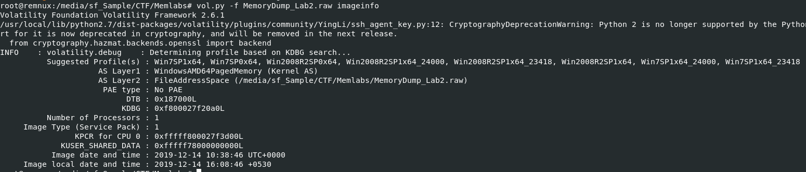
Lets start with `vol.py -f MemoryDump_Lab2.raw imageinfo` to find the suitable profile for this memory dump then after we have one, we will continue to follow the challenge description to get all flags.

## Get first flag
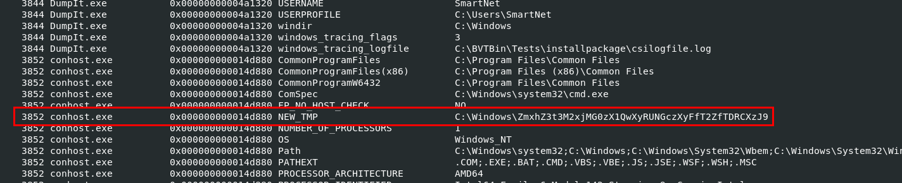

First one that describes client who owns a machine that was taken memory dump of is "environmental" so this is our first hint toward our first flag and volatility 2 just happened to have a plugin that print all environment variables of provided memory dump so lets proceed with `vol.py -f MemoryDump_Lab2.raw --profile=Win7SP1x64 envars` and then after carefully review an output, we could see that `NEW_TMP` variable in `conhost.exe` store some strange path.

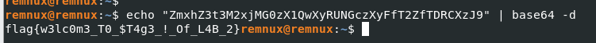

So I tried to decode this path with base64 and look like it worked, we got our first flag!

```
flag{w3lc0m3_T0_$T4g3_!_Of_L4B_2}
```

## Get second flag
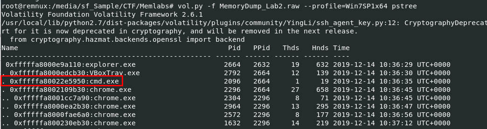

Now lets see how many processes were running when this memory was captured with `vol.py -f MemoryDump_Lab2.raw --profile=Win7SP1x64 pstree` then we could see that `cmd.exe` and `chrome.exe` are running so we might use `consoles` for command history and `chromehistory` plugin for Chrome browsing history.

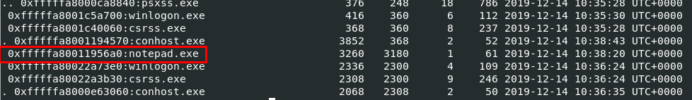
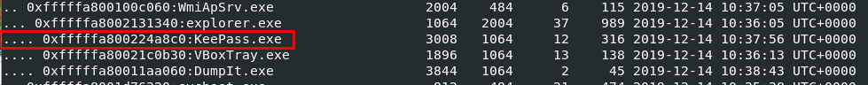

We can also noticed that `notepad.exe` and `KeePass.exe` were also running as well which mean we might have to dump keepass database to get a flag from this password manager.

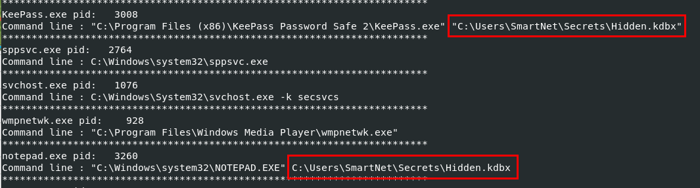

To determine which file `notepad.exe` and `KeePass.exe` were opened we can use `vol.py -f MemoryDump_Lab2.raw --profile=Win7SP1x64 cmdline` which display all command-line arguments of all running processes (when it was captured) then we could see that these 2 processes were opened the same file.

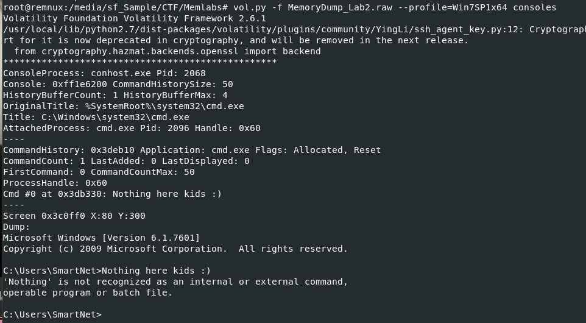

Before going to dump it, I tried to use view command history via `consoles` plugin but there is nothing here

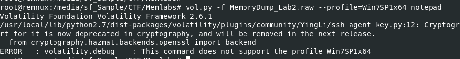

Next I also tried `notepad` plugin which is not working neither because of this profile.

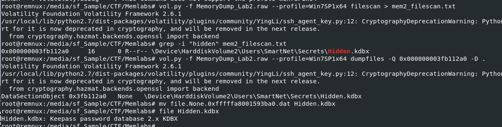

So lets get physical address of the all files using `vol.py -f MemoryDump_Lab2.raw --profile=Win7SP1x64 filescan > mem2_filescan.txt` then using grep to get physical address of that keepass database we found which we will use `vol.py -f MemoryDump_Lab2.raw --profile=Win7SP1x64 dumpfiles -Q 0x000000003fb112a0 -D .` to dump it and rename to its original name.

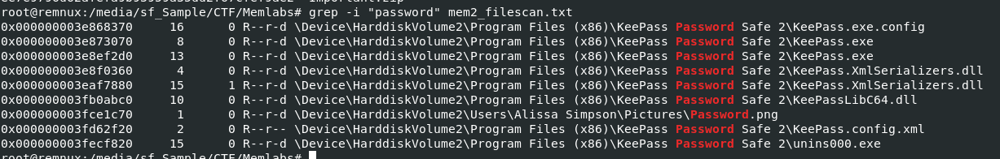

I tried to bruteforce for master password with `keepass2john` and `john` but it did not work so I came back to `mem_filescan.txt` to find for anything we could use which we can see that `Password.png` might be the one we're looking for

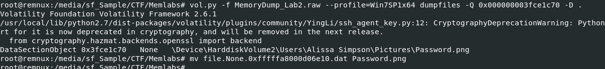

Lets dump it with `vol.py -f MemoryDump_Lab2.raw --profile=Win7SP1x64 dumpfiles -Q 0x000000003fce1c70 -D .` and do not forget to rename it so we could open this file with image viewer.


This is an image we just dumped, there is no flag but a password was there.

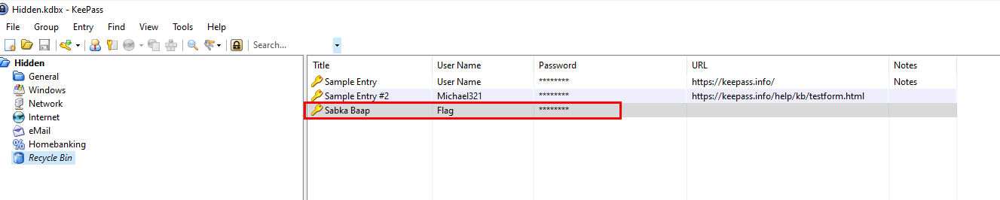

We can this password to open keepass database file and obtain a flag from "Recycle Bin"

```
flag{w0w_th1s_1s_Th3_SeC0nD_ST4g3_!!}
```

## Get third flag
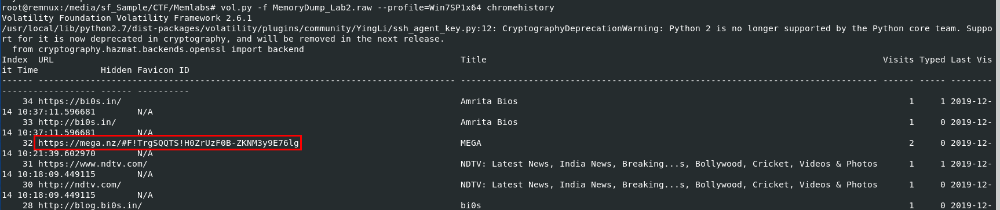

The only thing we still did not tackle in is Chrome Browser History so lets use `vol.py -f MemoryDump_Lab2.raw --profile=Win7SP1x64 chromehistory` then we can see one MEGA url that is so outstanding here

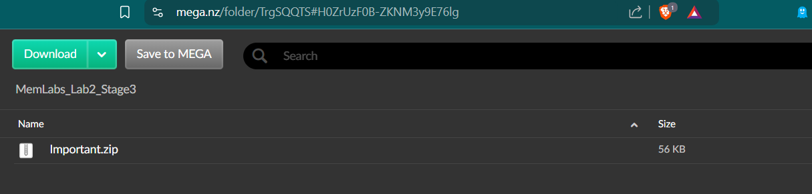

Upon visiting this, we can see a zip file on this url so lets download it

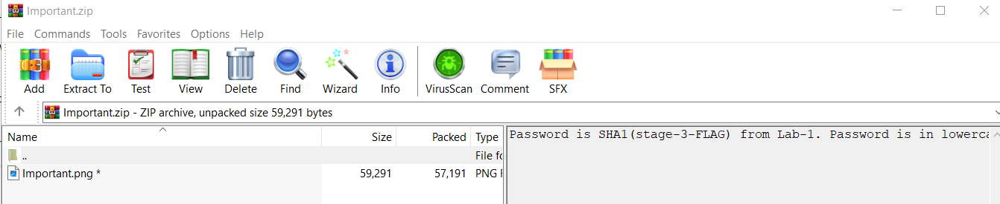

We got the right file! we just need SHA1 of Lab 1 - stage-3 flag to read an image file inside.

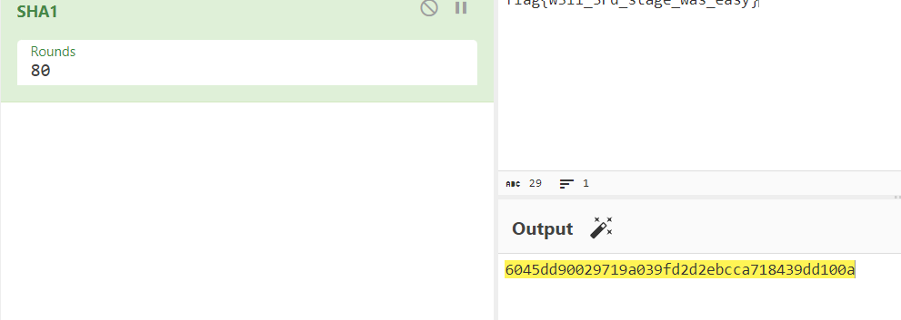

Before tackle this lab, we should already done with Lab 1 so we just need to calculate SHA1 hash of this text then use it as a password for this zip file.


We're done with Lab 2! see you in Lab 3!

```
flag{oK_So_Now_St4g3_3_is_DoNE!!}
```

## Lab 2 : Flags
```
flag{w3lc0m3_T0_$T4g3_!_Of_L4B_2}
flag{w0w_th1s_1s_Th3_SeC0nD_ST4g3_!!}
flag{oK_So_Now_St4g3_3_is_DoNE!!}
```
***