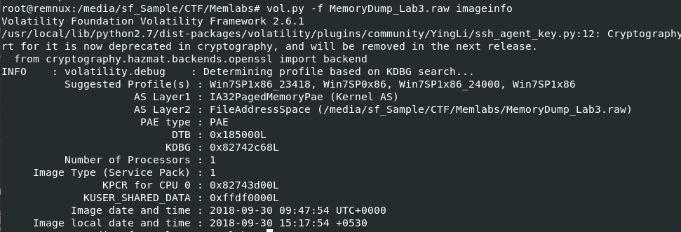
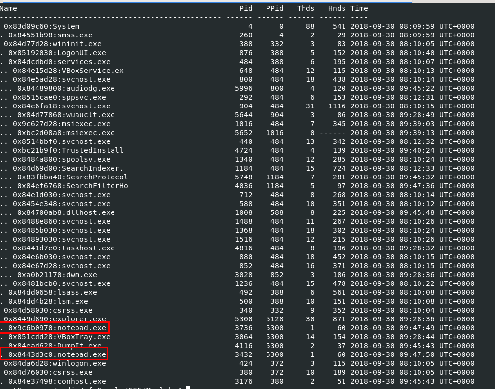
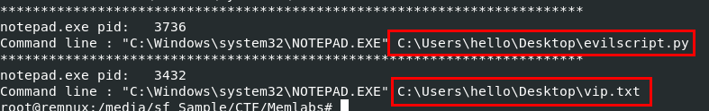
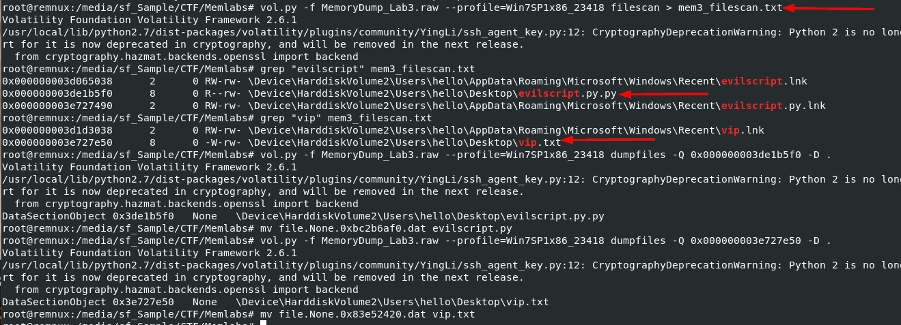
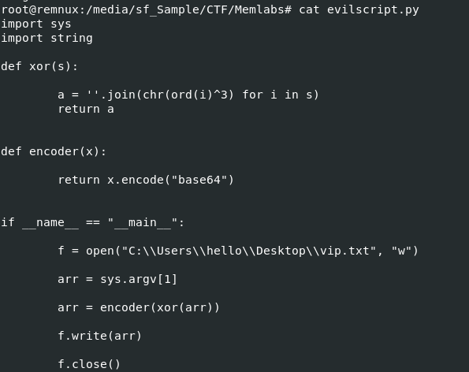
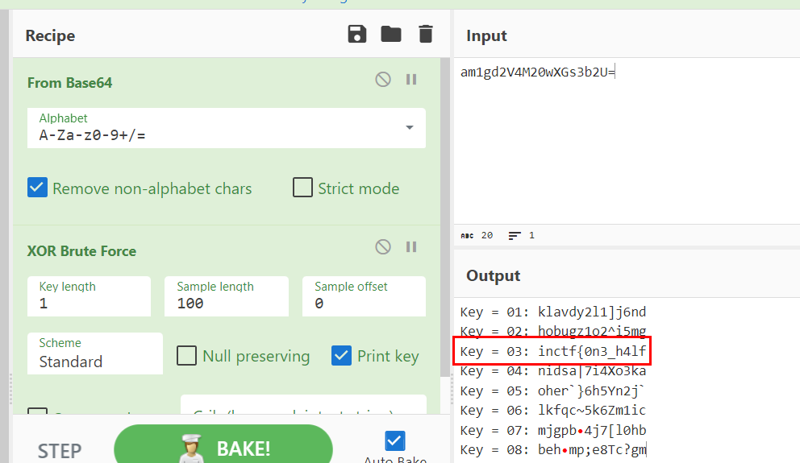
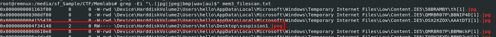
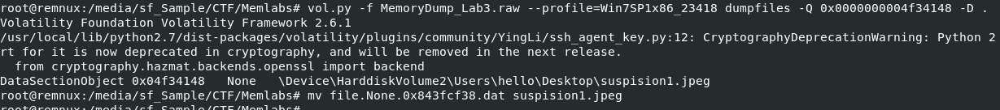
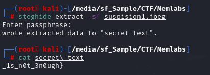

# [MemLabs Lab 3 - The Evil's Den](https://github.com/stuxnet999/MemLabs/tree/master/Lab%203)
Created: 14/07/2024 16:20
Last Updated: 24/08/2024 16:23
***
[toc]
## Challenge Description
A malicious script encrypted a very secret piece of information I had on my system. Can you recover the information for me please?

**Note-1**: This challenge is composed of only 1 flag. The flag split into 2 parts.

**Note-2**: You'll need the first half of the flag to get the second.

You will need this additional tool to solve the challenge,

```
$ sudo apt install steghide
```

The flag format for this lab is: **inctf{s0me_l33t_Str1ng}**

Challenge file: [MemLabs_Lab3](https://mega.nz/#!2ohlTAzL!1T5iGzhUWdn88zS1yrDJA06yUouZxC-VstzXFSRuzVg)
***


Lets start with `vol.py -f MemoryDump_Lab3.raw imageinfo` to determine a suitable profile for this memory dump then we can proceed with this challenge.

## Getting first half of a flag


Challenge description says that there is some malicious script that encrypted very secret piece of information so that would be our hint to get first flag and I want to see if there is any process that will lead us to this script so lets start with `vol.py -f MemoryDump_Lab3.raw --profile=Win7SP1x86_23418 pstree` to show a process tree which we can see that there are 2 `notepad.exe` were running.



And by using `vol.py -f MemoryDump_Lab3.raw --profile=Win7SP1x86_23418 cmdline` to get command-line arguments from these 2 processes, we can see that they opened 2 files (1 is evil script and 1 is a text file)



Now we get physical address of all file and pipe it to a text file with `vol.py -f MemoryDump_Lab3.raw --profile=Win7SP1x86_23418 filescan > mem3_filescan.txt` then we could proceed to dump both file with `vol.py -f MemoryDump_Lab3.raw --profile=Win7SP1x86_23418 dumpfiles -Q 0x000000003de1b5f0 -D .` and `vol.py -f MemoryDump_Lab3.raw --profile=Win7SP1x86_23418 dumpfiles -Q 0x000000003e727e50 -D .` then after renamed both files to their respective names, lets review the script to see what it does 



We can see that this script is reading `vip.txt` and xor it with key given by user and use `encoder` function to encode ciphertext from `xor` to base64 then write that output to `vip.txt` replacing old content inside of it



We might not know a key but we can use "XOR Brute Force" on CyberChef to crack it which we can see that we got first half of a flag when Key = 03

## Getting second half of a flag
Challenge description also telling us that we might need `steghide` to obtain second half of a flag and first half of a flag is required to get the second so we could guess that first part of a flag is a passphrase we will put to `steghide` to get the second



so lets find anything that could be used for steganography with `grep -Ei "\.(jpg|jpeg|bmp|wav|au)$" mem3_filescan.txt` which we will see this file definitely standing out than the rest.



Dump it with `vol.py -f MemoryDump_Lab3.raw --profile=Win7SP1x86_23418 dumpfiles -Q 0x0000000004f34148 -D .` then get our steghide ready!



To extract content out of any steg file, use `steghide extract -sf suspision1.jpeg` and a passphrase is the first half of a flag then we will have "secret text" that contains second part of this flag.

We solved this!

## Lab 3 : Flag
```
inctf{0n3_h4lf_1s_n0t_3n0ugh}
```
***