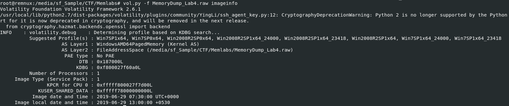
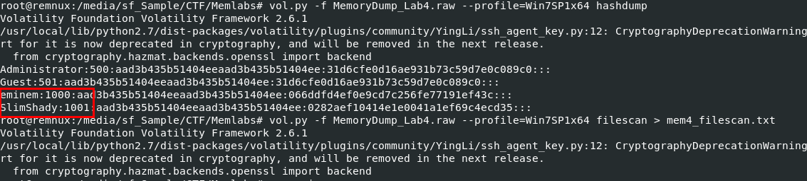
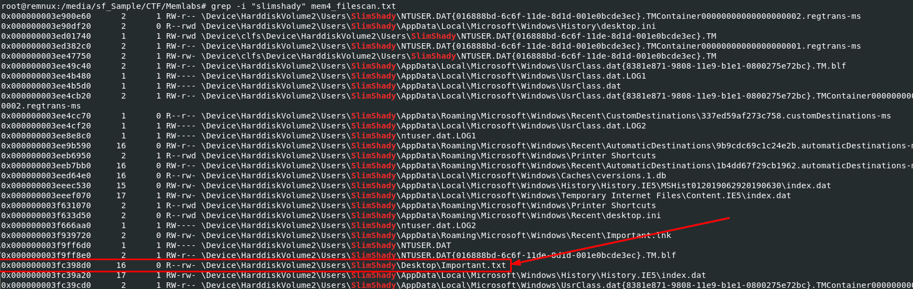
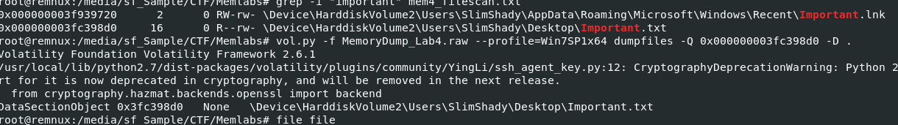
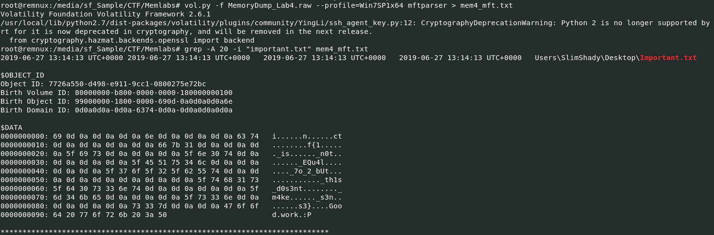
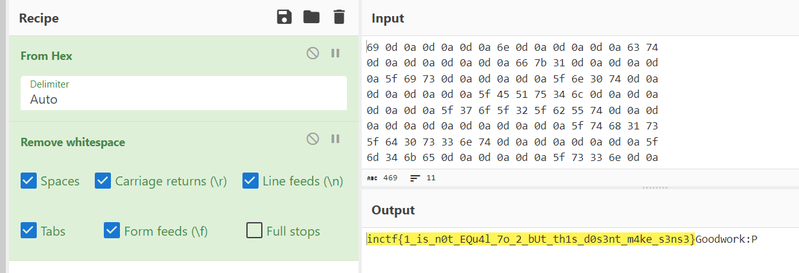

# [MemLabs Lab 4 - Obsession](https://github.com/stuxnet999/MemLabs/tree/master/Lab%204)
Created: 14/07/2024 16:48
Last Updated: 24/08/2024 17:46
***
[toc]
## Challenge Description
My system was recently compromised. The Hacker stole a lot of information but he also deleted a very important file of mine. I have no idea on how to recover it. The only evidence we have, at this point of time is this memory dump. Please help me.

**Note**: This challenge is composed of only 1 flag.

The flag format for this lab is: **inctf{s0me_l33t_Str1ng}**

**Challenge file**: [MemLabs_Lab4](https://mega.nz/#!Tx41jC5K!ifdu9DUair0sHncj5QWImJovfxixcAY-gt72mCXmYrE)
***
We already did Lab 1-3 which considered first half of MemLabs now we are in 4 and will proceed to 6 which is second half of MemLabs challenges so lets dig it



Lets start with `vol.py -f MemoryDump_Lab4.raw imageinfo` to determine suitable profile for this memory dump then reviewing challenge description again, which we might notice that hacker deleted important file which we could have guess that it is a flag so we may not find this file or a process related to this file



We might use `vol.py -f MemoryDump_Lab4.raw --profile=Win7SP1x64 filescan > mem4_filescan.txt` to get all physical address associated with all the files from this memory dump (which might included recycle.bin) and as you might notice that I also used `hashdump` plugin, why? because I want to know how many users were on this system so we can search for all files inside each user folder.



I tried to search for a file in `recyble.bin` but did not find anything so I started searching for any clue left on each user folder and then I found this one is a little interesting



I tried to dump it but there is no file dumpped from this offset which mean this is a file we are looking for and it was already deleted from this system.

But since we already know that this file is a text file and it contains a flag which is relatively small so we can use `mftparser` plugin to parse Master File Table and restore its content for us.



By using `vol.py -f MemoryDump_Lab4.raw --profile=Win7SP1x64 mftparser > mem4_mft.txt`, we will pipe an output of `mftparser` plugin into a text file since it will be massive text overwhelming our terminal and after its done then we can use `grep -A 20 -i "important.txt" mem4_mft.txt` to display 20 lines following matching line to `important.txt` which we can see that a flag is right there, we just need to remove white spaces from these hex



We can do this by copy those hex to CyberChef and use "Remove whitespace" recipe after "From Hex" then we can easily read a flag without any worries.

## Lab 4 : Flag
```
inctf{1_is_n0t_EQu4l_7o_2_bUt_th1s_d0s3nt_m4ke_s3ns3}
```
***