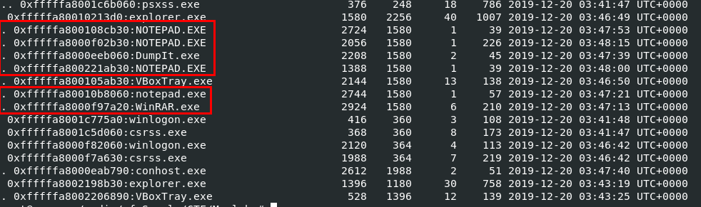

# [MemLabs Lab 5 - Black Tuesday](https://github.com/stuxnet999/MemLabs/tree/master/Lab%205)
Created: 14/07/2024 16:51
Last Updated: 27/08/2024 18:10
***
## Challenge Description
We received this memory dump from our client recently. Someone accessed his system when he was not there and he found some rather strange files being accessed. Find those files and they might be useful. I quote his exact statement,

>The names were not readable. They were composed of alphabets and numbers but I wasn't able to make out what exactly it was.

Also, he noticed his most loved application that he always used crashed every time he ran it. Was it a virus?

**Note-1**: This challenge is composed of 3 flags. If you think 2nd flag is the end, it isn't!! :P

**Note-2**: There was a small mistake when making this challenge. If you find any string which has the string "***L4B_3_D0n3!!***" in it, please change it to "***L4B_5_D0n3!!***" and then proceed.

**Note-3**: You'll get the stage 2 flag only when you have the stage 1 flag.

**Challenge file**: [MemLabs_Lab5](https://mega.nz/#!Ps5ViIqZ!UQtKmUuKUcqqtt6elP_9OJtnAbpwwMD7lVKN1iWGoec)
***
Almost done! We're at Lab 5 of MemLabs, lets contiue this journey to the end!


Always start with `vol.py -f MemoryDump_Lab5.raw imageinfo` to determine suitable profile for this memory dump.



Now after we got suitable profile, lets see how many processes that might pick up our investigation sense with `vol.py -f MemoryDump_Lab5.raw --profile=Win7SP1x64 pstree` which you can see that there are so many `NOTEPAD.exe` processes and 1 `WinRAR.exe` process that we may need to take a look.


Then after using `vol.py -f MemoryDump_Lab5.raw --profile=Win7SP1x64 cmdline`, we can see this rar archive file that might contains a flag.


So lets scan for offset with `vol.py -f MemoryDump_Lab5.raw --profile=Win7SP1x64 filescan > mem5_filescan.txt` then dump that file with `vol.py -f MemoryDump_Lab5.raw --profile=Win7SP1x64 dumpfiles -Q 0x000000003eed56f0 -D .` and lastly, rename it to its original name.


But its password-protected as expect but we could still see that this archive file store stage 2 image which should be second flag of this lab and by now we could guess that we need first flag as a password for this archive.


I tried to use many plugins to get some clues like `chromehistory`, `firefoxhistory` which got no luck but there is one plugin that actually give me anything that is `iehistory` and from this screenshot, you can see that strange bmp file was accessed on IE that was opened from  `explorer.exe` and it also matches challenge description.


I tried decode it with base64 and turns out, It is the first flag!


Now we can use first flag as a password to get second file inside rar archive we just dumped

## Bonus Flag


But since there is one more flag, I could not let it end like this but I remembered that there are multiple `NOTEPAD.exe` when we scanned with `pstree` and `cmdline` plugin also gave us a hint that this notepad is not definitely windows native notepad since its in User's folder


So I dumped that file and open it with IDA (Freeware btw) which lead to these weird strings push to stack and when I putted it together, turns out it is a flag and now we're done with Lab 5.

## Lab 5 : Flags
```
flag{!!_w3LL_d0n3_St4g3-1_0f_L4B_5_D0n3_!!}
flag{W1th_th1s_$taGe_2_1s_cOmPL3T3_!!}
bi0s{M3m_l4b5_OVeR_!}
```
***