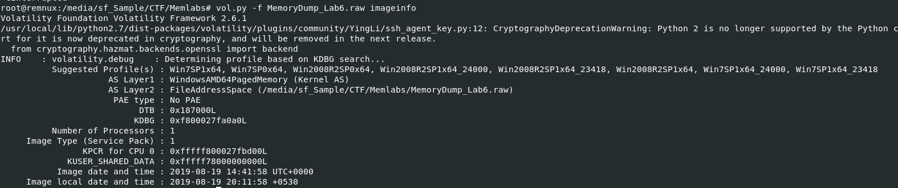
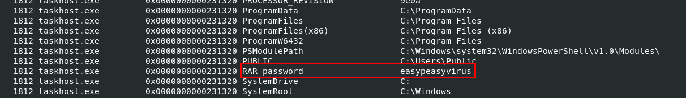
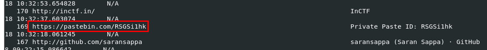

# [MemLabs Lab 6 - The Reckoning](https://github.com/stuxnet999/MemLabs/tree/master/Lab%206)
Created: 14/07/2024 19:01
Last Updated: 27/08/2024 18:10
***
## Challenge Description
We received this memory dump from the Intelligence Bureau Department. They say this evidence might hold some secrets of the underworld gangster David Benjamin. This memory dump was taken from one of his workers whom the FBI busted earlier this week. Your job is to go through the memory dump and see if you can figure something out. FBI also says that David communicated with his workers via the internet so that might be a good place to start.

**Note**: This challenge is composed of 1 flag split into 2 parts.

The flag format for this lab is: **inctf{s0me_l33t_Str1ng}**

**Challenge file**: [MemLabs_Lab6](https://mega.nz/#!C0pjUKxI!LnedePAfsJvFgD-Uaa4-f1Tu0kl5bFDzW6Mn2Ng6pnM)
***
Finally! we are in the final lab of MemLabs, are you ready to tackle this? lets go!



After determined which profile to use with `vol.py -f MemoryDump_Lab6.raw imageinfo`, now we are ready to rock!

## Getting second half of a flag


Showing process tree should be my signature move at this point since I always start with `vol.py -f MemoryDump_Lab6.raw --profile=Win7SP1x64 pstree` after determined image profile, You could see a lot of processes here that totally outstanding which are WinRAR, chrome, cmd and firefox


Start with `vol.py -f MemoryDump_Lab6.raw --profile=Win7SP1x64 cmdline`, since most flag we got so far almost start from here and this is likely to be the case for this one too.


And now its time to dump it, first getting an offset with `vol.py -f MemoryDump_Lab6.raw --profile=Win7SP1x64 filescans > mem6_filescan.txt` then `vol.py -f MemoryDump_Lab6.raw --profile=Win7SP1x64 dumpfiles -Q 0x000000005fcfc4b0 -D .` and lastly, change dumped filename to its original name.


Its always password-protected, my first instinct is to use first half of a flag as a password but then I realized..."wait.. how about cmd.exe process?"


So I used `vol.py -f MemoryDump_Lab6.raw --profile=Win7SP1x64 consoles` to show command history which you can see that Jaffa user was trying to list all environment variables with `env` command



So we can use `envars` plugin to find for anything remotely closed to password or a clue to password which will lead us to this `RAR password` variable that stores password for flag archive file.


Use password we obtained to get second half of a flag!

## Getting first half of a flag



We still have `chrome.exe` and `firefox.exe` left to explore so I started with `firefoxhistory` and got nothing but `chromehistory` has this url that stand out.


So lets visit it, and we can see that this pastebin contains another url and a hint which we do not know yet how this key will be used for but lets keep that in mind for now.


Upon visiting url stores in pastebin, its a google doc that contain Lorem ipsum paragraph so we might need to skim this to find anything that should not be here.


Which eventually lead us to Mega Drive which is locked by a key so now we need to find password to unlock it.


Since a key was sent with mail and it might be a gmail so I did not expect it to be found by any plugin so I used `strings` to search for "the key" which we can see that it worked!


Unlock mega with that key and download a flag.


But look like this file is corrupted so we might need to use hexeditor to fix it


I used HxD that pre-installed in Flare-VM and we can see that in IHDR chuck because it supposed to be IHDR not iHDR 


Compare to `flag2.png`, we can see which offset we need to fix.


Lets change 0x0000000C offset from 69(i) to 49(I) then save it, we should be able to view this image for now.


Now we have both path of a flag and solved this lab! And now we've completed all Labs in MemLabs!

## Lab 6 : Flags
```
inctf{thi5cH4LL3Ng3_!s_g0nn4_b3_?_aN_Am4zINg_!_i_gU3Ss???}
```
***