# Thailand Cyber Top Talent 2024 OPEN [Qualifier] - Network/Forensics/Mobile - MaAowHa (มาเอาฮา) Team
[toc]
***
## Introduction
สวัสดีครับท่านผู้อ่านทุกท่าน ผม chicken0248 หัวหน้าทีม MaAowHa (มาเอาฮา) ได้รับหน้าที่เป็น Blue teamer ประจำทีมโดยอีกสองท่านคือ PL.0x00  (pentester) และ casperx (dev) เป็นสมาชิกทีม โดยทีมของเราจะเป็นการรวมตัวกันระหว่างผมที่ทำงานในหน่วยงานภาครัฐและเพื่อน ๆ อีกสองคนที่ทำงานในหน่วยงานเอกชน แล้วก็เป็นการแข่ง CTF เป็นทีมครั้งแรกของพวกเราหลังจากเรียนจบด้วย

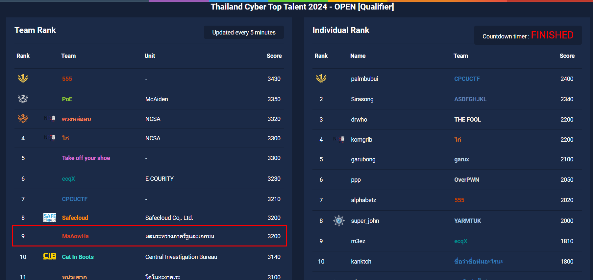

ใน write-up นี้ผมได้เขียนถึงวิธีการ solve challenge ใน 3 หมวดหมู่ได้แก่ 
- Networks (ทำได้ 3 จาก 4 ข้อ)
- Digital Forensics (ทำได้ 3 จาก 4 ข้อ)
- Mobile Security (ทำได้ทุกข้อ)

So without further ado, Lets jump right in ครับ

***
## Networks
### HTTP Mayhem (100)
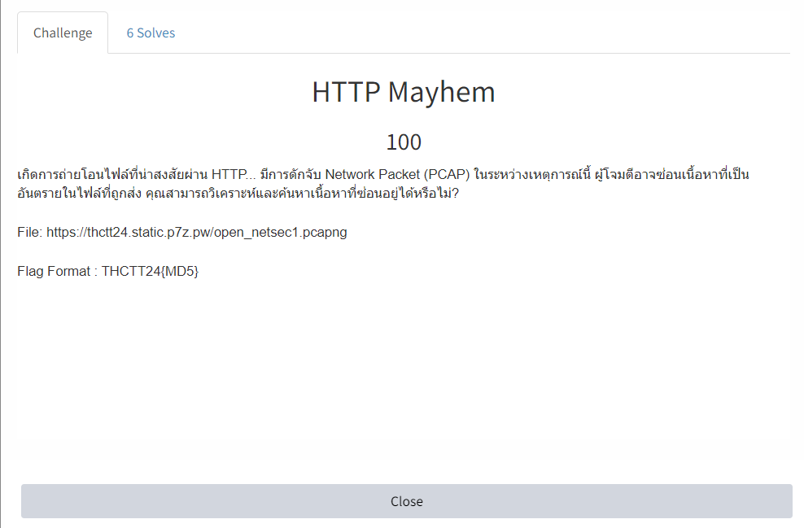
เกิดการถ่ายโอนไฟล์ที่น่าสงสัยผ่าน HTTP... มีการดักจับ Network Packet (PCAP) ในระหว่างเหตุการณ์นี้ ผู้โจมตีอาจซ่อนเนื้อหาที่เป็นอันตรายในไฟล์ที่ถูกส่ง คุณสามารถวิเคราะห์และค้นหาเนื้อหาที่ซ่อนอยู่ได้หรือไม่?
* * *
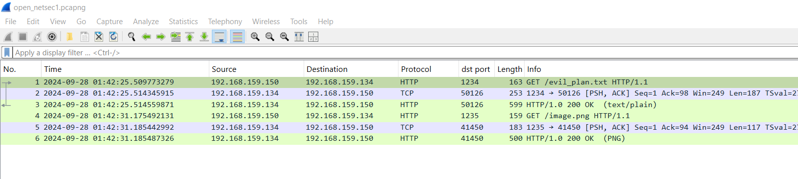
เมื่อเราโหลดไฟล์มาแล้วเปิดด้วย Wireshark ก็จะพบว่ามีการส่ง HTTP GET Request ไปขอไฟล์ 2 ไฟล์มาจาก server โดยไฟล์แรกก็คือ `evil_plan.txt` และไฟล์ที่สองก็คือ `image.png`

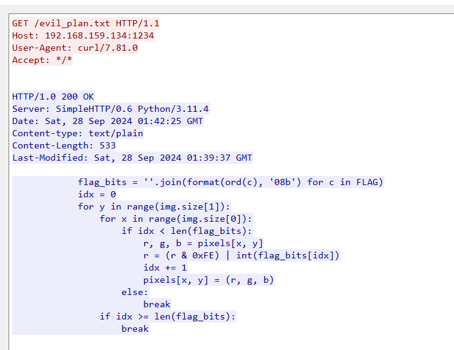

ไฟล์แรกจะเป็นสคริปต์เพื่อทำการ embed flag ลงใน LSB (Least Significent-Bit) ของไฟล์รูปภาพ ซึ่งเราก็น่าจะเรากันได้ว่าไฟล์รูปภาพนั้นมาจากไหน

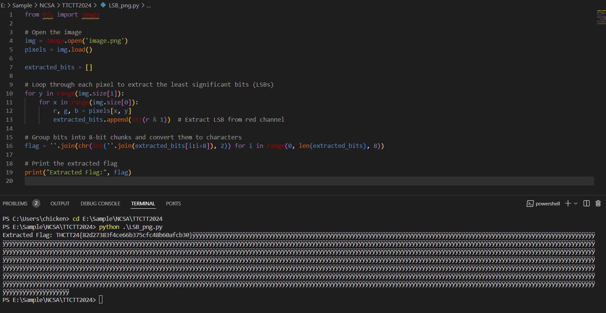

ผมก็เลยให้ ChatGPT เขียนสคริปต์ให้เปิดไฟล์ภาพแล้ว ดึง LSB ออกมา เพื่อ decode แล้วจะออกมาเป็น flag อย่างที่เห็นครับ

```
THCTT24{82d27383f4ce66b375cfc48b60afcb30}
```
***
### Silent Whisper (100)
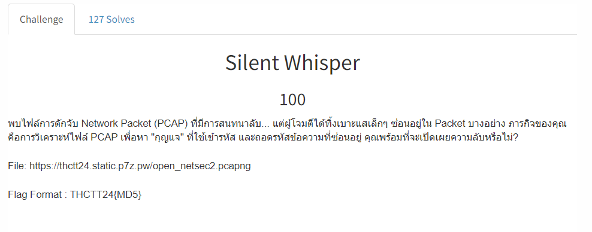
พบไฟล์การดักจับ Network Packet (PCAP) ที่มีการสนทนาลับ... แต่ผู้โจมตีได้ทิ้งเบาะแสเล็กๆ ซ่อนอยู่ใน Packet บางอย่าง ภารกิจของคุณคือการวิเคราะห์ไฟล์ PCAP เพื่อหา "กุญแจ" ที่ใช้เข้ารหัส และถอดรหัสข้อความที่ซ่อนอยู่ คุณพร้อมที่จะเปิดเผยความลับหรือไม่?

Flag Format : THCTT24{MD5}
***
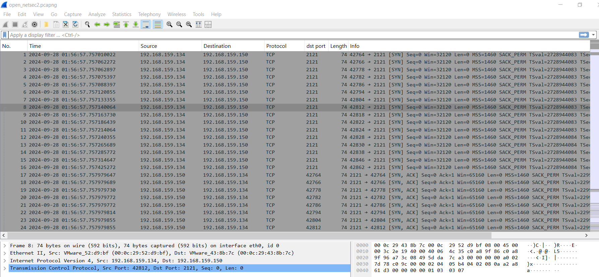

แวปแรกเมื่อเราเปิดไฟล์โจทย์ด้วย Wireshark จะพบว่ามี packet SYN จำนวนมากไปยัง Port 2121 ของอีก IP

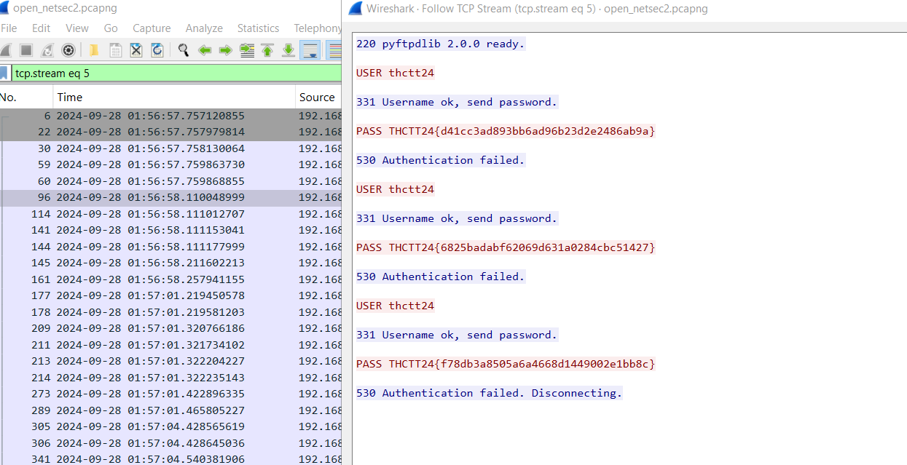

เมื่อเราเลือก follow TCP Stream ขึ้นมาซักตัวก็จะพบว่าเป็นการพยายาม authenticate ไปยัง Python FTP server ด้วย user เป็น `thctt24` และ password เป็น flag 

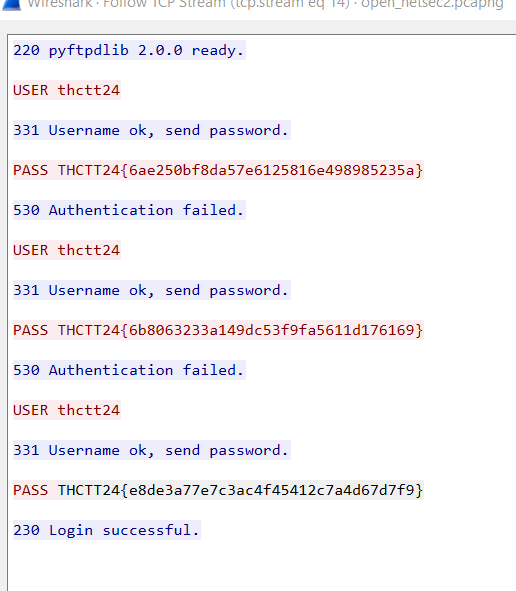

ซึ่งก็น่าจะเดาไม่ยากว่า flag ที่ถูกต้องจะทำให้ authenticate success โดย authentication successful บน FTP จะใช้ Status 230 Login Successful โดยนี่ก็คือ flag ของข้อนี้ครับ

```
THCTT24{e8de3a77e7c3ac4f45412c7a4d67d7f9}
```

***
### Encrypted C2 v2 (200)
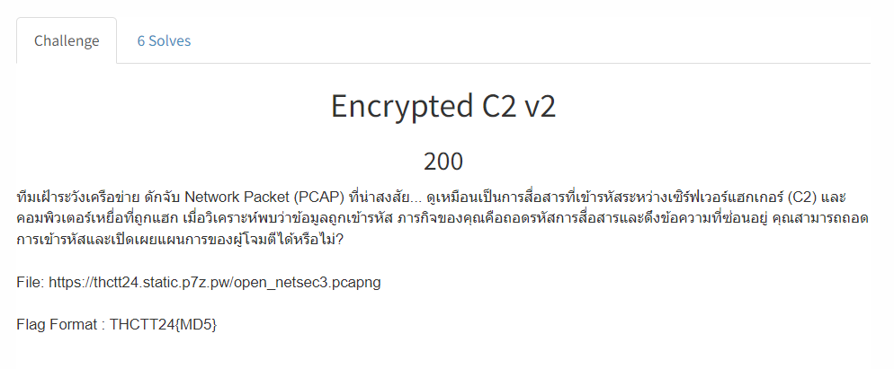
ทีมเฝ้าระวังเครือข่าย ดักจับ Network Packet (PCAP) ที่น่าสงสัย... ดูเหมือนเป็นการสื่อสารที่เข้ารหัสระหว่างเซิร์ฟเวอร์แฮกเกอร์ (C2) และคอมพิวเตอร์เหยื่อที่ถูกแฮก เมื่อวิเคราะห์พบว่าข้อมูลถูกเข้ารหัส ภารกิจของคุณคือถอดรหัสการสื่อสารและดึงข้อความที่ซ่อนอยู่ คุณสามารถถอดการเข้ารหัสและเปิดเผยแผนการของผู้โจมตีได้หรือไม่?

Flag Format : THCTT24{MD5}
***
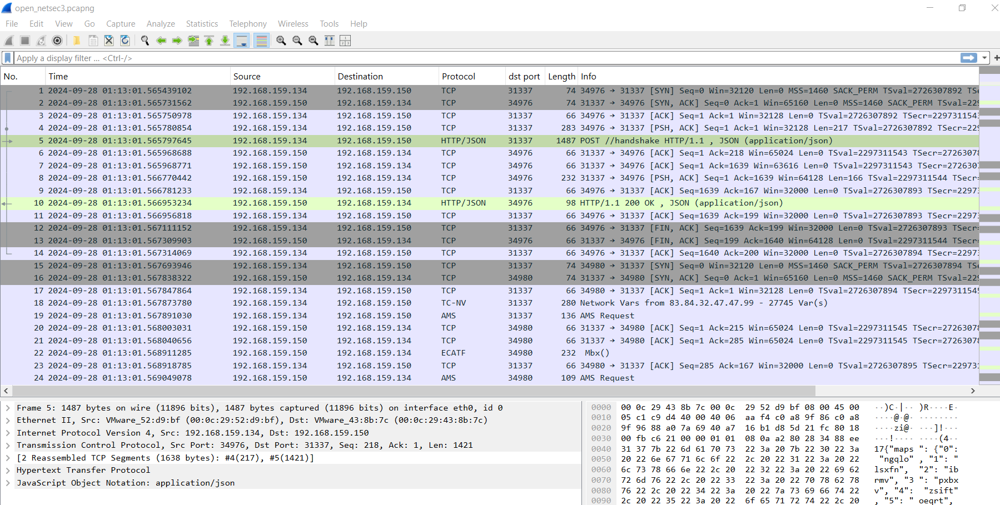

สิ่งแรกที่เราจะพบเมื่อเปิดไฟล์โจทย์ด้วย Wireshark ก็คือ HTTP POST ไปยัง //handshake endpoint ซึ่ง server ก็จะตอบกลับมาว่า "handshake received"

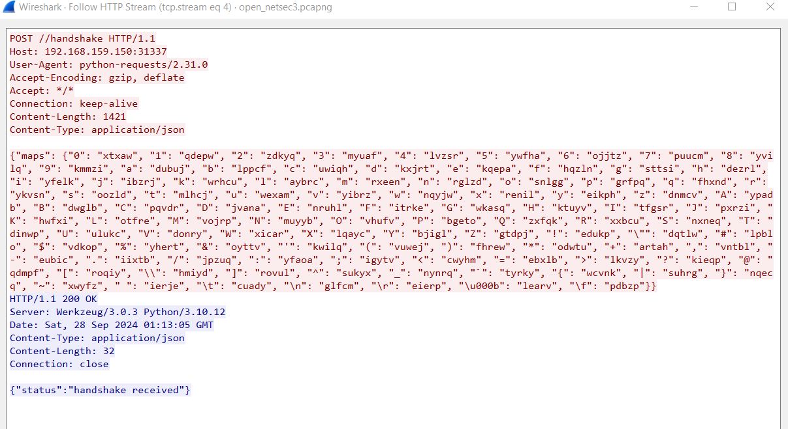

ซึ่งเมื่อเราลองมองดูสิ่งที่ส่งไปให้ server ก็จะรู้ได้ทันทีว่านี่ก็คือ wordlist นั่นเอง

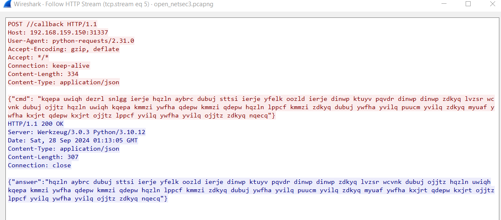

โดยสิ่งที่เราจะนำมา decode ก็จะมาจาก //callback โดยผมก็ได้ให้ ChatGPT เขียนสคริป match แต่ละ word ใน cmd ให้

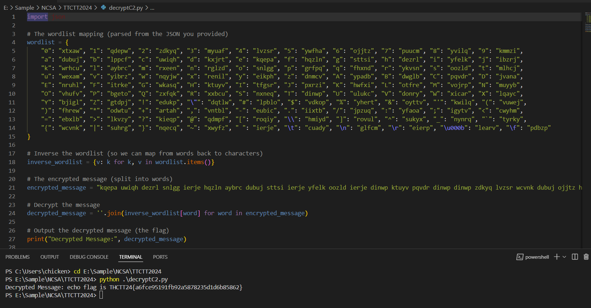

ผลลัพธ์ก็จะออกมาเป็นคำสั่งให้ echo flag ลงบน terminal นั่นเอง

```
THCTT24{a6fce95191fb92a5878235d1d6b85862}
```
***
## Digital Forensics
### Easy1 (100)
Format: THCTT24{md5()}
***
ข้อนี้จะเป็นข้อที่ไม่บอกอะไรเรามาเลย ดังนั้นสิ่งที่เราทำได้ก็คือสำรวจไฟล์ที่ได้รับมา

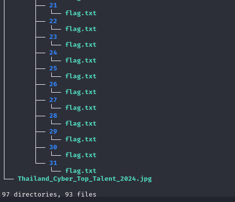

ซึ่งหลังจากแตกไฟล์ผมก็พบว่ามันเป็น Nested directories โดยจะมี `flag.txt` อยู่ทุก directory 

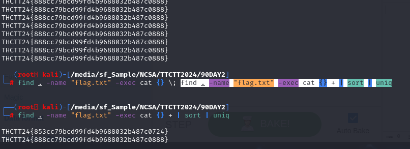

สิ่งแรกที่ผมทำก็คือใช้ `find` command เพื่ออ่าน flag ซึ่งผมก็เอ๊ะขึ้นมาว่าถ้า flag มัน identical กันเกือบทุกตัว มันก้ต้องมีตัวนึงแหละที่มัน unique, จึงเป็นสาเหตุให้ผมเพิ่ม `uniq` แล้วก็พบ flag ของจริงที่ซ๋อนอยู่

```
THCTT24{853cc79bcd99fd4b9688032b487c0724}
```

***
### Easy2 (100)
Format: THCTT24{md5()}
***
ข้อนี้ก็ยังไม่ให้คำอธิบายโจทย์มา ดังนั้นเราก็ต้องมาสำรวจไฟล์ที่ได้ตามเดิมครับ

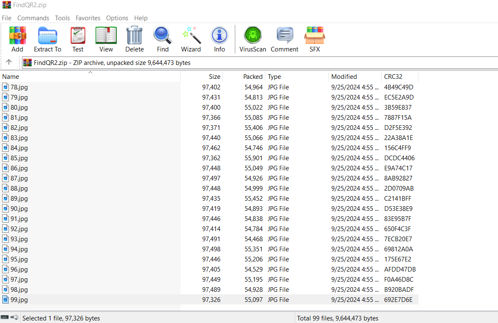

สิ่งที่เราได้รับมาก็คือไฟล์ QR Code จำนวน 99 รูป ซึ่งผมก็ให้ ChatGPT เขียน python script ในการ parse QR Code เหล่านี้แล้ว print output ออกมาผ่าน terminal 

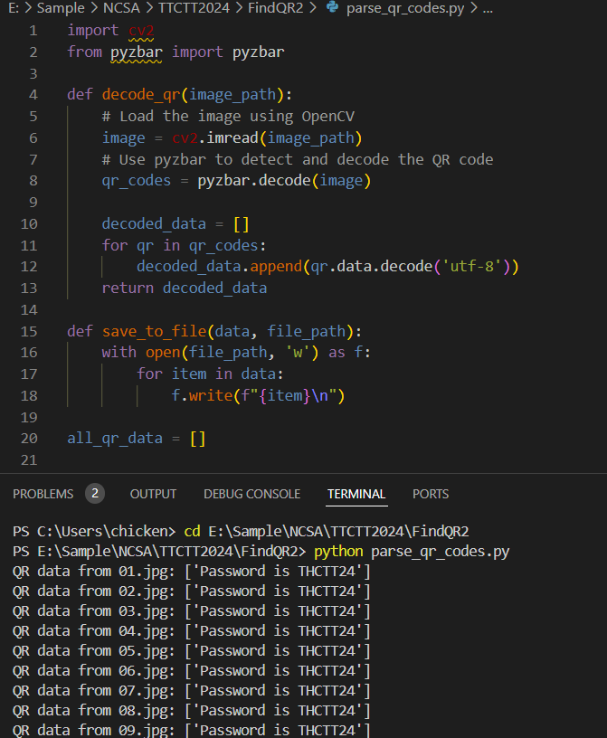

ซึ่งทุก ๆ ภาพก็จะได้เป็นข้อความเดียวกันก็คือ "Password is THCTT24" แต่ password ใช่กับอะไรหละ?

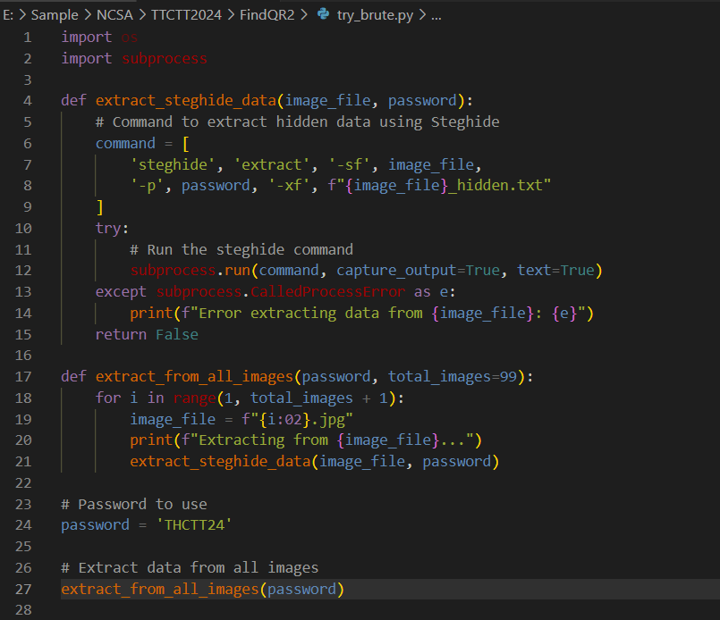

เนื่องจากเราได้ไฟล์ที่เป็น jpeg มา ซึ่งแน่นอนว่าเราก็ต้องลอง steghide กับทุกไฟล์ด้วย password ที่เราได้รับมาครับ ซึ่งนี่ก็คือ script ที่ผมใช้

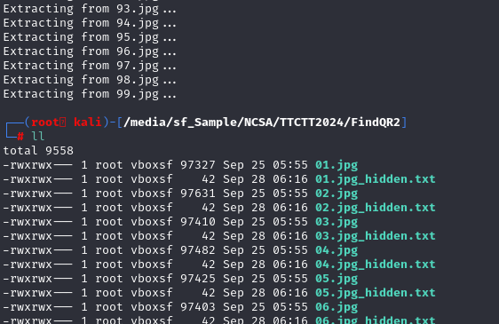

หลังจากรันสคริปต์ก็จะพบว่าทุกไฟล์มี text file ซ่อนอยู่และทุกไฟล์เหมือนจะมี flag format หมดเลย

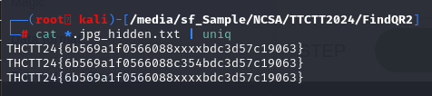

ผมก็เลยอ่านมันทุกไฟล์เลยแล้ว pipe ใส่ `uniq` ซึ่งจะเห็นว่าตรงกลางก็คือ flag ที่ถูกต้องเนื่องจากไม่ถูก REDACTED ตรงกลางนั่นเอง

```
THCTT24{6b569a1f0566088c354bdc3d57c19063}
```
***
### Cloudo (300)
TechCorp, a mid-sized technology company, has recently experienced a security incident. The company's SOC team has been alerted to suspicious activities on their server. As a Tier 1 SOC Analyst, you've been tasked with investigating the incident using the available server logs.

**The Situation**
On September 2024, TechCorp's monitoring systems detected an unusually high number of requests to their server. The server hosts a custom application, and an administrative backend. Initial AI analysis reports suggest that there might have been attempts to:
- Exploit SQL injection vulnerabilities
- Access sensitive files through Local File Inclusion (LFI)
- Bypass access controls to reach restricted areas of the application
- Enumerate and discover hidden directories and files
- N-day vulnerability.

The SOC team is concerned that these activities might be part of a larger, coordinated attack aimed at compromising TechCorp's systems and exfiltrating sensitive data.

**Your Mission**
As a Tier 1 SOC Analyst, your task is to analyze the provided log files and identify the nature and extent of the potential breach. You need to:

- Identify the IP address(es) of the potential attacker(s)
- Determine the types of attacks attempted

https://storage.googleapis.com/secplayground-event/thailandtoptalent2024/cloudo.zip

Password for unzip: THCTT24

Format of answer: THCTT24{threat-actor-ip_CVE-number} such as THCTT24{10.0.0.01_cve-2024-4087}
***
นี่ก็เป็นข้อยากอีกข้อเลยที่ถ้าหากเราเริ่มต้นไม่ถูกตั้งแต่แรก เราก็จะหาคำตอบไม่ได้เลยเพราะหลงอยู่ใน log จำนวนมหาศาลครับ โดยสิ่งแรกที่ผมทำเลยก็คือเปิด splunk enterprise instance จาก docker ขึ้นมาแล้ว โยน log file ทั้งสามเข้าไปเพื่อทำให้การ search ง่ายขึ้น

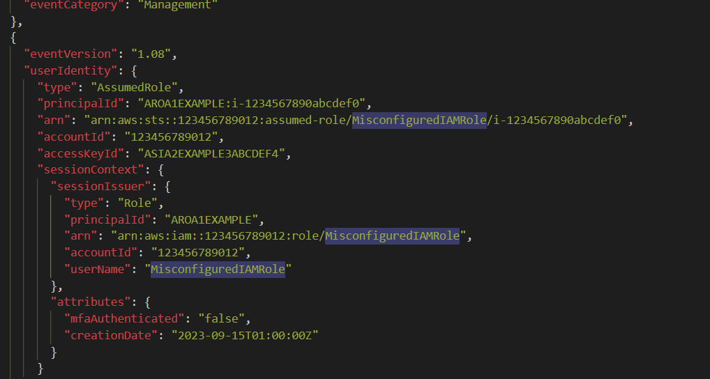

สิ่งแรกที่ผมเริ่มจับผิดสังเกตได้ก็คือ `userName` ใน CloudTrail log ที่มีชื่อว่า `MisconfiguredIAMRole` ซึ่งมีความเป็นไปได้ว่า threat actor จะเข้าถึง role ตัวนี้แล้วทำการเข้าถึง resources อื่น ๆ บน Cloud

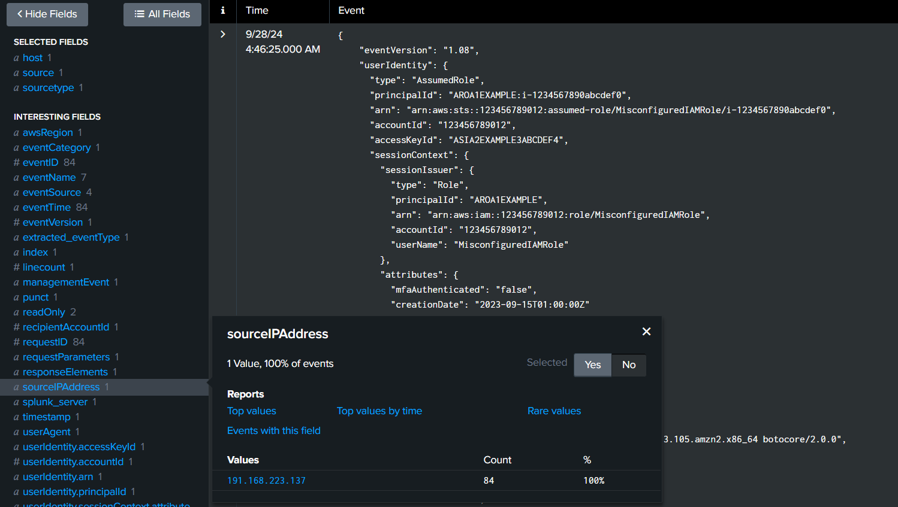

ซึ่งเมื่อ query ด้วย splunk จะพบว่ามีเพียง IP เดียวที่เข้าถึง arn ตัวนี้

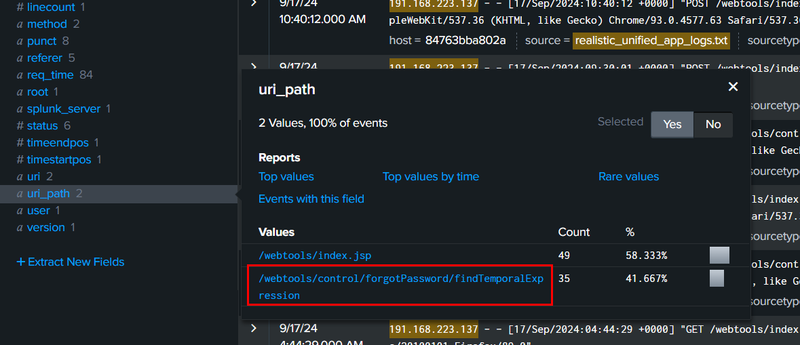

จากนั้นผมก็มาค้นหา IP นี้ต่อที่ `realistic_unified_app_logs.txt` และผมก็พบว่า IP นี้ได้ส่ง request ไปยัง endpoint แปลก ๆ ซึ่งดูเหมือนจะเป็นการ exploit vulnerability หนึ่ง

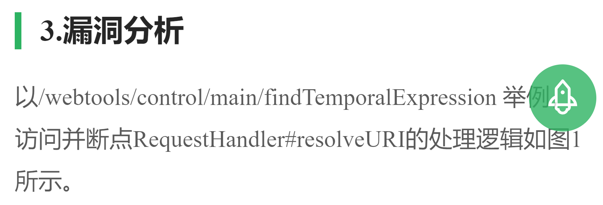

หลังจากหาใน google ซักพักนึงผมก็ไปเจอ write-up (https://m.freebuf.com/articles/web/410898.html) ของช่องโหว่ที่พูดถึง endpoint นี้ โดยช่องโหว่นั้นก็คือนั่นก็คือ CVE-2024-45507 ซึ่งเป็นช่องโหว่ Server-side request forgery (SSRF) และ Code Injection บน Apache OFBiz นั่นเอง 

แน่นอนว่าเรารู้ IP address ของ threat actor แล้ว ทาง CVE เราก็รู้แล้ว งั้นก็ submit เอาคะแนนได้เลยครับ

```
THCTT24{191.168.223.137_cve-2024-45507}
```
***
## Mobile 
### Easy - YouSeeMe (100)
***
ข้อนี้ผมไม่ได้ Capture ตัวโจทย์ไว้ขออภัยด้วยครับ แต่เราจะได้ `YouSeeMe.apk` มา ซึ่งเราก็ต้องเอาไป decompile ใน Java decomplier เช่น jadx ซึ่งผมก็ได้ใช้ java decomplier online (https://www.decompiler.com/) ในการ decompile ครับ

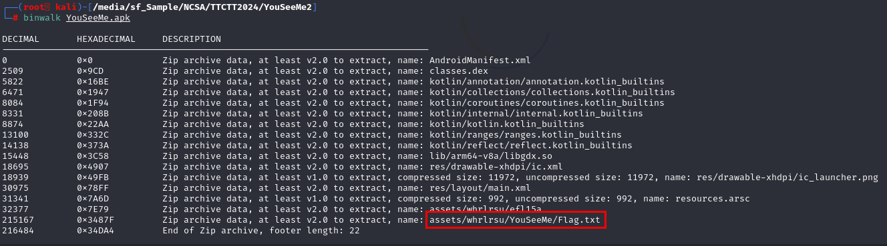

ก่อนผมเริ่ม decompile ผมลองหาดูก่อนว่ามันมีไฟล์น่าสนใจซ่อนอยู่ไหม ซึ่งผมก็เจอว่ามันมี `flag.txt` ซ่อนอยู่จริง ๆ 

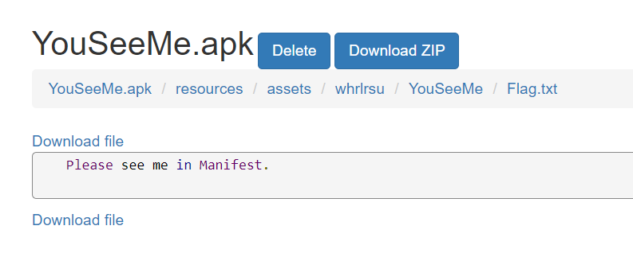

แต่เมื่อทำการ decompile เข้าไปอ่านก็จะพบว่า content ของ flag จริง ๆ นั้น อยู่ใน Manifest ไฟล์

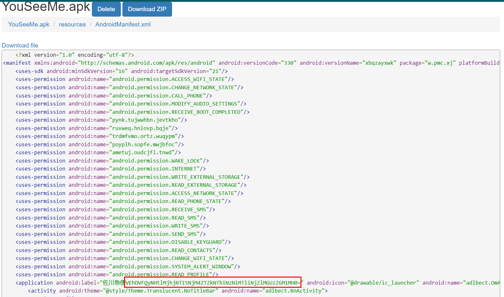

ซึ่งตัว Manifest ไฟล์ที่ว่าก็คือ `AndroidManifest.xml` นั่นเอง โดยเราจะพบ base64 encoded string อยู่ตรงนี้

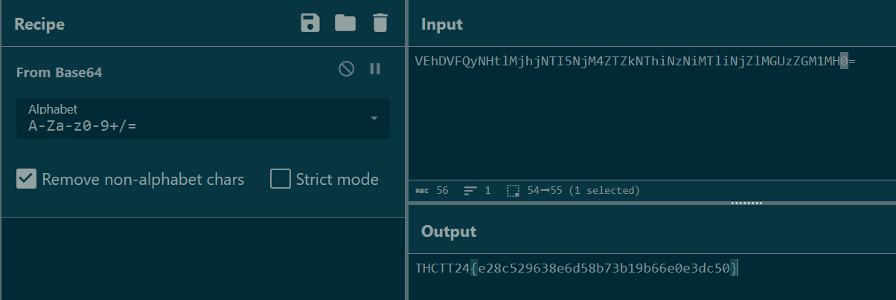

เอาไป decode ก็จะได้ flag มา

```
THCTT24{e28c529638e6d58b73b19b66e0e3dc50}
```

***
### The Face THCTT24 (100)
แอปพลิเคชัน The Face THCTT24 ได้รวบรวมใบหน้าของบุคคลสำคัญที่คาดว่าท่านจะได้เจอในการแข่งขัน Thailand Cyber Top Talent 2024 แต่เดี๋ยวก่อนนะมีหน้าใครบางคนหายไป

หมายเหตุ รูปแบบของ Flag ที่เป็นคำตอบของข้อนี้คือ THCTT24{md5}
***
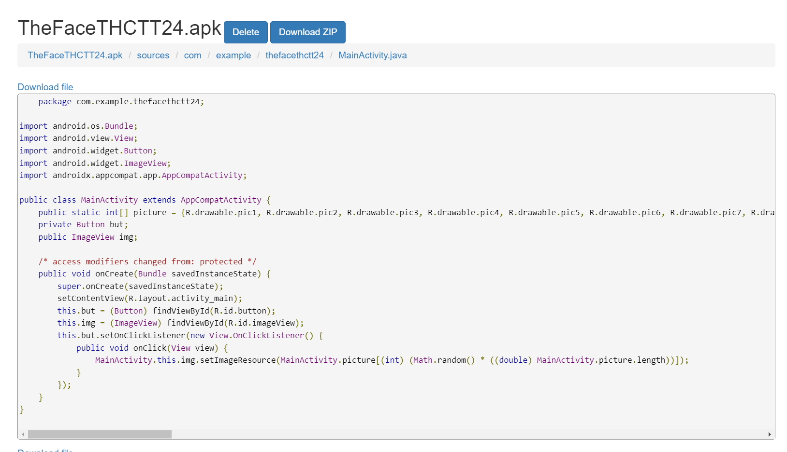

เมื่อเราทำการ decompile, สิ่งแรกที่ทำได้ก็คือทำความเข้าใจหลักการทำงานของ app ตัวนี้ครับ ซึ่งสามารถอ่านได้ใน path `TheFaceTHCTT24.apk\sources\com\example thefacethctt24\MainActivity.java` 

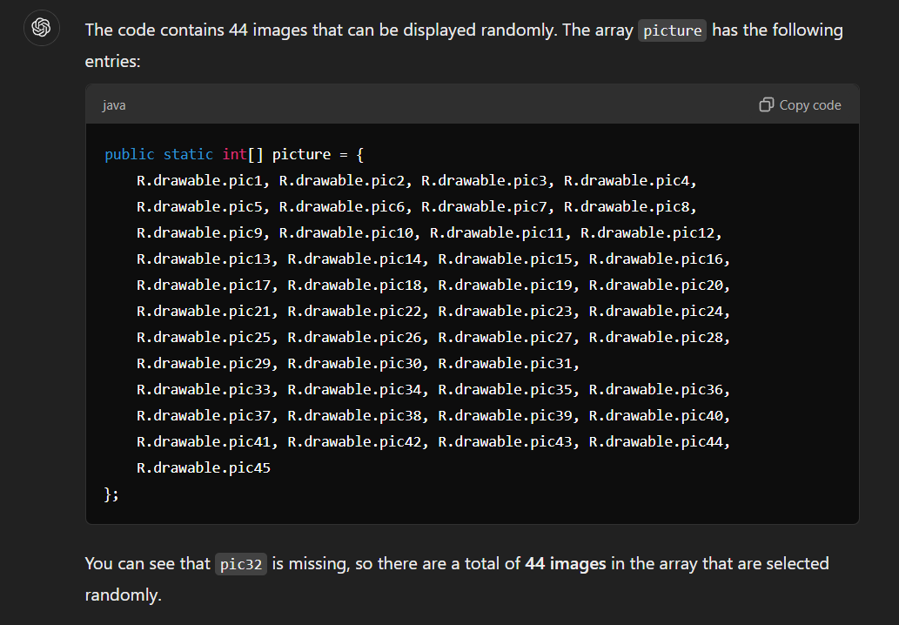

โดยสรุปก็คือ application นี้จะทำการสุ่มแสดงผลรูป 44 รูป แต่มีรูปนึงที่หายไปนั่นก็คือ pic32 นั่นเอง แต่เราจะไปหา pic32 ได้จากไหน? 

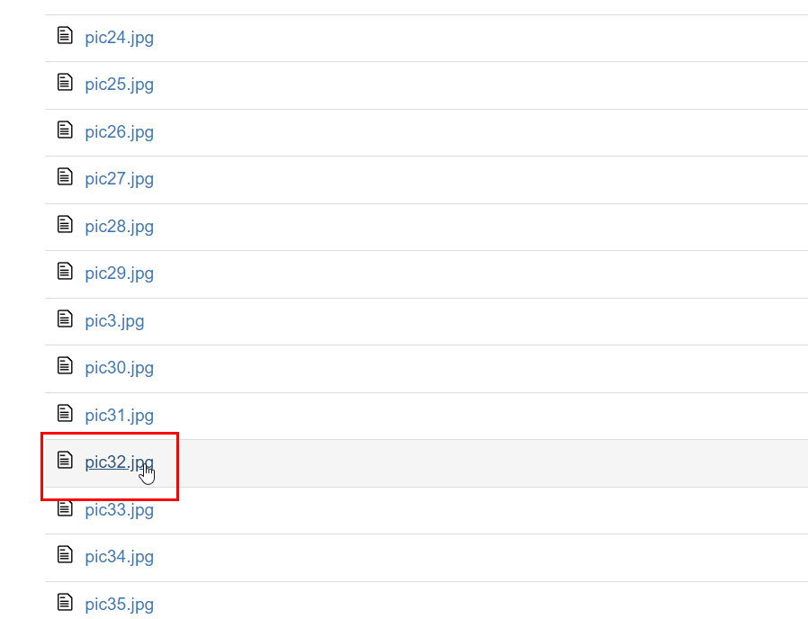

เราต้องไปที่ `resources\res\drawable` เพื่อหารูปนี้ครับ

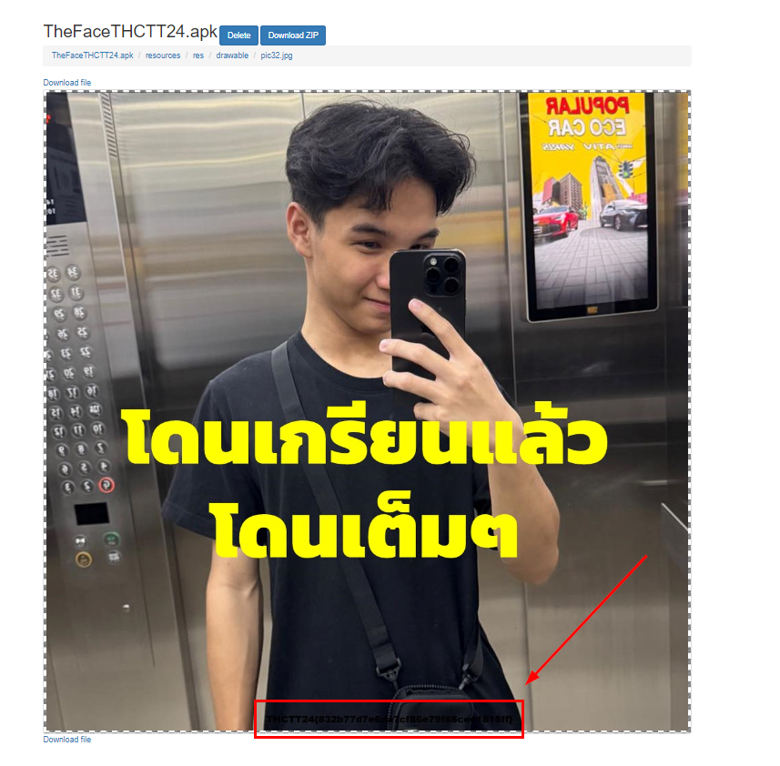

เมื่อเราได้ภาพมา เราก็จะเห็นว่ามันมีข้อความที่เป็น flag แอบอยู่ใต้ภาพ


Inverse ให้ดูอ่านง่าย แล้วก็พิมพ์ออกมาเพื่อส่ง flag ครับ

```
THCTT24{832b77d7e6da7cf86e79f85cee1815ff}
```

*ข้อนี้เพื่อนผม PL.0x00 เป็นคนทำแล้วส่งรูปที่มันหายไปมาให้ผม ถามว่า "มันต้องทำ forensics อะไรป่าว ดูให้หน่อย" ซึ่งผมมอบแวบแรกก็เห็น flag เลย มีคนโดนเกรียนแบบนี้ไปแล้วกี่คนครับ :D 

***
### Medium (200)
***
ข้อนี้ผมลืม capture คำอธิบายโจทย์ ขออภัยด้วยครับ แต่เพื่อนผมเริ่มจากการหา string `flag` จากไฟล์ทั้งหมดเผื่อเจอ hardcoded flag

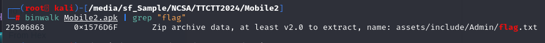

ซึ่งก็เจอจริง ๆ ครับ...

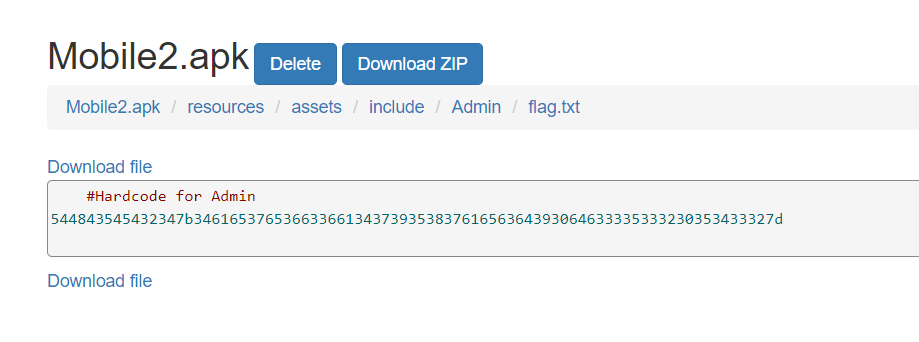

เข้าไปอ่าน content หรือเราจะ unzip apk ไฟล์โดยตรงเลยก็ได้

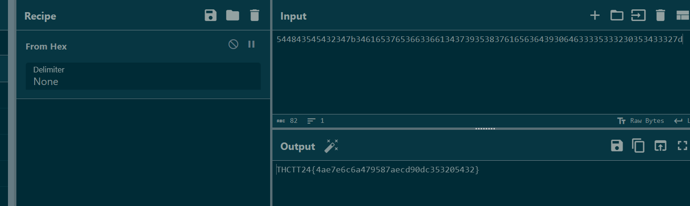

หลังจาก decode จาก hex ก็จะได้ค่า flag ออกมาครับ

```
THCTT24{4ae7e6c6a479587aecd90dc353205432}
```

***
### Click Click (200)
ก็แค่ใส่ข้อมูลให้ถูกต้องแล้วก็คลิก ถ้าโชคดีก็จะได้ Flag

หมายเหตุ รูปแบบของ Flag ที่เป็นคำตอบของข้อนี้คือ THCTT24{md5}
***
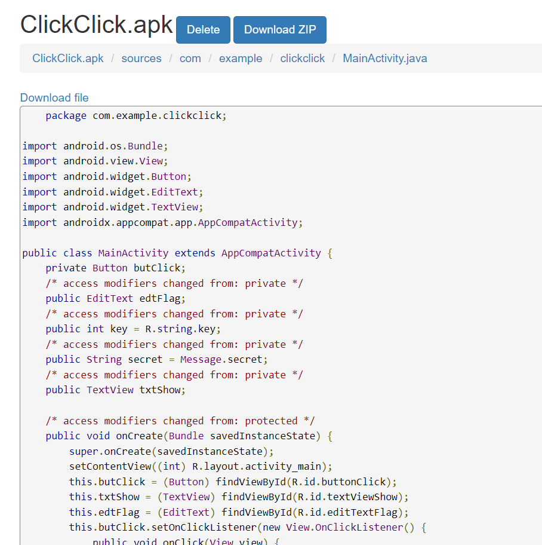

สิ่งแรกที่ผมทำในข้อนี้ก็คือการ decompile แล้วไปส่องหลักการทำงานของโปรแกรมซึ่งจะเห็นว่าเป็นการรับ input (flag) จาก user แล้วมาเช็คว่า flag ตรงกับที่คำนวณมาหรือไม่

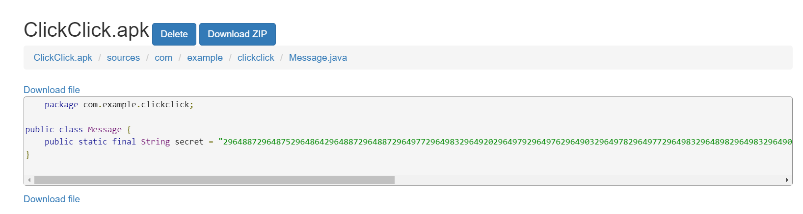

ซึ่งตัว secret เราจะหาได้จาก `Message.java`

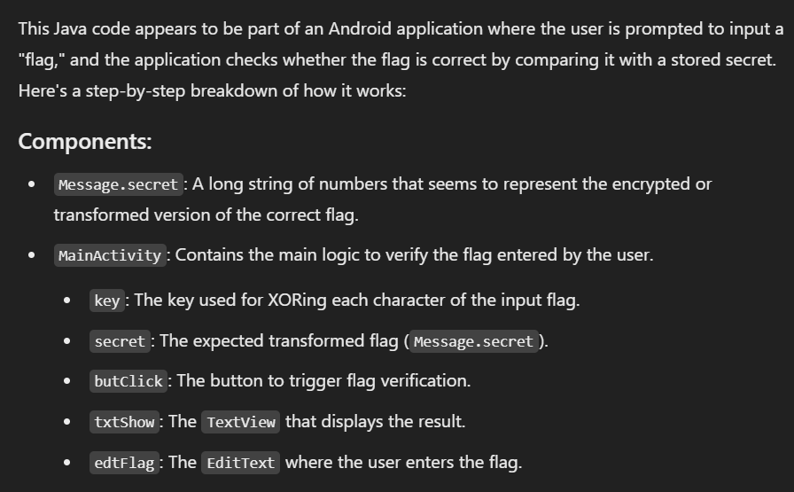

นี่คือหลักการทำงานคร่าว ๆ ของโปรแกรมครับ เรามี secret แล้ว เราแค่ต้องหา key ในการ XOR

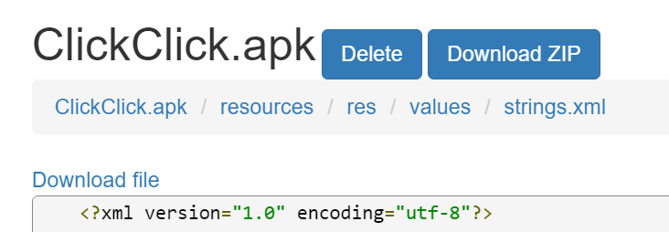

ซึ่งผมเห็นหลาย ๆ คนพลาดข้อนี้ตรงที่ไปเจอตัวแปร key ใน `R.java` ซึ่งนั่นไม่ใช่ตัวแปร key จริง ๆ แต่เป็นการ reference ไปหา key ครับ ซึ่ง key จริง ๆ จะถูก define ในไฟล์ `strings.xml` 

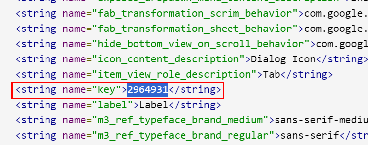

ตรงนี้นั่นเอง

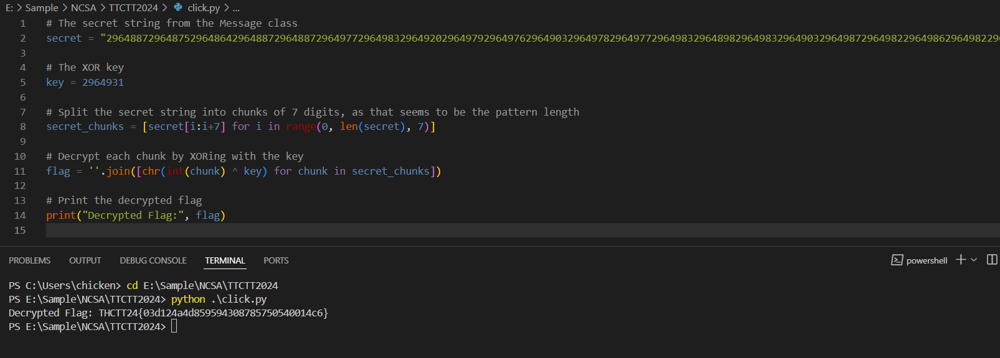

เขียน script ให้มันคำนวณหา flag มาให้ เท่านี้เราก็ solve ข้อนี้แล้วครับ

```
THCTT24{03d124a4d859594308785750540014c6}
```
***

จบกันไปแล้วครับกับ Write-up ของ 3 หมวดนี้ที่พวกผมทำได้ 
Digital Forensics ข้อ **Bad Company** จะให้หา file ที่ถูก transfer ออกไปโดยให้ VMWare image มา investigate ซึ่งเน็ตผมกากครับ ผมเลย gave up ไป

ส่วนข้อ Network ยากสุดก็จะเป็น Communication ที่ถูกเข้ารหัส ซึ่งไม่มีใครในฝั่ง OPEN ที่ solve โจทย์นี้ได้เลย ซึ่งผมก็หวังว่าทาง official จะปล่อย write-up ของข้อนี้ออกมาครับ

ส่วนในหมวดหมู่ของ Cryptography, Reverse Engineering และ Programming จะพยายามเขียนลงใน blog หน้าครับ วันนี้พอก่อนเพราะเพื่อนร่วมทีมเป็นคน solved โจทย์พวกนี้เกือบทั้งหมด ซึ่งผมมีส่วนร่วมแค่นิดเดียวเลยไม่สามารถปั่นให้เสร็จภายในวันนี้ได้

ขอบพระคุณผู้จัดงานและผู้เข้าแข่งขันทุก ๆ ท่านที่มอบความบันเทิงให้กับทีมของพวกเราครับ!!
***

