# Thailand Cyber Top Talent 2024 OPEN [Qualifier] - Reverse/Crypto/Programming - MaAowHa (มาเอาฮา) Team
[toc]
***
## Introduction
สวัสดีท่านผู้อ่านทุกท่าน blog นี้จะเป็น part ที่สองที่ ทีม MaAowHa (มาเอาฮา) มาแสดงถึงวิธีการ solved ของทีมที่เหลือกันครับ

ซึ่งใครยังไม่เคยอ่าน part ที่ 1 ก็สามารถกดเข้าไปอ่านได้ที่ลิงค์นี้เลยครับ (https://medium.com/@chaoskist/thailand-cyber-top-talent-2024-open-qualifier-network-forensics-mobile-maaowha-%E0%B8%A1%E0%B8%B2%E0%B9%80%E0%B8%AD%E0%B8%B2%E0%B8%AE%E0%B8%B2-team-bbb9b3d7c87f) 

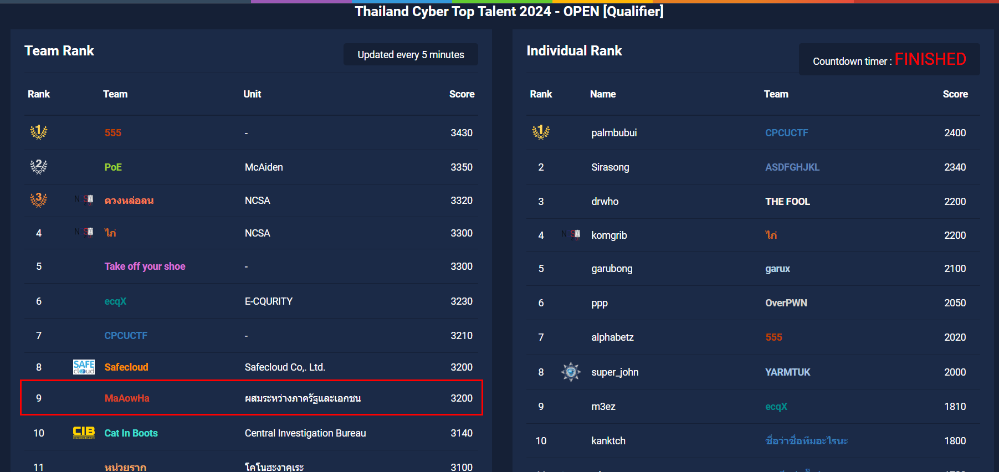

โดยใน write-up นี้ผมได้เขียนถึงวิธีการ solve challenge ในอีก 3 หมวดหมู่ที่เหลือได้แก่ 
- Reverse Engineering (ทำได้ครบ 2 ข้อ)
- Programming (ทำได้ครบ 4 ข้อ)
- Cryptography (ทำได้ 3 จาก 4 ข้อ)

ส่วนหมวดหมู่ของ Web นั่น คุณ Pichaya Morimoto ได้ทำการเฉลยไปแล้ว จึงอยากให้ทุกท่านไปฟัง live นั้นซึ่งจะได้สาระกว่าเยอะครับ โดยสามารถเข้าไปฟังได้ที่ลิงค์นี้เลย (https://www.youtube.com/watch?v=l0MqzU4hmV0)

ส่วนใครที่พร้อมจะอ่าน part 2 กันแล้ว lets just right in ครับ
***
## Reverse Engineering/Pwnable
### Running Number (100)
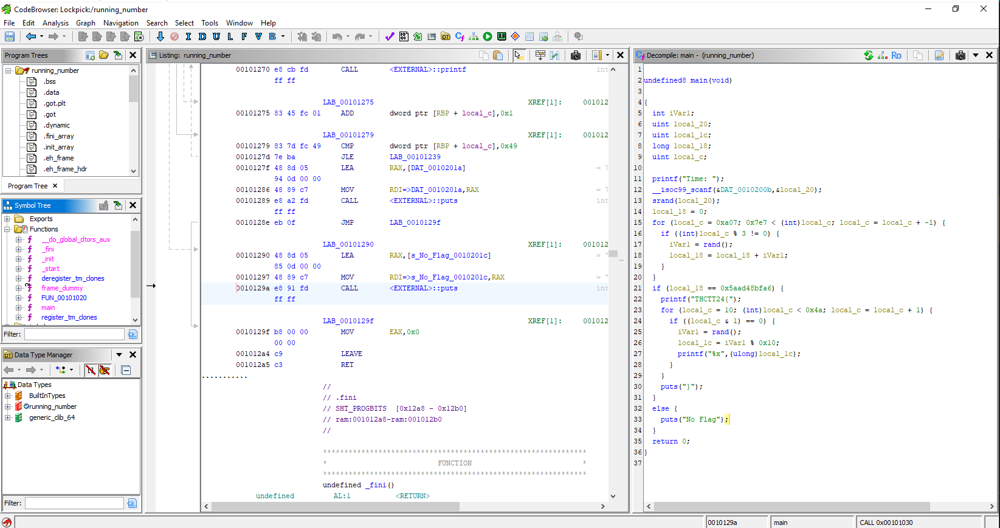

ในข้อนี้เราจะได้ไฟล์ ELF ซึ่งเป็น executable file ของ Linux มา โดยสิ่งที่ทีมของผมทำก็คือการ Import file นี้เข้า Code Browser ของ Ghidra เพื่อให้มัน decompile code มาให้ครับ ซึ่งโปรแกรมนี้ก็จะให้ user input ค่า seed เข้าไปแล้ว loop generate ค่า random แล้ว accumulate sum มาเรื่อย ๆ (โดยจะข้ามการสุ่มเมื่อตัวแปรที่ใช้ loop หารด้วย 3 ลงตัว) จนมาเช็คว่ามันตรงกับค่าที่กำหนดรึเปล่า ซึ่งถ้าตรงก็จะ เอาค่า seed ไป generate เป็น flag ออกมาให้เรานั่นเอง

นั่นหมายความว่าเราก็ต้องเอาโค้ดนี้ไปปรับแต่งนิดหน่อยเพื่อหาค่า seed แทนการรับค่าจาก user และเมื่อได้ค่า seed เราก็เอาไป generate flag ได้เลย 

ซึ่งนี่ก็คือ Code ภาษา C ที่ใช้ในการ bruteforce หาค่า seed ที่ผมใช้ครับ
```
#include <stdio.h>
#include <stdlib.h>

int main(void) {
    int iVar1;
    long local_18;
    unsigned int local_c;
    unsigned int local_1c;
    unsigned int seed;
    
    // Iterate over possible seed values
    for (seed = 0; seed < 0xFFFFFFFF; seed++) {
        srand(seed);  // Seed the random number generator
        local_18 = 0;

        // Calculate the local_18 value based on the loop and random numbers
        for (local_c = 0xa07; local_c > 0x7e7; local_c--) {
            if (local_c % 3 != 0) {
                iVar1 = rand();
                local_18 += iVar1;
            }
        }

        // Check if local_18 matches the expected value
        if (local_18 == 0x5aad48bfa6) {
            printf("Seed found: %u\n", seed);
            printf("THCTT24{");

            // Generate and print the flag
            for (local_c = 10; local_c < 0x4a; local_c++) {
                if (local_c % 2 == 0) {
                    iVar1 = rand();
                    local_1c = iVar1 % 0x10;
                    printf("%x", local_1c);
                }
            }
            puts("}");
            break;  // Exit the loop once the correct seed is found
        }
    }

    return 0;
}
```
แน่นอนว่าผมโยนเข้าไปให้ ChatGPT เพิ่มส่วนของการ bruteforce ให้เลย ชื่อตัวแปรก็จะเหมือน export มาจาก Ghidra (ไม่ใช่แค่เหมือนครับ export มาเลยแหละ 555)

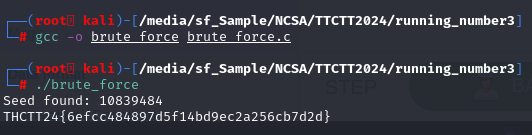

เมื่อทำการ compiled เสร็จ ผมก็เริ่มรันแล้วเราก็จะได้ค่า seed ก็คือ 10839484 ซึ่งจะสามารถ generate flag ได้ออกมาเป็นค่านี้ซึ่งนำไป submit ได้คะแนน หรือก็คือค่านี้เป็นค่า seed ที่ถูกต้องแล้วนั่นเอง

```
THCTT24{6efcc484897d5f14bd9ec2a256cb7d2d}
```

ส่วนสาเหตุว่าทำไมเราถึงต้อง bruteforce ด้วย C? คำอธิบายง่าย ๆ ก็คือ ทุก ๆ ภาษาจะมีการ handle PRNG ต่างกัน ซึ่งหมายความว่าค่าจาก function random ของแต่ละภาษาก็จะใช้ algorithm ที่ต่างกันนั่นเอง 

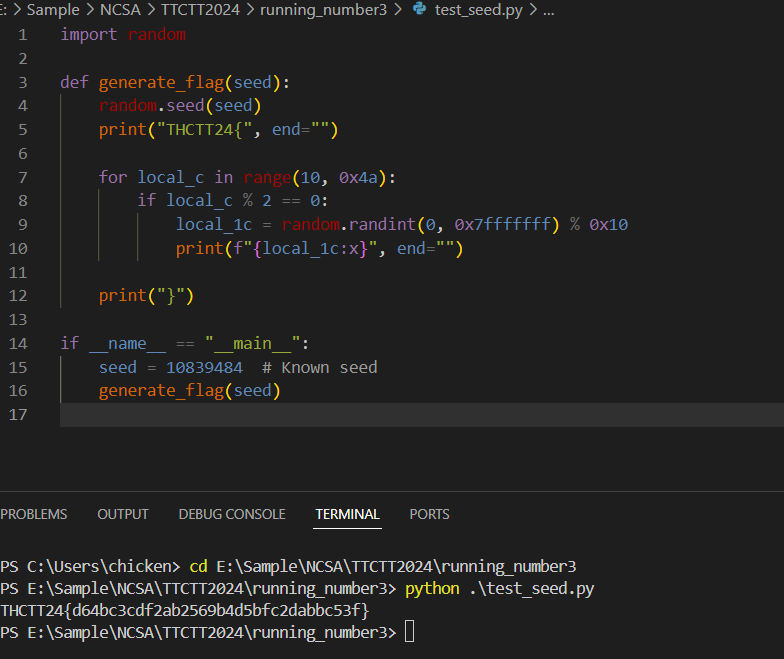

และนี่ก็คือผลจากการที่เราใช้ seed เดียวกันแต่ใช้ random function จาก Python ซึ่งจะเห็นว่าค่า flag ที่ generate มาได้มันไม่ตรงกับของภาษา C ที่โจทย์รับเป็นคำตอบที่ถูก

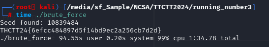

ส่วนนี่ก็เป็นการจับเวลาที่ใช้ในการ bruteforce หา seed บน Kali Linux ด้วย RAM 4GBs, CPU 2 core ครับ
***
### Embedded Malware (200)
ในข้อนี้โจทย์จะให้ไฟล์ที่ claim ว่ามีมัลแวร์ฝังอยู่ข้างในมาแล้วบอกให้เราระวัง 

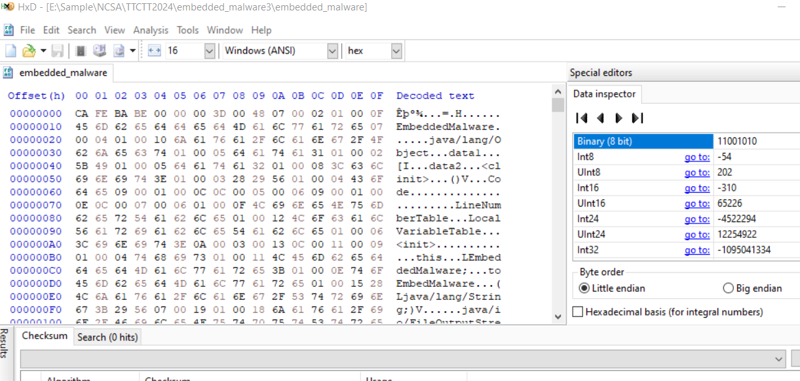

ซึ่งสิ่งแรกที่ผมทำก่อนเลยคือเปิดไฟล์ด้วย Hex Editor ซึ่งก็จะพบว่ามันเป็นไฟล์ compiled ของ Java ดังนั้นผมก็ rename file เป็น .jar แล้วเอาเข้าไป decompile ด้วย jadx บนเครื่อง Windows ของผม (เนื่องจากรอบนี้ decompiler online มันไม่รับ)

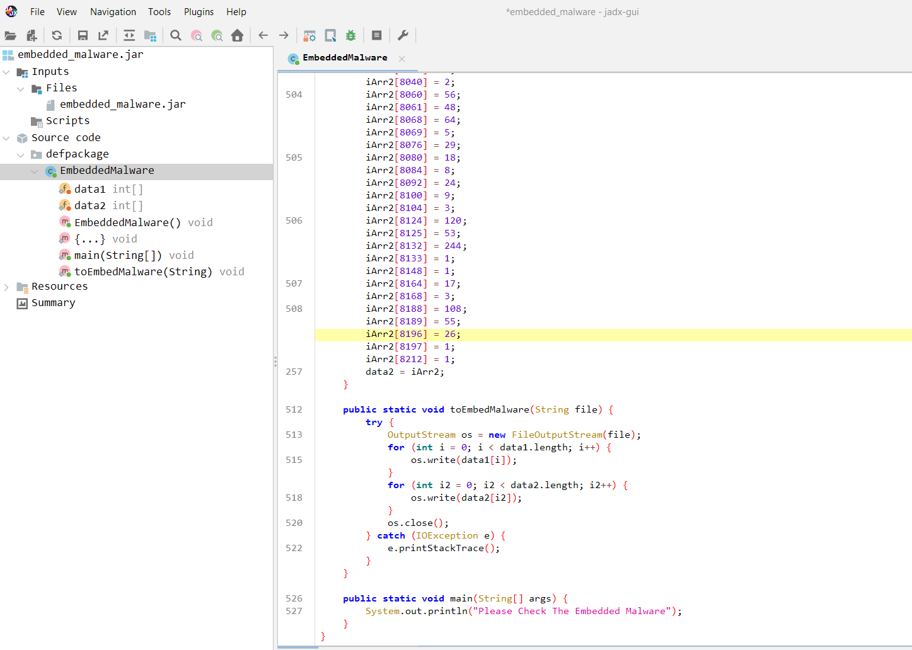

หลังจาก decompile ผมก็พบว่ามันเป็นการสร้างไฟล์ โดยไฟล์ที่สร้างก็จะมาจาก Array 2 ตัวก็คือ data1 และ data2

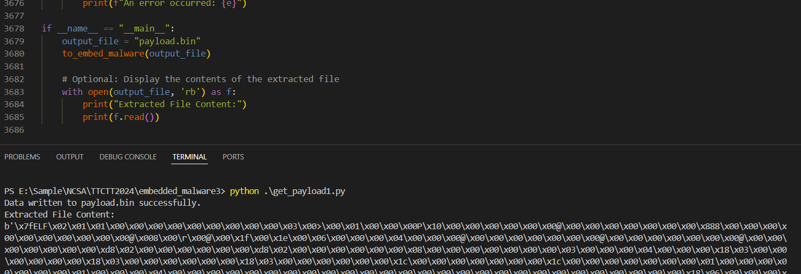

ผมเปลี่ยนภาษาเป็น Python ให้มันง่ายต่อการรัน ซึ่งเมื่อรันแล้วเราก็จะได้ ELF หรือ Executable File สำหรับ Linux มา

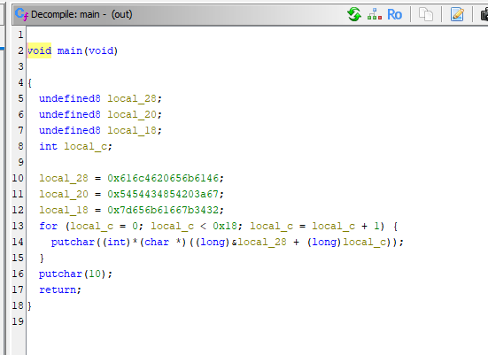

ผมก็เอาไฟล์นี้ไปทำการ decompile ด้วย ghidra ต่อซึ่งก็จะพบว่าในฟังก์ชัน main จะเป็นการ print ข้อความออกมาเมื่อเรารันโปรแกรม

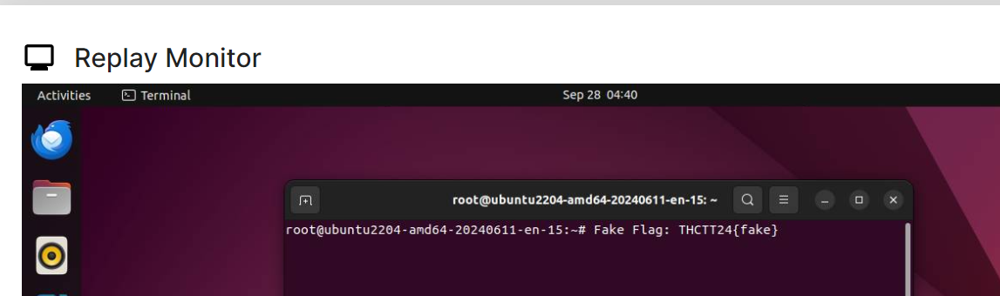

ผมก็เลยเอาไฟล์นี้ไปรันใน vm ของ recorded future ซึ่งพบว่ามัน print fake flag ออกมา อ่าวแล้วยังไงต่อหละ?

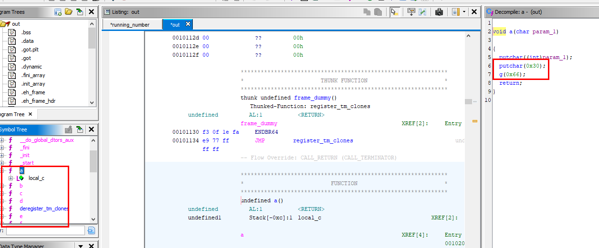

แน่นอนว่ามันไม่จบแค่นี้ครับ มันยังมีฟังก์ชันอื่น ๆ ที่ซ่อนอยู่แต่ไมได้ถูกเรียกออกมาซึ่งจะมีตั้งแต่ฟังก์ชัน a ไปจนถึงฟังก์ชัน t เลย โดยฟังก์ชันเหล่านี้ก็จะเป็นการ `put char` ออกมาทีละตัวจนกลายเป็น flag (โดยฟังก์ชันเหล่านี้ก็จะเรียกกันเองจนเองมาครบ string นั่นเอง) ซึ่ง casperx เพื่อนร่วมทีมของผมก็ไปแกะได้ว่ามันเริ่มจากฟังก์ชัน n ดังนั้นหากเรา patch ตัว executable ให้ไปรันฟังก์ชัน n แทน `putchar(10)` เราก็น่าจะได้ flag ออกมาผ่านทาง console ของ debugger นั่นเอง

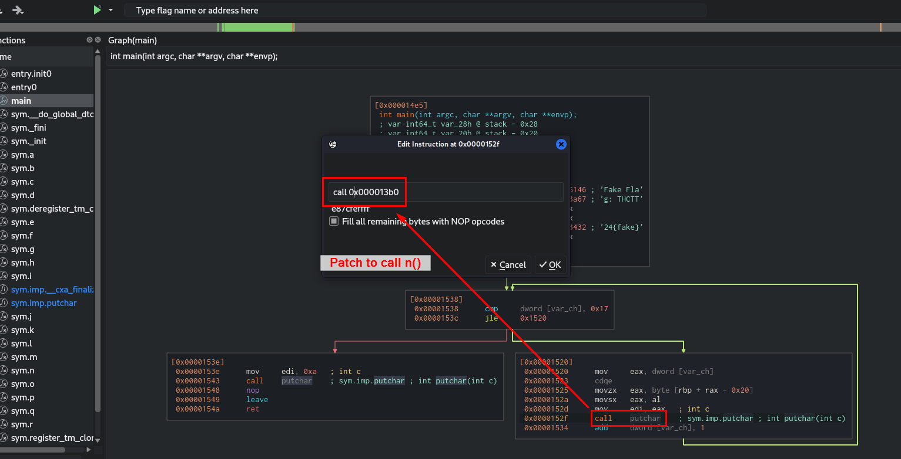

ซึ่งผมก็ได้ใช้ cutter ในการเปลี่ยน address ของ function call เป็น address ของฟังก์ชัน n แบบนี้

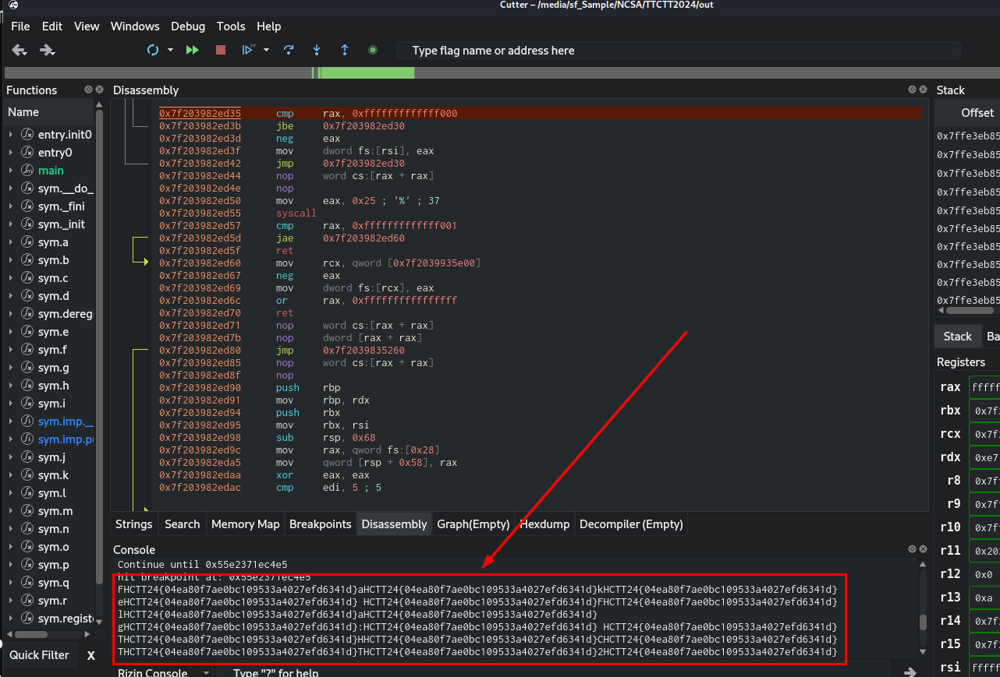

พอกด run ก็จะได้ flag ตามที่คาดไว้ครับ

```
THCTT24{04ea80f7ae0bc109533a4027efd6341d}
```
***
## Cryptography
### Easy1 (100)
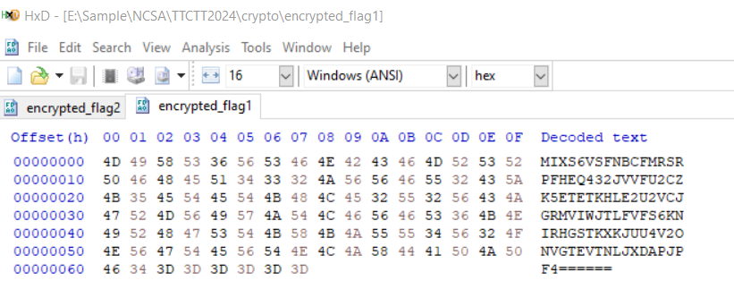
โจทย์จะให้ไฟล์เรามาซึ่ง content ข้างในนั้นก็จะเป็นการเข้ารหัส flag โดยเราสามารถนำ string นี้ไปเข้า CyberChef เพื่อให้มัน auto detect algorithm ที่ใช้เข้ารหัสข้อความได้เลย

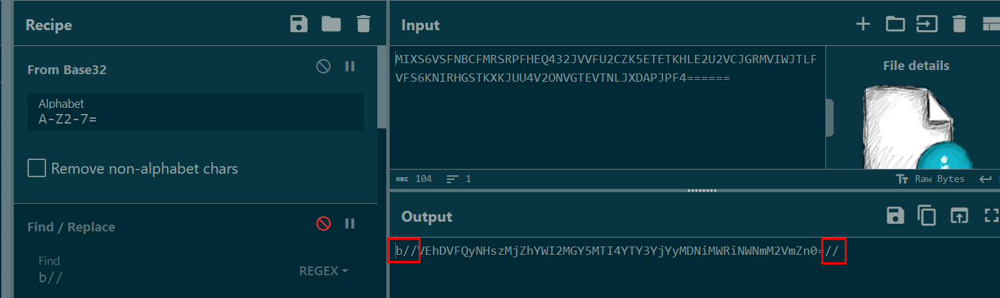

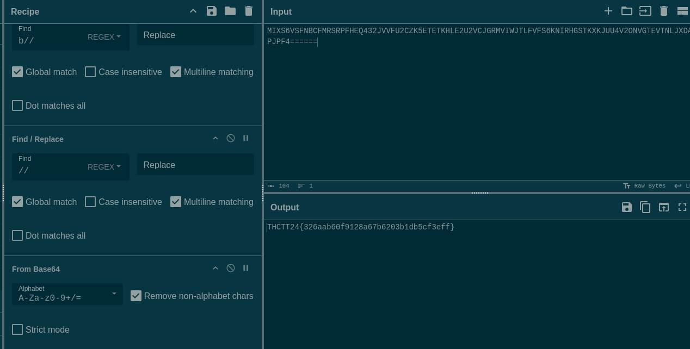

```
THCTT24{326aab60f9128a67b6203b1db5cf3eff}
```
***
### Easy2 (100)
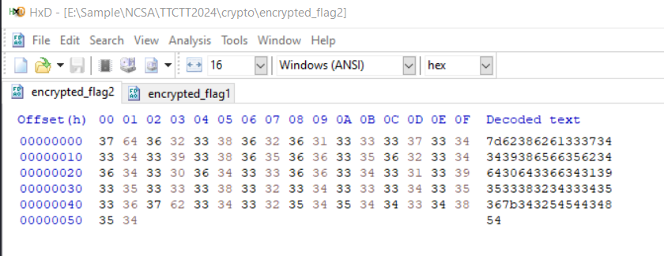

ข้อนี้เราก็ได้ไฟล์มาเหมือนเดิมแต่ดูเหมือนว่า content ข้างในจะเป็น hex encoded string

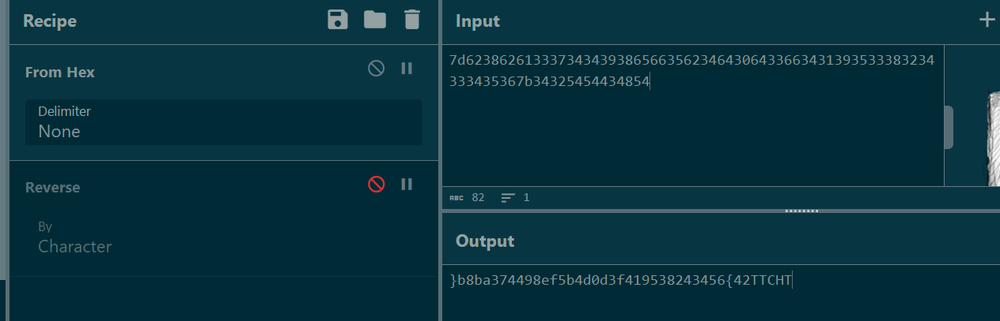

เมื่อแปลงค่ากลับมาเป็น ascii เราก็จะพบว่ามันเป็น flag ที่ถูก reverse อยู่ ดังนั้นเราแค่ต้อง reverse มันกลับมา แล้วเราก็จะได้ flag เพื่อไป submit

```
THCTT24{654342835914f3d0d4b5fe894473ab8b}
```
***
### Hard (300)
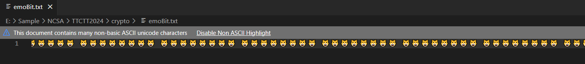
ซึ่งที่โจทย์ให้เรามาก็คือ text file ที่เก็บรูป emoji แมวเอาไว้ ซึ่งเราจะเห็นว่าจะมีการแบ่ง set ของออกเป็น 8 ซึ่งก็น่าจะเป็น 8 bit และ emoji แมวก็จะเป็นรูป 😺 กับ 😸 ผมก็เลยคิดว่า emoji เปิดตาก็ควรจะแทนค่าได้ด้วย 1 ส่วน ปิดตาก็แทนด้วย 0

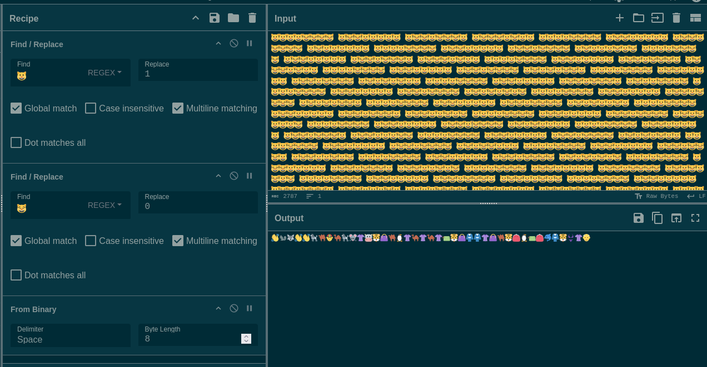

แล้วเราก็จะได้ Emoji เหล่านี้มา แล้วเราจะไปต่อกันยังไงหละ?

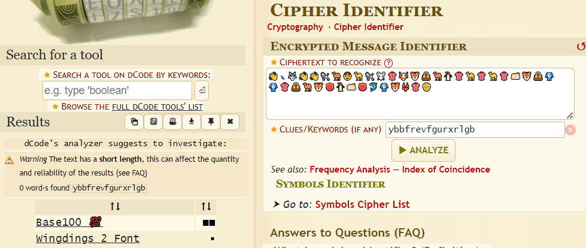

เราสามารถ decode message ที่เป็น Emoji ได้ด้วย Base100 ครับ ซึ่งจะเป็นการ encode ที่ให้ 1 byte (1 ตัวอักษร) สามารถถูกแทนค่าด้วย Emoji นั่นเอง บางคนสามารถรู้ได้ทันที แต่สำหรับคนที่ไม่รู้ เราสามารถใช้ [Cipher Identifier ของ Dcode](https://www.dcode.fr/cipher-identifier) เพื่อ detect encoding scheme จาก ciphertext ได้ครับ 

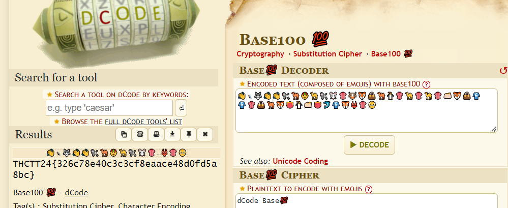

แล้วเราก็สามารถใช้เว็บเดียวกันในการ decode ได้เลย
```
THCTT24{326c78e40c3c3cf8eaace48d0fd5a8bc}
```

***
## Programming
### Easy1 - Shift2 (100)
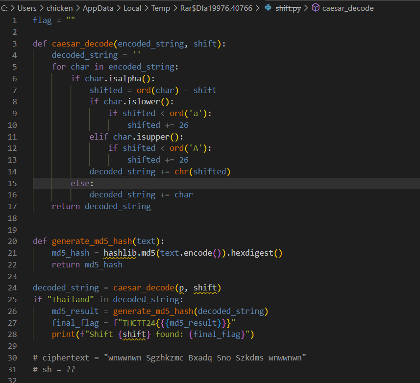

ข้อนี้โจทย์จะให้สคริปต์เรามาให้เราหาทางหา flag ให้ได้ซึ่งเราจะเห็นว่าโจทย์ได้ให้ ciphertext มาในสคริปต์แล้ว พร้อมกับวิธีการ decode แต่ที่เราไม่รู้ก็คือ key ในการ shift ของ caesar cipher นั่นเอง แต่ในสคริปต์ก็มี hint บอกอยู่ว่าถ้ามีคำว่า "Thailand" ใน `decoded_string` ก็จะทำมา generate MD5 แล้วเข้า flag format 

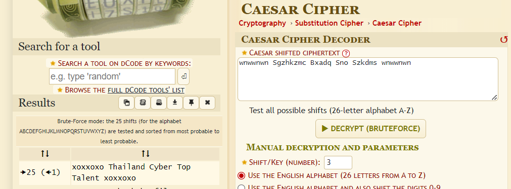

ซึ่งเมื่อรู้อย่างนี้แล้ว เราสามารถเข้าเว็บ https://www.dcode.fr/caesar-cipher เพื่อไปทำการ bruteforce หา key แบบในรูปแล้วเอาไป hash ด้วย MD5 ก็จะได้ flag แล้ว

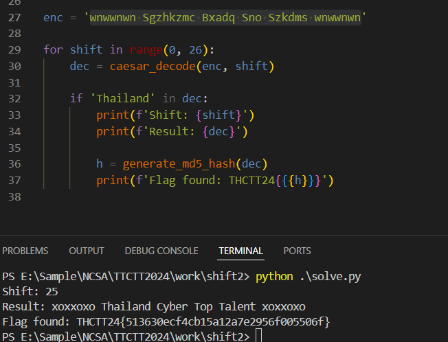
หรือเราจะสานต่อสคริปต์ด้วยการเติมให้มัน loop หา key ก็ออกได้เหมือนกัน

```
THCTT24{513630ecf4cb15a12a7e2956f005506f}
```
***
### Easy2 - emoji funny2 (100)
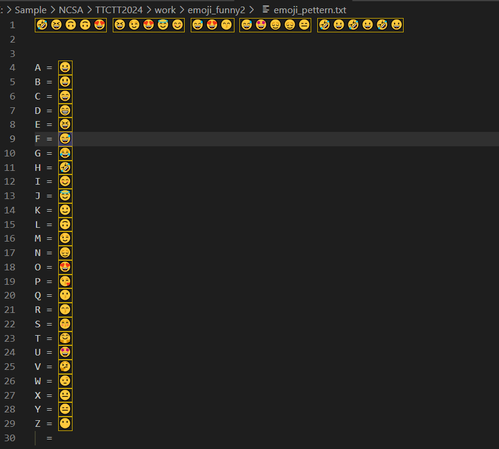
ข้อนี้โจทย์จะให้ pattern ของ emoji มาให้เราแปลงกลับเป็นข้อความครับ ซึ่งเราก็จะนำข้อความที่ได้จากการแปลงนั้นไปทำเป็น md5 แล้วใส่ใน flag format เพื่อส่งนั่นเอง

ผมจำไม่ได้ว่าข้อนี้ได้ให้ script generate flag มารึเปล่า เพราะผมไม่ได้ทำเอง คิดว่ามีเหมือนกัน แต่แค่นี้ก็เพียงพอแล้วครับ

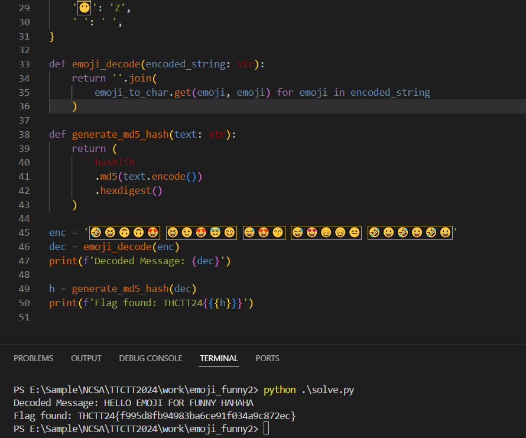

และนี่ก็คือ message และ flag ที่ได้หลังจาก การแปลง emoji ครับ

```
THCTT24{f995d8fb94983ba6ce91f034a9c872ec}
```

***
### Medium - emoji pattern (200)
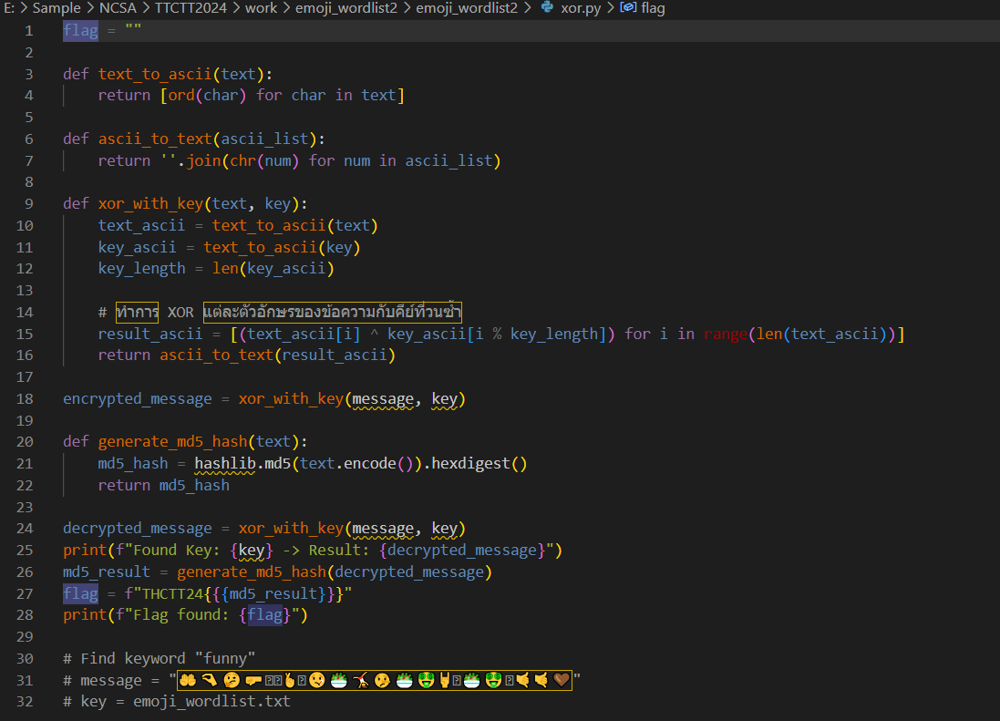
ข้อนี้จะให้ wordlist เรามาพร้อมกับสคริปต์ที่ใช้ในการ generate flag 

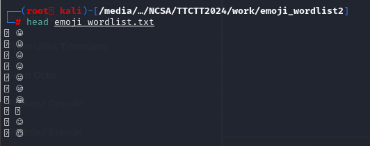

โดยข้อนี้ flag จะถูก generate ด้วย message ที่มีข้อความว่า "funny" ซึ่งจะหาได้จากการที่เราเอา ciphertext มา XOR กับ key ที่อยู่ใน wordlist (ซึ่งเป็น emoji)

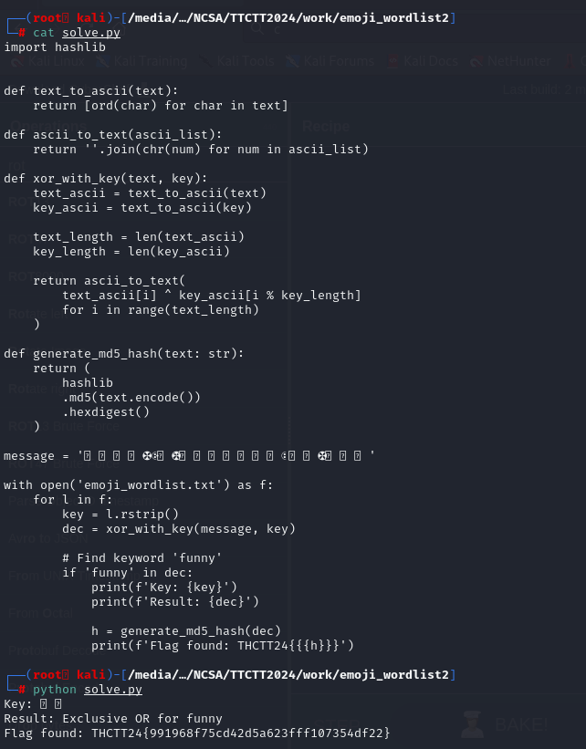

แต่ในเมื่อเรารู้วิธีการ generate flag และ keyword ที่เราต้องการค้นหาแล้วเราก็ปรับให้มัน loop key หา keyword เพื่อหา flag ได้เลย

```
THCTT24{991968f75cd42d5a623fff107354df22}
```

***
### type_the_word (300)
ข้อนี้โจทย์บอกให้เราทำการ connect ไปที่ server โดยให้ส่งข้อความ/ตอบคำถามเป็นจำนวน 100 ครั้งหรือตีความได้ว่าต้อง solve โจทย์ที่ server ส่งมา 100 ครั้งก่อนที่ server จะยอมให้ flag เรามานั่นเอง โดยโจทย์จะให้เรามาแค่ IP Address ของ server แล้วเราก็ต้องไปแสกน port หาวิธีการเชื่อมต่อไปยัง server เอง

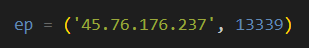

ซึ่งเพื่อนผมก็ไปเจอว่า port 13339 มัน connect ไปได้นะ ซึ่งก็จะเป็นจุดเริ่มต้นของหายนะในครั้งนี้ครับ

**ข้อนี้ต้องขออภัยด้วยนะครับเนื่องจากตอนแข่งผมไม่ได้ให้เพื่อนที่เขียน script solve โจทย์ทำการ capture มาให้ว่าแต่ละ stage มีอะไรบ้าง ซึ่งผมก็ต้องมาทำ code review เพื่อบอกว่าทีมผมทำอะไรไปบ้างครับ*

โดยเมื่อเราทำการ connect ไปที่ server แล้ว ทาง server ก็จะส่งโจทย์ให้เรา โดยให้เรามีเวลา solve โจทย์ในเวลา 5 วินาทีก่อนจะทำการ terminate session ซึ่งแน่นอนแหละใครมันจะอยากตอบคำตอบ 100 ข้อด้วยการพิมพ์มือ 

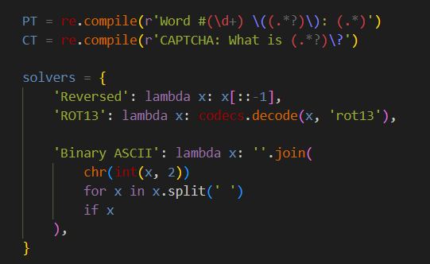

โจทย์ที่จะให้เรามาก็จะมีตั้งแต่ leetspeak, scrambled, rot13, reversed, morsecode และรวมถึง Captcha ที่จะมาในรูปแบบของ "What is a {operation} b?" แต่ภายหลังเพื่อนผมก็สังเกตอะไรบางอย่างได้ 

ซึ่งนั่นก็คือการที่ต่อให้เราใส่คำตอบที่ผิดเข้าไปในบางอัลกอ session ก็ไม่ได้ถูก terminate ดังนั้นเราก็แค่ต้องใส่ basic algorithm (อัลกอเดียวก็ได้นะขอแค่มัน solve โจทย์ให้เราได้ก็พอ) แล้วส่งคำตอบไปเรื่อย ๆ ส่วนอันไหนที่ไม่มัน recognize ก็ส่งค่าเปล่า ๆ ไปขอโจทย์ใหม่จนครบ 100 แล้ว server ก็จะ print flag ออกมาให้เราครับ

นี่คือ script ที่ทีมของผมใช้ในการ solve โจทย์ข้อนี้
```
import socket
import re
import codecs

ep = ('45.76.176.237', 13339)

s = socket.socket(
    socket.AF_INET,
    socket.SOCK_STREAM,
    socket.IPPROTO_TCP
)

s.connect(ep)

LF = bytes((
    10,
))

def read_until(rd: socket.socket):
    # leftover data
    buf = b''

    while data := rd.recv(1024):
        # combine leftover data with incoming data
        cuts = (buf + data).split(LF)

        # leftover data
        buf = cuts[-1]

        for l in cuts[:-1]:
            # connvert to string
            yield l.decode()

    # connvert to string
    yield buf.decode()

PT = re.compile(r'Word #(\d+) \((.*?)\): (.*)')
CT = re.compile(r'CAPTCHA: What is (.*?)\?')

solvers = {
    'Reversed': lambda x: x[::-1],
    'ROT13': lambda x: codecs.decode(x, 'rot13'),

    'Binary ASCII': lambda x: ''.join(
        chr(int(x, 2))
        for x in x.split(' ')
        if x
    ),
}

rd = read_until(s)

for l in rd:
    # show raw
    print(f'>>> {l}')

    if m := CT.match(l):
        # extract challenge
        chal = m.group(1)

        # inspect challenge first
        print(f'chl: {chal}')

        ans = input('ans: ')

        # auto solve challenge
        if ans == '':
            # solve challenge
            ans = eval(
                chal,
                {},
                {}
            )

            # auto solve result
            print(f'ans: {ans}')

        s.sendall(ans.encode() + LF)

    elif m := PT.match(l):
        # extract algo and encoded data
        alg = m.group(1)
        enc = m.group(2)

        # show encoded
        print(f'enc [{alg}]: {enc}')

        dec = ''

        if solver := solvers.get(alg, None):
            # decode data
            dec = solver(enc)

            # show decoded
            print(f'dec: {dec}')

        # submit answer
        s.sendall(dec.encode() + LF)

        # consume answer result
        next(rd)
```

***
## Conclusion
จบไปแล้วครับกับ write-up part สุดท้ายของทีม MaAowHa ส่วนตัวมองว่าปีนี้ทางทีมผู้จัดงานค่อนข้างเน้นหนักไปที่ emoji (?), การเขียนโปรแกรม และการทำความเข้าใจโค้ดเพื่อหาช่องโหว่ ส่วนต่อไปจะเป็นการเล่าความรู้สึกหลังจากจบการกับโจทย์ที่ผมได้ลองทำครับ

ก็มีแอบเสียดายอยู่บ้างที่ข้อ network อาจจะออกให้น่าสนใจกว่านี้ด้วยการเล่นกับหลาย ๆ protocol เช่น data exfiltration ผ่าน DNS หรือ ICMP แต่พอมาคิดดูอีกทีก็เข้าใจได้ครับว่ามันอาจจะเป็นการแชร์โจทย์กันระหว่างรอบ Junior / Senior และ Open ซึ่งก็ต้องมีโจทย์ให้น้อง ๆ ทำได้เพื่อจะมีกำลังใจในการเล่น CTF และเข้าสู่โลกของ Cybersecurity อย่างเต็มตัว

ในส่วนของข้อ Digital Forensic ในฐานะที่เป็น Blue Teamer คนนึง ผมมองว่าข้อ Cloudo กำลังดีครับ เสียดายที่ไม่ได้เล่นข้อ Bad Company เนื่องจากขนาดไฟล์ที่ใหญ่ ที่ไม่ได้มาพร้อมกับเน็ตหอ + เน็ตโทรศัพท์อันกากยิ่งของผม แต่ผมหวังว่าปีหน้า ๆ ก็อยากจะเห็นโจทย์แนว Disk Image ที่ Capture มาจาก File System ของ Windows หรือ Linux, การทำ Memory Forensic หรือการหา persistence ของมัลแวร์ใน Registry key ที่มาในขนาดไฟล์ไม่เกิน 3 GBs ที่พอจะโหลดเสร็จได้ด้วยเน็ตซิมโทรศัพท์รายปีครับ 5555 

ท้ายที่สุดก็ขอขอบคุณผู้ออกโจทย์ ผู้จัดงาน และท่านอื่น ๆ ที่เกี่ยวข้องที่ได้จัดกิจกรรมสนุก ๆ แบบนี้ให้พวกเราได้มาเล่นกันครับ 

PEACH~
***