# n00bz CTF 2024 by ByTheW4y
[toc]
* * *
## Crypto
### Vinegar (100 points)
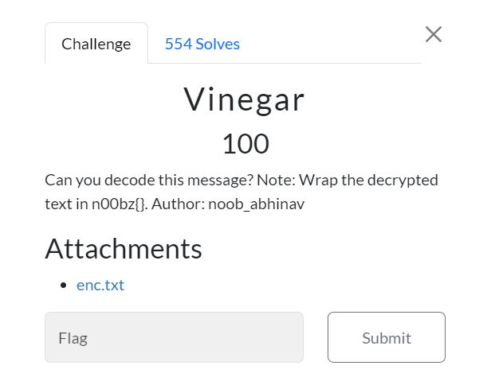
Can you decode this message? Note: Wrap the decrypted text in n00bz{}. Author: noob_abhinav

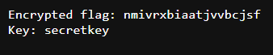

An [attachment](https://static.n00bzunit3d.xyz/Crypto/Vinegar/enc.txt) got us ciphertext and a key to decrypt it then after reviewing challenge name again, this one should be vigenere cipher 

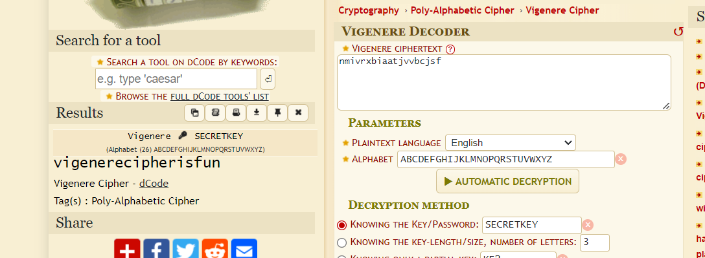

So I went to https://www.dcode.fr/vigenere-cipher to decode it and sure enough, this one is vigenere cipher

```
n00bz{vigenerecipherisfun}
```
***
### RSA (291 points)
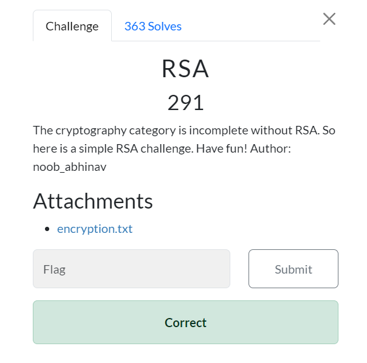
The cryptography category is incomplete without RSA. So here is a simple RSA challenge. Have fun! Author: noob_abhinav

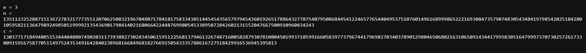

An [attachment](https://static.n00bzunit3d.xyz/Crypto/RSA/encryption.txt) got us everything we need to decrypt ciphertext to plaintext again, here are what we got
- e is public exponent (used for encryption)
- n is modulus
- c is ciphertext 

Because e is 3 (small number) then if plaintext is also small enough, we can decrypt ciphertext easily by computing the integer cube root of c

and here is the python script that will do just that
```
import gmpy2

# Given values
e = 3
n = 135112325288715136727832177735512070625083219670480717841817583343851445454356579794543601926517886432778754079508684454122465776544049537510760149616899986522216930847357907483054348419798542025184280105958211364798924985051999921354369017984140216806642244876998054533895072842602131552047667500910960834243
c = 13037717184940851534440408074902031173938827302834506159512256813794613267487160058287930781080450199371859916605839773796744179698270340378901298046506802163106509143441799583051647999737073025726173300915916758770511497524353491642840238968166849681827669150543335788616727518429916536945395813

# Compute cube root
m, exact = gmpy2.iroot(c, e)

if exact:
    print("The message is:", m)
else:
    print("No direct cube root found, message might be larger.")

# Assuming m is found and is an integer
plaintext = m.to_bytes((m.bit_length() + 7) // 8, 'big')
print("Decoded message:", plaintext.decode())
```

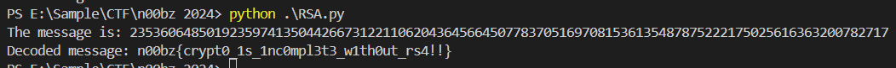

Then execute it to get a flag

```
n00bz{crypt0_1s_1nc0mpl3t3_w1th0ut_rs4!!}
```
***
### Vinegar 2 (360 points)
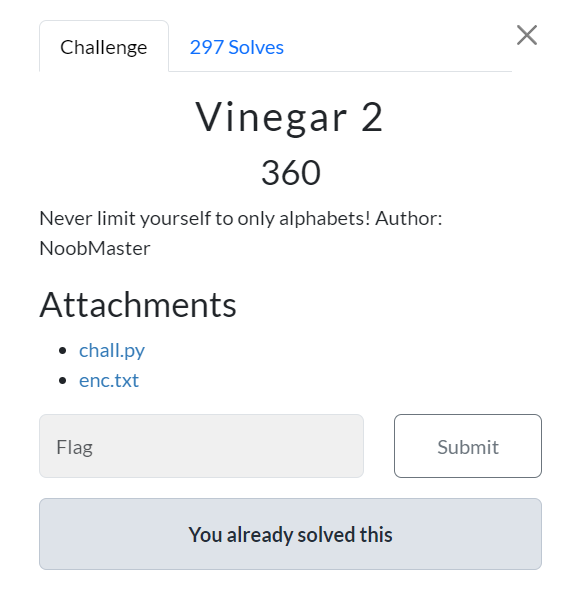
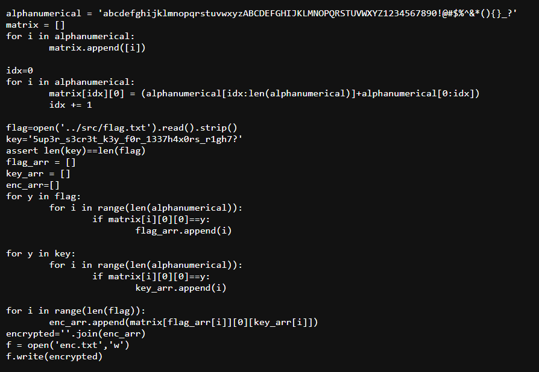
https://static.n00bzunit3d.xyz/Crypto/Vinegar2/chall.py
https://static.n00bzunit3d.xyz/Crypto/Vinegar2/enc.txt

We were provided with a script to encrypt content of a flag to ciphertext and a ciphertext 

And since we already got a key and know which encryption that was using, we can write a new script to reverse it back to plaintext like this
```
alphanumerical = 'abcdefghijklmnopqrstuvwxyzABCDEFGHIJKLMNOPQRSTUVWXYZ1234567890!@#$%^&*(){}_?'
matrix = []
for i in alphanumerical:
    matrix.append([i])

idx=0
for i in alphanumerical:
    matrix[idx][0] = (alphanumerical[idx:len(alphanumerical)] + alphanumerical[0:idx])
    idx += 1

key = '5up3r_s3cr3t_k3y_f0r_1337h4x0rs_r1gh7?'
ciphertext = '*fa4Q(}$ryHGswGPYhOC{C{1)&_vOpHpc2r0({'

assert len(key) == len(ciphertext)

key_arr = []
for y in key:
    for i in range(len(alphanumerical)):
        if matrix[i][0][0] == y:
            key_arr.append(i)

dec_arr = []
for i in range(len(ciphertext)):
    char = ciphertext[i]
    key_index = key_arr[i]
    for j in range(len(alphanumerical)):
        if matrix[j][0][key_index] == char:
            dec_arr.append(matrix[j][0][0])
            break

decrypted_flag = ''.join(dec_arr)
print(decrypted_flag)
```
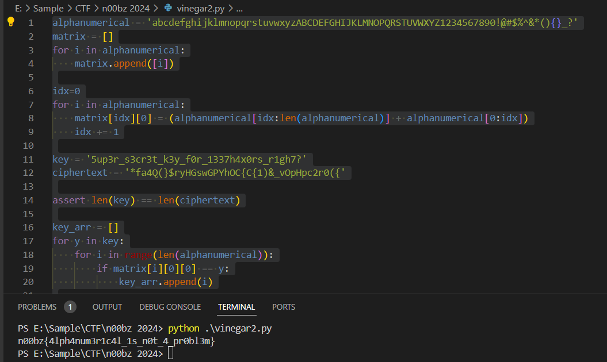

Execute it to get a flag

```
n00bz{4lph4num3r1c4l_1s_n0t_4_pr0bl3m}
```
***
## Forensics
### Plane (176 points)
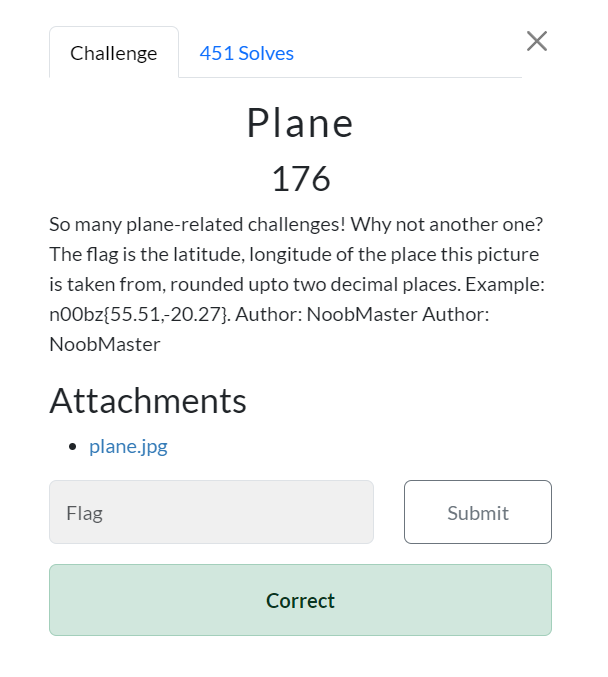
So many plane-related challenges! Why not another one? The flag is the latitude, longitude of the place this picture is taken from, rounded upto two decimal places. Example: n00bz{55.51,-20.27}. Author: NoobMaster Author: NoobMaster
https://static.n00bzunit3d.xyz/Forensics/Plane/plane.jpg
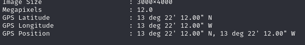

This challenge is not "OSINT" but "FORENSICS" so we must exiftool to find GPS Position when taking this photo

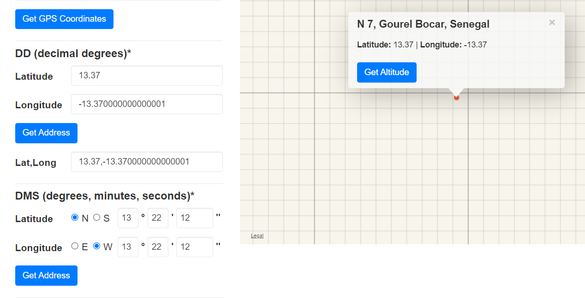

Then use https://www.gps-coordinates.net/ to get latitude and longtitude of this position which we can see that it landed us with the most favorite number of all CTF players 

```
n00bz{13.37,-13.37}
```
***
## Web
### Passwordless (100 points)
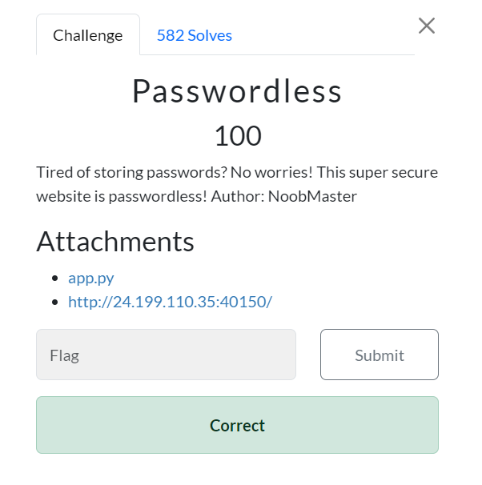
Tired of storing passwords? No worries! This super secure website is passwordless! Author: NoobMaster
Attachments
https://static.n00bzunit3d.xyz/Web/Passwordless/app.py
http://24.199.110.35:40150/

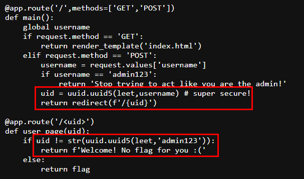
We were given source code of targeted website which we will need to bypass login page to admin user authorized page and get a flag but we could not login as admin directly but we will need to get correct `uid` so we can skip login process and go straight to that page to retrieve a flag

We know that `uid` was generated by `uuid5` with `leet` and `username` as parameters and we already know both of them so we can create a script to generate `uid` for us like this

```
import uuid

leet = uuid.UUID('13371337-1337-1337-1337-133713371337')
admin_username = 'admin123'
admin_uuid = uuid.uuid5(leet, admin_username)
print(admin_uuid)
```

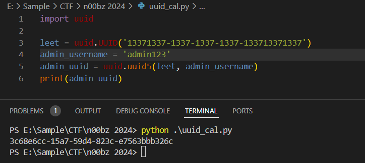

Execute it to get `uid` of an admin

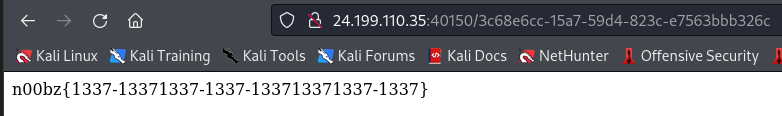

Go straight to this page and get a flag

```
n00bz{1337-13371337-1337-133713371337-1337} 
```
***
## OSINT
### Pastebin (347 points)
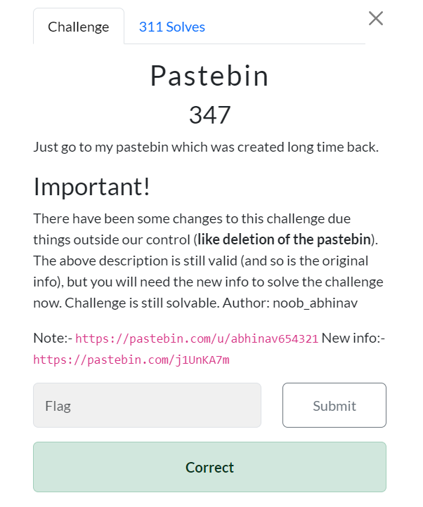
Just go to my pastebin which was created long time back.
Note:- https://pastebin.com/u/abhinav654321 New info:- https://pastebin.com/j1UnKA7m

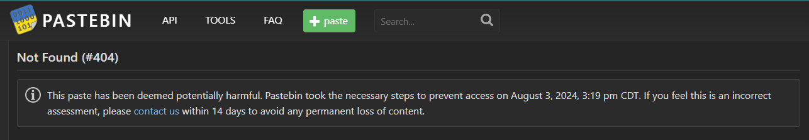

Since this link is already taken down, we will need to use waybackmachine 

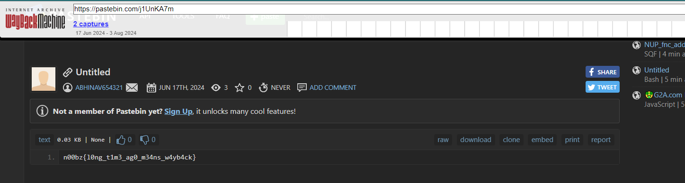

Someone already created snapshot for us so we just have to visit that specific snapshot and get a flag right there

```
n00bz{l0ng_t1m3_ag0_m34ns_w4yb4ck}
```
***
## Rev
### Vacation (126 points)
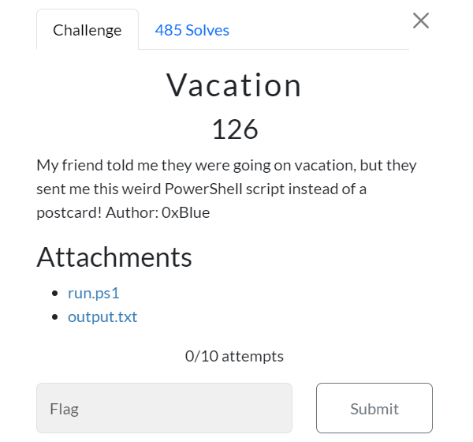
My friend told me they were going on vacation, but they sent me this weird PowerShell script instead of a postcard! Author: 0xBlue

Attachments
https://static.n00bzunit3d.xyz/Rev/Vacation/run.ps1
https://static.n00bzunit3d.xyz/Rev/Vacation/output.txt
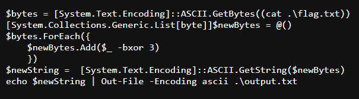

We were given a powershell script that convert content of a flag with XOR and save it to `output.txt` 

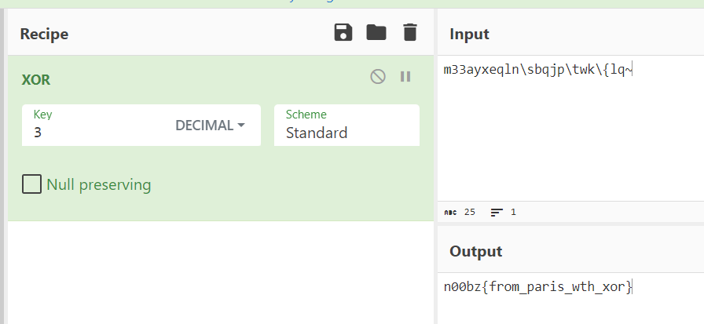

So we just need to convert it back to plaintext with XOR recipe with 3 as a key

```
n00bz{from_paris_wth_xor}
```
***